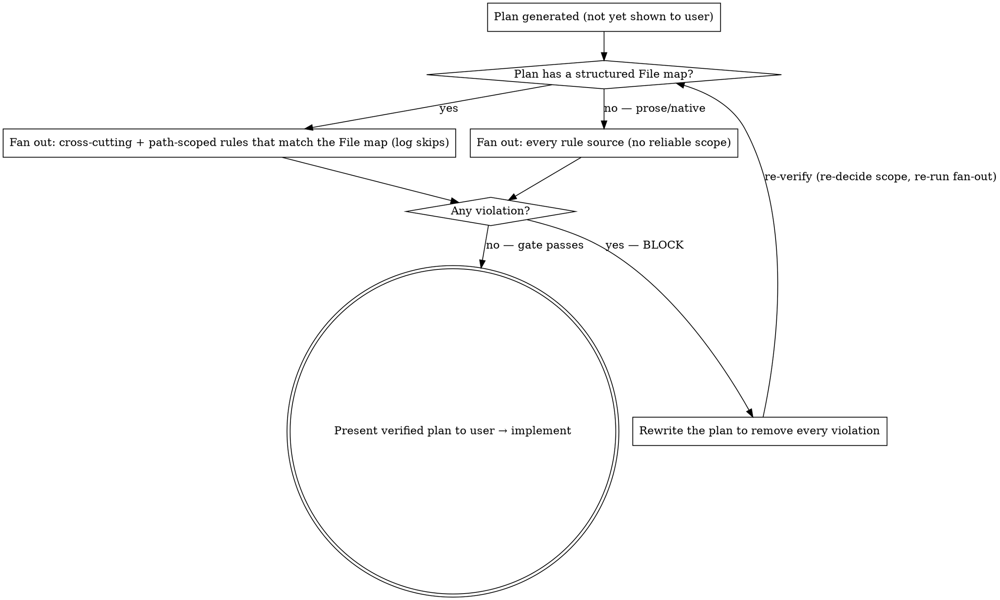

# Verifying a Technical Plan Against the Rules

## Overview

A **blocking gate**. The moment a technical plan is generated — and **before it is presented to the
user** for review, approval, or implementation — verify it adheres to **every rule that governs it** in
`.claude/rules/` (and `CLAUDE.md`) — every cross-cutting rule unconditionally, plus every path-scoped
rule whose scope the plan touches (see the fan-out gating in *Process*). **Violations block** — the plan is rewritten and re-verified until
clean, *then* offered to the user. A plan with violations is never shown as "ready". Suggestions are
advisory and never block.

The check is **delegated, one subagent per applicable rule source**, on purpose. An agent that is about to *implement*
checks rules ad hoc, misses subtle clauses, and — when it does spot a deviation — tends to *flag it and
build anyway*. A dedicated reviewer that judges the plan against **one** rule and does not implement
catches what the builder misses and has no incentive to continue past a violation.

**Violating the letter of a rule is violating the spirit of the rule.** A "minor" deviation is a
violation.

## When to use

- A **technical plan** has just been generated (from `writing-plans`, native plan mode / `ExitPlanMode`,
  or hand-written). Run this **the moment the plan is complete and BEFORE offering it to the user** for
  review, approval, or implementation — the gate sits between *"plan written"* and *"plan presented"*. A
  plan that fails the gate is rewritten and re-verified first; only a clean plan is shown to the user.
- Re-run it whenever the plan is **materially changed** afterwards (e.g. the user requests edits) before
  re-presenting it.

When NOT to use:

- At the **brainstorming / spec stage.** A spec is a guide *for* the plan, not a technical plan — there
  is nothing to gate yet. Wait until a technical plan exists.
- There is no plan (pure exploration).

## Process



1. **Locate the rule corpus.** The technical plan to be implemented, **plus the whole rule corpus**:
   - **every** rule file in `.claude/rules/` (glob it — do **not** hardcode the list; rules are added
     over time), **and**
   - **`CLAUDE.md`** (and any instructions file it references). This is **not optional**: normative
     rules live **only** in `CLAUDE.md`, not in any `.claude/rules/` file — e.g. *"every new route must
     declare a permission (`@PermissionsRequired`)"*, *entity files are plain kebab-case with no
     `.entity.ts`*, the *layering invariant*, and the *git workflow*. A fan-out scoped to `.claude/rules/`
     alone is **blind** to these and will pass a plan that omits a route permission or misnames an entity.
2. **Fan out — one subagent per *applicable* rule source.** Decide which sources to dispatch by these
   three rules, then send one agent each:
   - **Cross-cutting sources always run:** **`CLAUDE.md`'s normative rules** (auth/permissions, entity
     naming, the layering invariant, git workflow, commands) **and `testing.md`**. They are not bounded
     to a layer, and a real violation often hides exactly where no rule *file* covers it — never gate
     these out.
   - **Path-scoped rules are gated on the plan's file set — but only when that set is reliable.** If the
     plan carries a structured **File map** (the `writing-plans` Create/Modify file list), dispatch a
     path-scoped rule's agent **only if** one of those files matches the rule's `paths:` glob; otherwise
     mark it **`SKIPPED`** and **log the reason in the aggregate** (e.g. `application-amqp: SKIPPED — no
     file under src/application/amqp/**`). This is a **deterministic glob match, not a judgement call**,
     and the logged skip keeps it auditable. If the plan has **no** File map (native plan mode /
     hand-written prose), do **NOT** guess scope from prose — run the **full** fan-out (every source). A
     blocking gate must never false-skip on fuzzy extraction; pay for the extra agents instead.
   - **Merge tightly-coupled tiny sources:** `domain-glossary.md` rides **inside** the `domain-layer`
     agent (one agent receives both sources) — it is referenced by `domain-layer` and too small to
     warrant its own reviewer.

   Each dispatched subagent receives: the **full plan text** + its rule source(s) + read access to the
   repo. Its sole task: decide whether the plan, *as written*, would **violate that source** when
   implemented. It returns a structured verdict:
   - `rule` — the source(s) checked
   - `applies` — does this rule touch the plan's scope? If not → return N/A with **no** findings (never
     invent violations to look busy)
   - `violations` — `[{ plan step/quote, rule clause, why it violates }]`, concrete and **cited** to
     both the plan and the rule
   - `suggestions` — non-blocking improvements
   One source per agent (the `domain-layer` agent also carries `domain-glossary`): a focused reviewer catches subtle clauses (e.g. a `domain-layer` reviewer flags
   `@EnsureRequestContext` where a busy implementer keeps it). Dispatch each with the **per-rule agent
   prompt** below — the fixed role + structured-verdict framing is what keeps verdicts consistent and
   stops agents inventing findings or straying off their rule.
3. **Aggregate + gate.**
   - **Any violation → the gate FAILS. Do NOT implement.** Present the violations, **rewrite the plan**
     to remove every one, then **re-decide scope and re-run the fan-out** (loop) — a rewrite can change
     the File map, so the set of applicable rules is recomputed. The plan is not implementable until the
     gate returns **zero violations**.
   - Suggestions are listed for the author; they do not block.
4. **Pass → present, then implement.** Only a zero-violation plan is presented to the user as ready;
   implementation follows after the user reviews/approves it. The gate runs **before** the handoff, not
   after.

## Per-rule agent prompt (template)

Dispatch one agent per rule source with this prompt. Fill `{{RULE_SOURCE}}` (one `.claude/rules/*.md`
file, the `domain-layer`+`domain-glossary` pair, or `CLAUDE.md`) and `{{PLAN}}` (the full technical
plan). Validated wording — keep the role, the single-source scope, the N/A-don't-invent guard, and the
cited-verdict shape.

```
You are a strict compliance reviewer. You check a technical plan against ONLY the rule source(s) you are
given (usually one; the domain-layer reviewer also gets domain-glossary.md) and you do NOT implement
anything (no files, no git).

Rule source(s) to check (read in FULL): {{RULE_SOURCE}}
Check ONLY these — every other rule source is covered by a separate reviewer; do not stray.

Decide whether the plan below, AS WRITTEN, would VIOLATE this source when implemented. Return a verdict:
- applies: does this source touch the plan's scope? If not → applies:false, no findings (NEVER invent a
  violation to look useful).
- violations: a list of { plan quote, the specific rule clause it breaks, why } — concrete, citing BOTH
  the plan step and the exact clause. A violation is blocking regardless of how "minor" it seems.
- suggestions: non-blocking improvements (clearly separated from violations).
If something is governed by a different rule source, note it as out-of-scope — do not flag it here.

Technical plan:
{{PLAN}}
```

Notes:
- The agent's **role is fixed to reviewing, not building** — a reviewer has no incentive to "flag and
  continue", which is the builder's failure mode.
- The **structured verdict** (`applies` / `violations[{quote, clause, why}]` / `suggestions`) is what
  lets the orchestrator aggregate deterministically and apply the gate.
- The **N/A-don't-invent** guard prevents false positives from agents whose rule is out of scope (a real
  risk: an idle reviewer may manufacture findings to seem useful).
- If the runtime offers a dedicated reviewer `agentType` (e.g. a code-reviewer agent), use it and append
  this prompt; otherwise a general agent with this prompt is the portable default.

## This is a hard gate — do not negotiate with violations

| Excuse | Reality |
|--------|---------|
| "The plan's basically fine, I'll fix the violation while coding" | That is the exact failure this gate exists for. Fix the PLAN, re-verify, then code. |
| "It's only a minor deviation / a naming nit" | A rule violation is a violation. The gate is binary, not a severity vote. |
| "I'll flag it and proceed" | Flagging is not blocking. Implementation never starts with a known violation. |
| "I'll show the user the plan first and verify when we start coding" | Presenting an unverified plan as 'ready' is the failure this gate now prevents. Verify BEFORE the handoff; show only a clean plan. |
| "The plan was already approved / the team is waiting" | Approving a plan that breaks a rule doesn't make it compliant. Rewrite first. |
| "Only one rule obviously applies, I'll skip the rest by hand" | Scope is decided by a **deterministic `paths:` glob** against the plan's File map (skips logged), or — when the plan has no File map — by running **every** source. A hunch is not a glob match; cross-cutting sources (`CLAUDE.md`, `testing.md`) never skip. |
| "The implementing agent will self-correct" | It self-corrects some and silently keeps others. A dedicated per-rule check is why this gate exists. |

## Red flags — STOP

- About to **present a plan to the user as ready** — or to write implementation code — without a
  **passed** gate.
- A known violation described as "minor", "redundant", or "will fix later".
- "Flag and proceed" instead of "rewrite the plan and re-verify".
- Skipping a rule's agent on a **hunch** that it "probably doesn't apply" — only a deterministic
  `paths:` mismatch against the plan's File map (logged) may skip; a prose/native plan with no File map
  runs the full fan-out, and `CLAUDE.md`/`testing.md` never skip.
- Treating `.claude/rules/` as the whole rulebook — **`CLAUDE.md` carries rules too** (permissions,
  entity naming, the invariant). A real violation often hides exactly where no rule *file* covers it.

**All of these mean: do not present the plan and do not implement. Rewrite the plan, re-run the fan-out,
present (then implement) only at zero violations.**
