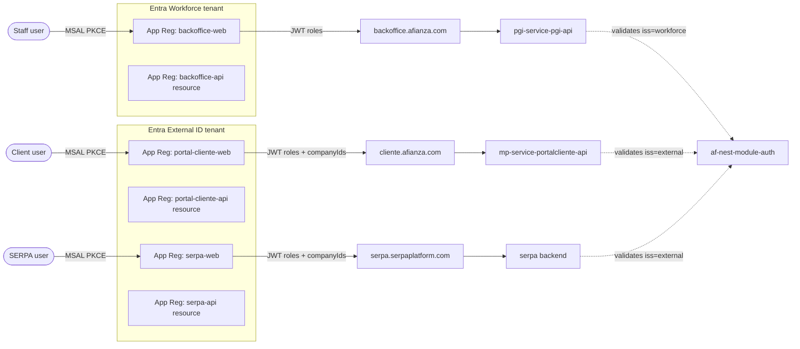

# Entra ID multi-app auth & authorization — Requirements

**Date:** 2026-05-08
**Status:** Draft (post-brainstorm, pre-plan)
**Scope:** Deep — feature/architecture
**Predecessor decision:** 2026-05-06 — discard `af-service-auth-idp`, use Entra direct + App Roles.

---

## Problem

Afianza needs a single coherent auth+authz strategy across multiple applications with different user populations:

- **Internal staff** (asesores, empleados) → access only the backoffice (`pgi-app-pgi-web`).
- **External clients** (empresas-cliente de Afianza) → access the customer portal (`mp-app-portalcliente-web`) and may also access SERPA.
- **SERPA users** → external product with free signup + trial flow, lives outside the Afianza domain.

Today only the backoffice has working auth (MSAL.js against a single Azure AD workforce tenant, JWT validated server-side via `af-nest-module-auth`). The customer portal is a greenfield scaffold with no auth at all. SERPA's auth posture is undefined. There is no shared authorization model to decide *which* user can use *which* app, and no mechanism to isolate data per client-company across the future portal cliente / SERPA.

## Goals

1. Authenticate three distinct user populations with the right kind of identity provider per population.
2. Decide app access centrally in Entra (workforce + External ID) without building or maintaining a custom IDP service.
3. Carry a `companyIds` claim in External ID tokens so backends can enforce per-client-company data isolation.
4. Reuse `af-nest-module-auth` across all NestJS services, extended to validate two issuers.
5. Reuse the SPA session pattern that already works in the backoffice (MSAL.js silent refresh) for the customer portal and SERPA.

## Non-goals

- Building or reviving a custom IDP service (`af-service-auth-idp` was scrapped 2026-05-06).
- BFF + HttpOnly cookie session model. Revisit only if security/audit demands it.
- Federating workforce identities with External ID (a staff member is *not* the same identity as a client).
- Replacing fine-grained per-app permissions (`BackofficePermissions` and similar) — those stay in each app's DB. App Roles in Entra decide *can enter the app at all*, not *which buttons inside*.
- Changes to `pd-service-azuread-adapter` (it keeps its current Microsoft Graph integration role).
- Cross-subdomain SSO beyond what the Entra session naturally provides.

## Users & flows

### Internal staff (workforce)
- Tenant: existing Afianza Entra workforce tenant (already in `VITE_AAD_TENANT_ID`).
- Apps allowed: backoffice (`pgi-app-pgi-web`).
- Identity created by: Afianza IT (existing process via `pd-service-azuread-adapter` / Graph).
- Token claims relevant to authz: `roles` (App Roles assigned in the backoffice App Registration), `oid`, `preferred_username`. **No `companyIds`** — staff see all clients within their own permission scope (NOA team etc.).

### Client end-users (portal cliente)
- Tenant: new Entra **External ID** tenant (single tenant for both portal cliente and SERPA).
- Apps allowed: portal cliente, optionally SERPA.
- Identity created by: Afianza onboarding process, with `extension_companyIds` already populated with the client-company they belong to.
- Token claims relevant to authz: `roles` (App Roles for portal-cliente App Registration), `extension_companyIds: string[]`, `oid`, `email`.

### SERPA users
- Tenant: same External ID tenant as portal cliente.
- Apps allowed: SERPA. May also be a portal cliente user if they are also an Afianza client (multi-claim case below).
- Identity created by: self-service signup (free trial). Initially `extension_companyIds` is empty.
- Trial-to-paid conversion: when approved, a new client-company is created and its id is appended to the user's `extension_companyIds`.
- Domain: SERPA lives at `serpa.serpaplatform.com` — outside the `*.afianza.com` family.

### Multi-empresa case
- A user may legitimately belong to multiple client-companies (e.g. a manager who runs SERPA for two of their own companies, or a portal-cliente user later approved on a SERPA trial for a sibling company).
- Therefore `extension_companyIds` is **always an array**, not a scalar, even when len = 1.
- Backend filters with `companyId IN (token.companyIds)` in every query that scopes by company.
- Frontend, when `companyIds.length > 1`, must surface a "switch active company" UX (tab, dropdown, etc.) and pass the selected company to backend calls (e.g. `X-Active-Company` header validated server-side against the token's array). Single-company users skip this UX entirely.

## Tenants & App Registrations

| Tenant | App Registration | Audience | App Roles (initial) |
|---|---|---|---|
| Workforce (existing) | `backoffice-web` | staff | `Admin`, `Manager`, `Operator` (TBD in plan) |
| Workforce (existing) | `backoffice-api` (resource) | accepts tokens for backoffice-web | n/a (resource) |
| Workforce (existing) | service-to-service apps (existing client credentials) | machine-to-machine | n/a |
| External ID (new) | `portal-cliente-web` | clients | `ClientUser` (and others as scope grows) |
| External ID (new) | `portal-cliente-api` (resource) | accepts tokens for portal-cliente-web | n/a (resource) |
| External ID (new) | `serpa-web` | SERPA users | `SerpaTrial`, `SerpaActive` (TBD with SERPA owners) |
| External ID (new) | `serpa-api` (resource) | accepts tokens for serpa-web | n/a (resource) |

User access to an app = "user (or group) is assigned to the corresponding App Registration with at least one App Role". This is the central authz toggle. Each App Registration enforces **assignment required** so unassigned users cannot get a token for it even if they exist in the directory.

## `af-nest-module-auth` extension

The module today exposes a single `AzureADStrategy` configured for one issuer + JWKS URL, plus `AzureClientCredentialsStrategy` for service-to-service. Required changes:

- Accept multiple issuer configurations in `AuthModuleOptions` (workforce + External ID), each with its own JWKS URL and audience.
- The strategy resolves the right validation config from the token's `iss` claim (or `tid`), not from a single hardcoded value.
- Expose a typed user object after validation: `{ kind: 'workforce' | 'external', oid, roles, companyIds?, email }`.
- Provide a guard / decorator to require a specific `kind` (e.g. `@RequireWorkforce()` for backoffice endpoints, `@RequireExternal()` for portal-cliente / SERPA endpoints) so each API rejects tokens from the wrong directory cleanly.
- Provide a guard / decorator to enforce App Roles (e.g. `@RequireRoles('ClientUser')`).
- Backend tenant-isolation helper: a request-scoped service that exposes `activeCompanyId` (from header) validated against `request.user.companyIds`. Used by domain services to filter queries.

Tests follow the existing pattern of the module's `*.spec.ts` files.

## SPA session strategy

Same pattern in all three SPAs (backoffice already does this):

- **Library:** `@azure/msal-browser` + `@azure/msal-react`.
- **Flow:** Authorization Code + PKCE.
- **Access token:** in-memory in MSAL cache (default ~1h Entra TTL).
- **Refresh:** MSAL silent refresh (iframe + refresh-token rotation handled by the lib).
- **Storage:** `sessionStorage` (default) — clears on tab close. Acceptable trade-off for the threat model.
- **Logout:** MSAL `logoutRedirect()` + revoke. Each SPA logs out independently.
- **TTLs:** Entra defaults (access ~1h, refresh ~24h with rolling rotation up to 90 days). Re-evaluate if compliance asks for shorter (open question).
- **Per-app config:** each SPA has its own `clientId` + `authority` (workforce vs External ID) + `redirectUri`.

The customer portal (`mp-app-portalcliente-web`) is currently a scaffold — it must adopt this stack as part of the implementation:

- Add `@azure/msal-browser`, `@azure/msal-react`, `axios`, `@tanstack/react-query`, `@afianza-ac/lib-core-definitions`.
- Port `AuthContext`, `httpClient` (with bearer auto-injection), `ProtectedRoute`, and the env-var pattern (`window.__APP_CONFIG__` runtime override) from `pgi-app-pgi-web`.
- Add the active-company switcher when the user's token carries multiple `companyIds`.

## Domains

- `backoffice.afianza.com` (workforce tenant authority).
- `cliente.afianza.com` or similar (External ID tenant authority).
- `serpa.serpaplatform.com` (External ID tenant authority, **not** under `*.afianza.com`).
- No cross-subdomain cookie sharing assumed. SSO experience comes from Entra's own session, not from shared cookies.

## Custom claim — `extension_companyIds`

- Defined as a custom attribute in the External ID tenant, type `string` (Entra attributes are scalar — store as comma-separated or JSON string and parse server-side, OR use an Entra schema extension that supports arrays via Microsoft Graph). To be confirmed in plan.
- Mapped into ID/Access tokens via the user flow's claims-mapping policy.
- Written by:
  - Portal cliente onboarding (Afianza-side process — out of scope here, but the requirements doc flags it as a dependency).
  - SERPA trial-approval workflow.
- Read by every NestJS service that serves External ID tokens; used by the tenant-isolation helper.

## Diagram (high level)

## Success criteria

- A staff user with `Admin` App Role on `backoffice-web` can log into the backoffice and call `pgi-service-pgi-api`. A staff user **without** that role gets a clean 403 from Entra (no token issued) — never reaches the SPA.
- A client user with `ClientUser` role and `companyIds = [42]` can log into the portal cliente and only sees data for company 42. Trying to access company 43 data (by URL manipulation or header forgery) yields 403.
- A SERPA-only user trying to reach the portal cliente fails at the Entra App Registration assignment check.
- A multi-company user sees a working "switch active company" control and the active selection drives all backend queries.
- A workforce token presented to `mp-service-portalcliente-api` is rejected as wrong issuer.
- `af-nest-module-auth` validates both issuers in the same service if needed, with a single `AuthModule.forAsyncRoot` call.
- Token expiry is invisible to users in normal use thanks to MSAL silent refresh.

## Dependencies & assumptions

- External ID tenant must be provisioned (open question — see below).
- An Afianza-side process exists (or will be created) to assign `extension_companyIds` at portal-cliente onboarding. This brainstorm does not design that process.
- SERPA's trial-approval workflow is owned by the SERPA team and must hook into External ID to set `extension_companyIds`. Coordination required.
- `pgi-app-pgi-web` continues to validate against the workforce tenant — this work does not migrate it.

## Open questions for the plan

1. **Is the External ID tenant provisioned?** If not, who owns provisioning and the Microsoft licensing implications?
2. **TTL policy vs compliance.** Entra defaults are usually fine, but does Afianza compliance/audit require shorter access tokens or refresh-token revocation guarantees beyond Entra's defaults?
3. **`extension_companyIds` storage shape.** Native Entra attributes are scalar. Use serialized JSON / CSV in a single string, or Microsoft Graph schema extension supporting arrays? Pick the one with the cleanest claim-mapping output.
4. **Active-company UX in portal cliente.** Where does the switcher live (header? sidebar?) and is it persisted across reloads (localStorage of last selected) without weakening the server-side check?
5. **App Roles inventory.** Define the actual App Roles per App Registration for portal-cliente and SERPA (the table above is placeholder).
6. **Logout coordination.** When a user logs out of one of the External ID SPAs, do we want global front-channel logout from Entra, or per-app? Default is per-app; revisit if UX feedback says otherwise.
7. **POC reference.** A POC in the Orbitant directory was mentioned but could not be located during the brainstorm. If found, reconcile against this doc before planning.

## Out of scope but worth flagging

- **`mp-app-portalcliente-web` adoption of the rest of the backoffice stack** (TanStack Query, Form, Table, `lib-core-definitions`, Matomo, ConfigCat). This brainstorm only requires what's needed for auth, but a full feature build will need them. Flag for the plan that owns the portal cliente migration.
- **Migration of existing client users**, if any pre-exist in some other system. Treat as a separate data migration plan.
- **B2B guest invites** (workforce-tenant-issued invites to external collaborators). Not currently needed; if it comes up, it's a different design.

---

## Recommended next step

`/ce-plan` against this document to produce the implementation plan. The plan should split into at least four tracks:

1. External ID tenant + App Registrations + custom attribute setup (infra/admin).
2. `af-nest-module-auth` multi-issuer extension (with tests).
3. `mp-app-portalcliente-web` auth bootstrap (MSAL + AuthContext + httpClient + ProtectedRoute, port from backoffice).
4. SERPA coordination doc (handoff to SERPA team — not implementation).
