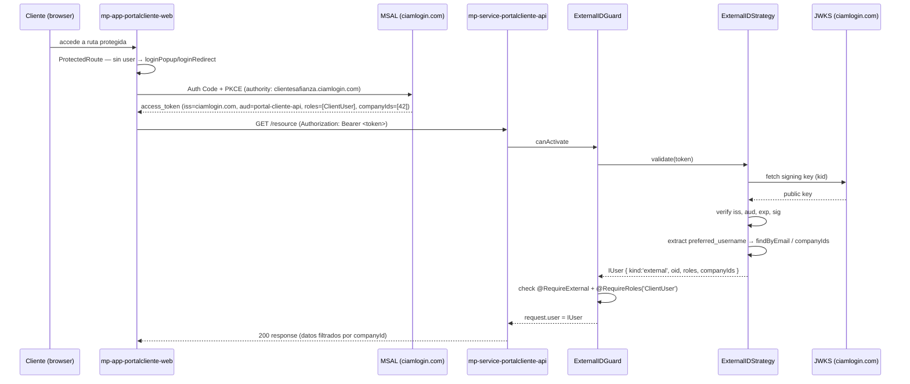

# feat: Entra ID auth — portal cliente + af-nest-module-auth multi-issuer

## Summary

Implementar autenticación con Entra External ID en el portal cliente (`mp-service-portalcliente-api` + `mp-app-portalcliente-web`) extendiendo `af-nest-module-auth` con una estrategia nueva para External ID, e introducir después el guard multi-tenant que permite que un mismo módulo valide tokens de dos issuers distintos (workforce y External ID) con un único `AuthModule.forAsyncRoot`. El plan se divide en dos fases secuenciales: Fase 1 cubre exclusivamente el portal cliente; Fase 2 extiende el módulo a dual-issuer y corrige las deudas técnicas del backoffice existente.

---

## Problem Frame

Hoy solo el backoffice tiene auth funcional (MSAL contra workforce tenant, JWT validado por `af-nest-module-auth`). El portal cliente es un scaffold sin ninguna capa de autenticación. `af-nest-module-auth` está hardcodeado al issuer v1 de STS (`sts.windows.net`) y al claim `unique_name`, ambos incompatibles con External ID y con tokens v2 modernos. No existe mecanismo para aislar datos por `companyId` de cliente ni decoradores para rechazar tokens del tenant equivocado. (ver origin: `docs/brainstorms/2026-05-08-entra-multi-app-auth-requirements.md`)

---

## Requirements

- R1. `af-nest-module-auth` valida tokens de Entra External ID (issuer `ciamlogin.com`, claim `preferred_username`, JWKS desde el endpoint del tenant externo).
- R2. `mp-service-portalcliente-api` registra `AuthModule` con la estrategia External ID como guard global; rechaza tokens sin `ClientUser` App Role con 403.
- R3. Un token del workforce tenant presentado a `mp-service-portalcliente-api` es rechazado por issuer incorrecto (401).
- R4. `mp-app-portalcliente-web` obtiene tokens vía MSAL Auth Code + PKCE contra el tenant External ID, los inyecta automáticamente en cada petición HTTP.
- R5. La sesión MSAL se renueva silenciosamente dentro de la TTL de 24 h; al expirar, la app re-autentica de forma interactiva.
- R6. (Fase 2) `af-nest-module-auth` soporta un guard multi-issuer que enruta al strategy correcto inspeccionando el claim `iss` sin verificar.
- R7. (Fase 2) `AzureADStrategy` usa issuer v2 (`login.microsoftonline.com/.../v2.0`) y claim `preferred_username`.
- R8. Los campos `kind?: 'workforce' | 'external'` y `companyIds?: string[]` se añaden a `IUser` en **Fase 1** (U1) — necesarios para que `CompanyIsolationService` (U2) **compile**. **Nota:** la correctitud en runtime de `parseCompanyIds` (que popula `companyIds`) depende de Q3 (storage shape); U1 expone `companyIdsClaimKey: string` configurable en `AuthModuleOptions` con default `'extension_companyIds'` para que la decisión de Q3 sólo requiera un cambio de env var, no un redeploy del strategy. (Fase 2) `AzureADStrategy` también popula `kind: 'workforce'` en su `validate()`.
- R9. (Fase 2) `pgi-service-pgi-api` externaliza `tenantId` y `clientId` a variables de entorno.

**Origin flows:** Login staff (workforce) · Login client (External ID) · Multi-company switch  
**Origin acceptance examples:** AE1 (staff login + backoffice access), AE2 (client login + company isolation), AE3 (wrong-tenant rejection), AE4 (multi-company switcher)

**Traceability (AE → R-IDs):**
- AE1 → R7 (AzureAD strategy fix) + R9 (workforce config externalized)
- AE2 → R2 (portal client guard + ClientUser role) + R8 (companyIds on IUser)
- AE3 → R3 (wrong-tenant 401) + R6 (multi-issuer routing — Fase 2)
- AE4 → R6 + R8 (multi-issuer + companyIds switcher scaffolding)

---

## Scope Boundaries

- SERPA: fuera de este plan — solo se coordina entrega de handoff doc (ver origin).
- `pd-service-azuread-adapter`: sin cambios — sigue siendo el lector de Graph para sincronizar empleados.
- Onboarding process que asigna `extension_companyIds` al cliente: fuera de scope — es una dependencia externa.
- Active-company switcher UI en el frontend: se scafoldea solo si `companyIds.length > 1` pero el diseño UX completo se defiere.
- BFF / HttpOnly cookie session model: explícitamente descartado.
- Migración de usuarios existentes a External ID: plan separado.
- `pgi-app-pgi-web`: no se toca en Fase 1; en Fase 2 solo se corrige la config del módulo de auth, no la SPA.

### Deferred to Follow-Up Work

- Company switcher UX completa (header/sidebar, persistencia localStorage): plan de portal cliente features.
- App Roles inventory definitivo para portal cliente y SERPA: pendiente de alineación con stakeholders.
- Custom domain (`login.afianza.com`) vía Azure Front Door: plan de infraestructura separado.
- `extension_companyIds` storage shape (string CSV vs Graph schema extension con array nativo): decisión bloqueada por pregunta abierta Q3 — se implementa con el tipo decidido pero se documenta el cambio en este plan.
- `mp-app-portalcliente-web` stack completo (TanStack Query/Form/Table, ConfigCat, Matomo): plan de migración portal cliente.

---

## Context & Research

### Relevant Code and Patterns

- `af-nest-module-auth/src/strategies/azure-ad-strategy/azure-ad-strategy.ts` — estrategia de referencia a replicar para External ID (issuer/JWKS/claim/caché de usuario en lines 18-19, 36)
- `af-nest-module-auth/src/strategies/azure-client-credentials-strategy/` — segundo ejemplo de estrategia dentro del módulo
- `af-nest-module-auth/src/models/auth-module-options.ts` — interface a extender con opciones de External ID
- `af-nest-module-auth/src/index.ts` — barrel de exportaciones; añadir nuevos guards/decoradores aquí
- `pgi-service-pgi-api/src/app.module.ts:90-99` — patrón de registro `AuthModule.forAsyncRoot` a replicar en portal cliente
- `pgi-app-pgi-web/src/contexts/auth/auth-context.tsx` — AuthContext a portar al frontend del portal
- `pgi-app-pgi-web/src/services/utils/httpClient.ts` — interceptor Axios + `acquireTokenSilent` a portar
- `pgi-app-pgi-web/src/components/shared/protected-route/protected-route.tsx` — ProtectedRoute a portar
- `pgi-app-pgi-web/src/config.ts:21-29` — patrón de MSAL config con `window.__APP_CONFIG__` runtime override
- POC de referencia: `/Users/sito/Documents/pd-poc-idp/` (repo `afianza-ac/pd-poc-idp`, clonado localmente) — `test-backend/src/middleware/auth.ts` y `test-frontend/src/auth/msalConfig.js`. Issuer/JWKS validados con el tenant `clientesafianza`. **Nota:** el POC usa `jose` (Express) y `includes('ciamlogin.com')` para enrutar issuer — el plan corrige ambos: `passport-jwt` por compatibilidad CJS de NestJS, y `startsWith` por la razón de F6. POC también demuestra el patrón **dos PublicClientApplication separadas** para dual-tenant frontend (B2C + Workforce instances) en lugar de popup con una sola PCA.

### Institutional Learnings

- Decisión 06/05/2026: `af-service-auth-idp` descartado — usar Entra directo con App Roles.
- `af-nest-module-auth` usa `passport-jwt` + `jwks-rsa` (CJS-compatible). `jose` es ESM-only y requiere dynamic import en NestJS — mantener el stack actual.
- Issuer External ID confirmado por POC: formato completo `https://${tenant}.ciamlogin.com/${tenant}.onmicrosoft.com/v2.0` — el dominio `ciamlogin.com` es parte del host, `.onmicrosoft.com` es el path del tenant (no GUID).
- `unique_name` es un claim v1 solo presente en tokens del STS workforce. External ID emite v2 — usar `preferred_username`.
- Audience para acceso a la API: **commit a GUID del `client_id`** (forma validada en POC, `test-backend/src/middleware/auth.ts:74` usa `config.b2c.clientId`). `api://...` se descarta para evitar ambigüedad entre `AAD_EXTERNAL_CLIENT_ID` y `AAD_EXTERNAL_AUDIENCE`.
- MikroORM: reads con `disableIdentityMap: true`, writes con `em.fork()`. `@EnsureRequestContext()` no usar en guards.

### External References

- Issuer/JWKS External ID (validado POC): `https://clientesafianza.ciamlogin.com/clientesafianza.onmicrosoft.com/v2.0`
- OIDC Discovery: `https://clientesafianza.ciamlogin.com/clientesafianza.onmicrosoft.com/v2.0/.well-known/openid-configuration`
- MSAL React v3 + External ID: `@azure/msal-browser ^4.x`, `@azure/msal-react ^3.x` — ya en `pgi-app-pgi-web`
- SPA redirect URI type `spa` (no `web`) — habilita CORS + PKCE en el token endpoint

---

## Key Technical Decisions

- **Mantener `passport-jwt` + `jwks-rsa`** en `af-nest-module-auth`: CJS nativo, sin workarounds ESM, stack ya probado. `jose` se descarta para NestJS.
- **Fase 1 — single strategy `ExternalID`**: el portal cliente solo valida tokens del External ID tenant. El RouterGuard multi-issuer (Fase 2) se desarrolla después para no bloquear el portal.
- **Routing multi-issuer (Fase 2) vía peek del `iss` sin verificar**: decodificar el payload del JWT (sin validar firma) solo para leer el `iss` y seleccionar el guard correcto. Patrón validado en el POC (`peekIssuer`). **`startsWith` es routing hygiene, no security boundary** — la seguridad la aporta la verificación de firma del guard delegado.
- **Issuer format — External ID usa subdomain form**: `https://${tenant}.ciamlogin.com/${tenant}.onmicrosoft.com/v2.0` (validado en POC). Workforce issuer (U5, Fase 2) usa standard form: `https://login.microsoftonline.com/${tenantId}/v2.0`. Ambas son endpoints v2.0.
- **OIDC discovery probe en startup**: `ExternalIDStrategy` (y `AzureADStrategy` tras U5) hace un fetch al `.well-known/openid-configuration` del tenant configurado en arranque y valida que el issuer publicado coincida con el esperado. Fail-fast en misconfiguración de subdomain.
- **`globalGuardType: 'externalID'`** en `AuthModuleOptions` para que `mp-service-portalcliente-api` seleccione el guard correcto sin añadir un campo `guardType` por servicio.
- **`IUser` tipado con `kind`**: en Fase 2 los backends pueden decorar endpoints con `@RequireWorkforce()` / `@RequireExternal()` para rechazar tokens del tenant equivocado a nivel de guard, sin lógica en el controller.
- **`useClaimsOnly: boolean` explícito en `AuthModuleOptions`**: el portal cliente Fase 1 pone `useClaimsOnly: true` y no provee `usersService`. **No** inferimos modo claims-only desde "usersService es null" — sin el flag, una caída accidental del provider del `usersService` en backoffice silenciaría todos los lookups en DB y abriría una superficie de elevación de privilegios. Con el flag, sin `usersService` lanza en startup; con `usersService` pero `findByEmail` retornando null/lanzando → 401 (no fallback).
- **`companyIdsClaimKey` configurable** en `AuthModuleOptions` con default `'extension_companyIds'`. Cuando Q3 resuelva (CSV vs Graph schema extension con clave `extension_<app-object-id>_companyIds`), se ajusta vía env var sin tocar el strategy.
- **MSAL frontend Fase 1 — `loginRedirect` single-tenant**: el portal cliente sólo consume External ID; `loginRedirect` es el flow más simple, sin popup blockers, sin window.opener references, y consistente con `httpClient` que dispara `loginRedirect` en `InteractionRequiredAuthError`. La futura dual-tenant en un mismo frontend (si llega) usará **dos `PublicClientApplication` separadas** (patrón POC `b2cMsalInstance` + `workforceMsalInstance`), no popup con una sola PCA.
- **`window.__APP_CONFIG__` runtime override** para env vars del frontend — mismo patrón que el backoffice, permite inyección de config en contenedores sin rebuild.
- **CSP ownership: U3 (portal cliente web)**. La promesa de "CSP estricta como compensación de sessionStorage" se materializa en U3: meta CSP en `index.html` + header equivalente servido por el hosting. Sin esto, la compensación de XSS prometida en sessionStorage no existe.

---

## Open Questions

### Resolved During Planning

- **¿Existe el frontend del portal?** Sí — `mp-app-portalcliente-web` existe pero sin MSAL ni auth. Es un scaffold con React 19 + Vite + React Router 7.
- **¿passport-jwt + jwks-rsa funciona con External ID?** Sí — solo cambia la config (issuer, JWKS URI, claim). La librería es agnóstica al tenant.
- **¿Audience en External ID?** Puede ser el GUID del client_id de la API o un Application ID URI. El POC usó el GUID. Verificar con jwt.ms decodificando un token real del tenant `clientesafianza`.

### Preconditions (bloquean inicio de unit correspondiente)

- **Q5a (precondition de U1) — ¿`payload.roles` se mapea al campo `permissions` existente de `IUser` o se añade un campo `roles?: string[]` nuevo?** El tipo `IUser` actual tiene `permissions: string[]`. U1 extrae `payload.roles ?? []` del token External ID y U4 introduce `@RequireRoles('ClientUser')`. Opciones: (a) mapear a `permissions` — backward-compatible pero nombre inconsistente con el claim; (b) añadir `roles?: string[]` en U1 y deprecar `permissions` en un paso posterior. **Gate U1 y U2:** la acceptance test R2 ("rechaza tokens sin `ClientUser` App Role con 403") no puede escribirse sin esta decisión. Renombrado de "Q5 — doc review" a Q5a para evitar colisión con Q5 del origen (App Roles inventory).
- **Q4 spike (precondition de U4) — ¿el patrón de delegación de `MultiIssuerGuard` a child guards funciona con NestJS/Passport?** `MultiIssuerGuard` inyecta `ExternalIDGuard` y `AzureADGuard` y llama a `childGuard.canActivate(ctx)` directamente. `AuthGuard` fue diseñado para ser invocado por el pipeline de guards de NestJS, no como servicio inyectado; `logIn()` y los callbacks de Passport pueden no ejecutarse en una llamada directa. **El spike es bifurcación, no checkpoint.** Antes de aprobar U4, ejecutar prueba aislada (un test integration que monta `MultiIssuerGuard` con `ExternalIDGuard` inyectado y verifica que `request.user` se popula tras `canActivate`). **PASS:** proceder con U4 como está. **FAIL:** reemplazar delegación por `passport.authenticate()` inline con config seleccionada por issuer — mismo `startsWith` hygiene, sin instanciar guards hijo.
- **Q7 (precondition de U1) — verificar POC y audience format.** Antes de implementar U1: (a) confirmar que el POC en `/Users/sito/Documents/pd-poc-idp/` sigue operativo (issuer `clientesafianza` activo); (b) decodificar un token real del tenant con jwt.ms y confirmar que `aud === clientId GUID` (no `api://...`). Si el tenant POC está deprovisionado, U1 desarrolla con mocks pero U1 Verification no puede pasar end-to-end hasta que el tenant productivo (Q1) exista.
- **Q8 (precondition de U5 contingency) — confirmar `passport-jwt` acepta `issuer: string[]`.** El rollback contingency de U5 (aceptar v1 + v2 durante ventana de transición) depende de que `passport-jwt` propague `issuer` como array a `jsonwebtoken.verify` (que sí lo acepta). Verificar con un test trivial antes de confiar en la ventana de transición.

### Deferred to Implementation

- **`extension_companyIds` storage shape** (Q3 del origin): decidir CSV vs Graph schema extension antes de implementar U2 y U3. **Mitigación de bloqueo:** U1 expone `companyIdsClaimKey` configurable (ver Key Technical Decisions). Cuando Q3 resuelva, solo cambia la env var — no hay redeploy del strategy.
- **App Roles definitivos** (Q5 del origin): `ClientUser` es el placeholder inicial. Antes de U2 confirmar los roles reales con stakeholders.
- **¿El External ID tenant está provisionado?** (Q1 del origin): si no lo está, U1-U3 se pueden desarrollar pero no se puede probar end-to-end hasta que exista. Coordinar con infra.

---

## High-Level Technical Design

> *Esto ilustra el enfoque previsto como guía de revisión, no como especificación de implementación.*



**Multi-issuer routing (Fase 2):**

```
request → MultiIssuerGuard
  peekIssuer(token)
    startsWith 'https://<tenant>.ciamlogin.com/'        → ExternalIDGuard → ExternalIDStrategy
    startsWith 'https://login.microsoftonline.com/'     → AzureADGuard   → AzureADStrategy
    unknown                                             → 401
```
> **Nota F6:** Usar `startsWith` con el prefijo completo (`https://...ciamlogin.com/`), **no** `includes('ciamlogin.com')`. Un issuer forjado como `https://evil.com/ciamlogin.com.phish/` pasaría el check de `includes` pero no el de `startsWith`. La comparación es sobre la URL completa del claim `iss`.
>
> **Nota F6b (Q4 contingency):** El routing de `MultiIssuerGuard` está sujeto al spike Q4. Si la delegación a child guards no funciona con el lifecycle de Passport, el routing inline alternativo también debe usar `startsWith` — no `includes`.

---

## Implementation Units

### U1. `af-nest-module-auth` — estrategia ExternalID

**Goal:** Añadir `ExternalIDStrategy` que valida tokens del tenant External ID de Afianza, junto con su guard y opciones de configuración.

**Requirements:** R1, R3, R8 (campos `kind`/`companyIds` en `IUser`)

**Dependencies:** Q5a Resolution (roles vs permissions field — gate de R2 acceptance test en U2) · Q7 Resolution (POC + audience format validation)

**Files:**
- Create: `af-nest-module-auth/src/strategies/external-id-strategy/external-id-strategy.ts`
- Create: `af-nest-module-auth/src/guards/external-id/external-id.guard.ts`
- Modify: `af-nest-module-auth/src/models/auth-module-options.ts`
- Modify: `af-nest-module-auth/src/models/user.model.ts` (añadir `kind` y `companyIds` a `IUser`)
- Modify: `af-nest-module-auth/src/auth.module.ts`
- Modify: `af-nest-module-auth/src/index.ts`
- Test: `af-nest-module-auth/src/strategies/external-id-strategy/external-id-strategy.spec.ts`

**Approach:**
- `ExternalIDStrategy extends PassportStrategy(Strategy, 'ExternalID')`: misma estructura que `AzureADStrategy` pero con:
  - `issuer`: `https://${externalTenant}.ciamlogin.com/${externalTenant}.onmicrosoft.com/v2.0`
  - `jwksUri`: `https://${externalTenant}.ciamlogin.com/${externalTenant}.onmicrosoft.com/discovery/v2.0/keys`
  - `audience`: `options.externalAudience` (configurable — GUID o `api://...`)
  - Claim de email: `payload.preferred_username` (no `unique_name`)
  - Claim de roles: `payload.roles ?? []`
  - Claim de companyIds: `parseCompanyIds(payload[options.companyIdsClaimKey ?? 'extension_companyIds'])` — la clave del claim es configurable vía `companyIdsClaimKey` para absorber la decisión de Q3 sin redeploy del strategy. Default CSV: `parseCompanyIds("42,99") → ['42','99']`.
- `AuthModuleOptions` añade: `externalTenant?: string`, `externalClientId?: string`, `externalAudience: string` (**requerido** cuando `globalGuardType === 'externalID'`), `companyIdsClaimKey?: string`, `useClaimsOnly?: boolean`.
- **Validación de options en factory `forAsyncRoot` (no en constructor del strategy)**: la lógica debe ejecutarse antes de cualquier registro condicional. Si `globalGuardType === 'externalID'` y `externalAudience` no es un string no-vacío que matchee `/^([a-f0-9-]{36}|api:\/\/.+)$/` → lanzar `Error('AAD_EXTERNAL_AUDIENCE is required and must be a GUID')` en bootstrap. Validar en el factory garantiza que un typo en `globalGuardType` no caiga fuera del check.
- **`useClaimsOnly: boolean` explícito**: en lugar de inferir desde "usersService es null". `validate()` lee `options.useClaimsOnly`. Si `true` → construir `IUser` íntegramente desde claims, no consultar DB. Si `false` (default) → `usersService` es **obligatorio**; falta del provider o `findByEmail` retornando null/lanzando → 401 (no fallback). Esto previene una superficie de elevación de privilegios si en backoffice se cae el provider accidentalmente.
- `globalGuardType` extiende a `'azureAD' | 'clientCredentials' | 'externalID'`
- `ExternalIDGuard extends AuthGuard('ExternalID')`: mismo patrón que `AzureADGuard`; checkea `@PublicRoute` y `@PermissionsRequired` (decorador ya existente en el módulo — no crear de nuevo)
- **APP_GUARD factory (auth.module.ts):** La lógica de selección del guard global debe convertirse de ternario binario a switch de 3 ramas: `'azureAD' → AzureADGuard`, `'clientCredentials' → AzureClientCredentialsGuard`, `'externalID' → ExternalIDGuard`. Sin esta tercera rama, `globalGuardType: 'externalID'` cae al guard de AD y el portal cliente nunca recibe el guard correcto.
- **Registro condicional (F1):** `ExternalIDStrategy` y `ExternalIDGuard` deben añadirse al array `providers` del `DynamicModule` dentro de `forAsyncRoot`, **no** en el decorator estático `@Module({ providers: [...] })`. El `@Module` estático instancia todos sus providers incondicionalmente al arrancar — cualquier servicio que instale el módulo sin proveer `externalTenant` (p.ej. `pgi-service-pgi-api`) crasheará en startup. La lógica condicional solo es posible dentro del factory de `forAsyncRoot`.
- **Registro condicional para `AzureADStrategy` (F1b — también Fase 1):** El `AzureADStrategy` **existente** también debe moverse de `@Module({ providers: [...] })` a providers condicionales en `forAsyncRoot` — solo incluirlo cuando `globalGuardType === 'azureAD'` o `globalGuardType === 'multiIssuer'`. Sin este cambio, `mp-service-portalcliente-api` (que provee `externalTenant` pero no `tenantId`) instanciará `AzureADStrategy` con `options.tenantId = undefined`, produciendo un issuer URL inválido en startup.
  > **Por qué Fase 1:** este cambio es necesario para que el portal cliente pueda arrancar correctamente; no puede diferirse a Fase 2.
- **Extensión de `IUser` (Fase 1):** `IUser` es `abstract class` (no `interface`). En este mismo unit añadir `kind?: 'workforce' | 'external'` y `companyIds?: string[]` al tipo en `af-nest-module-auth/src/models/user.model.ts`. **Ambos deben ser opcionales (`?`)** para no romper subclases concretas (p.ej. en `pgi-service-pgi-api`) que extienden `IUser` sin declararlos. **Pre-step obligatorio:** ejecutar `grep -rE "extends IUser|implements IUser" /Users/sito/Documents/afianza` y verificar que ninguna subclase concreta declara `companyIds` con tipo distinto a `string[]` ni `kind` con valor literal incompatible. `CompanyIsolationService` (U2) lee `user.companyIds` — sin estos campos el módulo no compila. `ExternalIDStrategy.validate()` devuelve `kind: 'external'`. `AzureADStrategy` añadirá `kind: 'workforce'` en U5/Fase 2.
- `validate()` aplica la regla `useClaimsOnly` descrita arriba — sin null-check implícito de `usersService`.
- Exportar `ExternalIDGuard` desde `index.ts`

**Patterns to follow:**
- `af-nest-module-auth/src/strategies/azure-ad-strategy/azure-ad-strategy.ts`
- `af-nest-module-auth/src/guards/azure-ad.guard.ts`

**Test scenarios:**
- Happy path: token válido de External ID (iss=ciamlogin.com, aud correcto, preferred_username presente) → `validate()` resuelve el usuario y devuelve `IUser`
- Edge case: `preferred_username` ausente pero `email` presente → usar `email` como fallback
- Edge case: `extension_companyIds` ausente → `companyIds: []`
- Edge case: `extension_companyIds` como string CSV `"42,99"` → parsear a `['42', '99']`
- Error path: token con issuer de workforce (`login.microsoftonline.com`) → `passport-jwt` falla validación de issuer → `UnauthorizedException`
- Error path: token expirado (`exp` en el pasado) → `UnauthorizedException`
- Error path: firma inválida (key incorrecta) → `UnauthorizedException`
- Error path: `audience` no coincide → `UnauthorizedException`
- Integration: cuando `usersService.findByEmail()` lanza → strategy propaga el error → 401

**Verification:**
- `npm test` en `af-nest-module-auth` pasa sin regresiones en `AzureADStrategy` ni `AzureClientCredentialsStrategy`
- Los nuevos tests de `ExternalIDStrategy` pasan con la config del tenant `clientesafianza` (Q7 resuelta) o con mocks de JWKS si el tenant no está disponible
- El módulo compila sin errores TypeScript (`npm run build`)
- **Nota sobre validación end-to-end de F1b:** la correctitud de F1b (registro condicional de `AzureADStrategy`) se demuestra en U2, cuando `mp-service-portalcliente-api` arranca con `globalGuardType: 'externalID'` y **sin** proveer `tenantId`/`clientId` de workforce. Si U1 se mergea antes de U2, programar manualmente un boot de `mp-service-portalcliente-api` con los providers mínimos que aporta U1 (sin `AuthModule` aún) sirve sólo como humo de TypeScript — la prueba real vive en U2.

---

### U2. `mp-service-portalcliente-api` — AuthModule + CompanyIsolationService

**Goal:** Registrar `AuthModule` con la estrategia ExternalID como guard global; añadir `CompanyIsolationService` request-scoped que valida el header `X-Active-Company` contra el array `companyIds` del token.

**Requirements:** R2, R3

**Dependencies:** U1 · Q5a Resolution (roles vs permissions — gate de R2 acceptance test) · Q3 Resolution recomendada pero no bloqueante (U1 absorbe Q3 via `companyIdsClaimKey`).

**Process gate:** `mp-service-portalcliente-api/CLAUDE.md` requiere aprobación explícita para editar `app.module.ts`. Confirmar antes de empezar U2.

**Files:**
- Modify: `mp-service-portalcliente-api/src/app.module.ts`
- Create: `mp-service-portalcliente-api/src/config/auth.config.ts`
- Create: `mp-service-portalcliente-api/src/domain/services/company-isolation.service.ts`
- Modify: `mp-service-portalcliente-api/.env.example`
- Test: `mp-service-portalcliente-api/src/domain/services/company-isolation.service.spec.ts`

**Approach:**
- `AppModule` importa `AuthModule.forAsyncRoot` con `globalGuardType: 'externalID'`, `externalTenant`, `externalClientId`, `externalAudience` desde `ConfigService`
- No hay `usersService` en el registro inicial (los clientes del portal no se buscan en DB por ahora — el `IUser` se construye 100% desde los claims del token)
- `CompanyIsolationService` (`@Injectable({ scope: Scope.REQUEST })`):
  - **Inyección (F3):** Recibe solo el token `REQUEST` (`@Inject(REQUEST) private readonly req: Request`) — **no** inyectar `IUser` directamente como parámetro del constructor (requeriría un factory custom y acopla el servicio al sistema de guards). En cambio, leer `(this.req as any).user as IUser` dentro de los métodos del servicio.
  - Expone `activeCompanyId: string`: lee `X-Active-Company` header, valida que esté en `user.companyIds` con comparación estricta (`companyIds.includes(header.trim())`); si `companyIds` tiene un solo elemento y no hay header, lo devuelve directamente (single-company shortcut); si `companyIds` vacío → 403
  - **Nota AMQP:** `Scope.REQUEST` es incompatible con consumidores AMQP (no tienen contexto HTTP de NestJS). Si en el futuro se necesita aislamiento por empresa en suscriptores AMQP, el `companyId` debe propagarse en el payload del mensaje, no via este servicio.
- **CORS:** Habilitar en el bootstrap (`main.ts`) con configuración restrictiva — Bearer auth no requiere `credentials`:
  ```ts
  app.enableCors({
    origin: configService.get('PORTAL_ALLOWED_ORIGIN'),  // single exact-match origin
    methods: ['GET', 'POST', 'PUT', 'DELETE', 'PATCH'],
    allowedHeaders: ['Authorization', 'Content-Type', 'X-Active-Company'],
    credentials: false,
  });
  ```
  `PORTAL_ALLOWED_ORIGIN` debe ser un único origen exacto (no `*`, no lista separada por comas). Validar en startup que el valor empieza por `https://` y no contiene `,` ni `*`.
- **Audit logging:** `CompanyIsolationService` emite un evento estructurado en cada `ForbiddenException` usando `@afianza-ac/nest-module-logger`:
  ```ts
  logger.warn({ event: 'company_isolation_violation', userOid: user.oid, requestedCompanyId: header, allowedCompanyIds: user.companyIds, path: req.path })
  ```
  **No loggear el token completo** ni `preferred_username` en el cuerpo del evento (PII). El `oid` es estable y suficiente para correlación. Este es el único signal post-hoc para detectar intentos de cross-tenant access.
- **Rate limiting:** Delegado a la capa de infraestructura (Azure Front Door / API Management) — no implementar en el servicio.
- Env vars en `.env.example`: `AAD_EXTERNAL_TENANT`, `AAD_EXTERNAL_CLIENT_ID`, `AAD_EXTERNAL_AUDIENCE`, `PORTAL_ALLOWED_ORIGIN`
- **`@PublicRoute()` a nivel método** (no controller) sobre `GET /healthcheck` que devuelve `{ status: 'ok' }` literal — sin info de versión, dependencias o entorno. Aplicar al método específico evita que readiness probes futuras del mismo controller hereden el bypass.

**Patterns to follow:**
- `pgi-service-pgi-api/src/app.module.ts:90-99` (registro AuthModule)
- `pgi-service-pgi-api/src/config/default.config.ts` (patrón de config por entorno)

**Test scenarios:**
- Happy path single-company: `companyIds=['42']`, sin header → `activeCompanyId = '42'`
- Happy path multi-company con header válido: `companyIds=['42','99']`, `X-Active-Company: 42` → `activeCompanyId = '42'`
- Error path: `companyIds=['42']`, `X-Active-Company: 99` → `ForbiddenException`
- Error path: `companyIds=[]` → `ForbiddenException`
- Error path: multi-company sin header → `BadRequestException` (header requerido cuando hay varios)
- **Error path CSV injection (F4):** `companyIds=['42']`, `X-Active-Company: 42,99` → `ForbiddenException` — la comparación es `companyIds.includes('42,99')`, que no coincide con `'42'` y debe rechazarse
- **Error path prefix match (F4):** `companyIds=['42']`, `X-Active-Company: 420` → `ForbiddenException` — `'420'` no está en el array aunque empiece por `'42'`; la comparación debe ser estricta (`===` tras `trim()`), no `startsWith`
- **Audit emission:** cada `ForbiddenException` de los tests anteriores debe verificar que se emitió el evento `company_isolation_violation` con `userOid`, `requestedCompanyId`, `allowedCompanyIds` y sin `preferred_username` ni token en el payload
- Integration: request sin token → `ExternalIDGuard` devuelve 401 antes de llegar al controller
- Integration: token con issuer workforce → issuer check falla → 401 (cubre R3)

**Verification:**
- `npm run start:dev` arranca sin errores
- Endpoint protegido con token External ID válido devuelve 200
- Mismo endpoint con token workforce devuelve 401
- `npm test` pasa todos los casos de `CompanyIsolationService`

---

### U3. `mp-app-portalcliente-web` — MSAL + AuthContext + ProtectedRoute + httpClient

**Goal:** Dotar al frontend del portal cliente de la capa de autenticación completa: MSAL configurado contra External ID, AuthContext con login/logout, httpClient con inyección automática del bearer token, y ProtectedRoute para rutas privadas.

**Requirements:** R4, R5

**Dependencies:** U1 (solo E2E testing — el track frontend puede desarrollarse en paralelo con U1; la dependencia solo bloquea las pruebas end-to-end. El `AuthContext` define su propio interface local `AuthUser` con los campos que necesita del token: `oid`, `email`, `companyIds`, `roles`)

**Files:**
- Modify: `mp-app-portalcliente-web/package.json`
- Create: `mp-app-portalcliente-web/src/auth/msalConfig.ts`
- Create: `mp-app-portalcliente-web/src/contexts/auth/auth-context.tsx`
- Create: `mp-app-portalcliente-web/src/utils/httpClient.ts`
- Create: `mp-app-portalcliente-web/src/components/shared/protected-route/protected-route.tsx`
- Modify: `mp-app-portalcliente-web/src/main.tsx`
- Modify: `mp-app-portalcliente-web/src/router.tsx`
- Modify: `mp-app-portalcliente-web/src/config.ts`
- Modify: `mp-app-portalcliente-web/.env.example`

**Approach:**
- Añadir deps: `@azure/msal-browser ^4.x`, `@azure/msal-react ^3.x`, `axios`
- `msalConfig.ts`: authority `https://${B2C_TENANT_SUBDOMAIN}.ciamlogin.com/${B2C_TENANT_SUBDOMAIN}.onmicrosoft.com/` (incluir el path del tenant — solo el host no basta para que MSAL resuelva el OIDC discovery), `knownAuthorities: [B2C_TENANT_SUBDOMAIN + '.ciamlogin.com']`, `cacheLocation: 'sessionStorage'` (borra tokens al cerrar la pestaña — tradeoff aceptado frente a localStorage; **CSP es la mitigación de XSS, implementada en este mismo unit — ver UX block abajo**), `allowPlatformBroker: false`
- Scopes hacia la API: `['api://<portal-api-client-id>/portalcliente.read']` (o el scope definido en la app registration)
- `main.tsx`: **reescribir completamente** — el render actual es síncrono y debe convertirse al patrón async: `PublicClientApplication.initialize()` → `handleRedirectPromise()` → render dentro de `MsalProvider`. Si no se hace esto, `handleRedirectPromise()` nunca se llama y los flujos redirect fallan silenciosamente. Patrón de referencia: `pgi-app-pgi-web/src/main.tsx`.
- `AuthContext`: port desde backoffice. Adaptar claims: `oid`, `preferred_username`, `roles`, `extension_companyIds` (parseado a array). Construir `AuthUser` íntegramente desde los claims del token — **no** llamar a `/v1/me` (el endpoint no existe todavía en el portal cliente).
- `httpClient.ts`: Axios con interceptor que llama `acquireTokenSilent` → falla con `InteractionRequiredAuthError` → ver UX block abajo (silent renewal flow). Eliminar la caché manual redundante (MSAL la gestiona internamente).
- `config.ts`: leer `VITE_B2C_CLIENT_ID`, `VITE_B2C_TENANT_SUBDOMAIN`, `VITE_B2C_KNOWN_AUTHORITY`, `VITE_PORTAL_API_HOST` (con fallback a `window.__APP_CONFIG__.*`)
- `.env.example`: documentar las 4 vars anteriores

**UX & Interaction Decisions (Fase 1):**

- **Login flow — `loginRedirect`** (no popup): consistente con `httpClient` que dispara `loginRedirect` en silent renewal failure. Sin popup blockers ni `window.opener` references. Dual-tenant futuro usará dos `PublicClientApplication` separadas (patrón POC), no popup.
- **Logout — `logoutRedirect`** con `postLogoutRedirectUri: '/'`. MSAL limpia automáticamente `sessionStorage`. Logout también limpia la key `activeCompanyId` en `sessionStorage` (ver multi-company switcher abajo).
- **Loading durante MSAL init:** `main.tsx` renderiza `<InitializingApp />` (componente nuevo) con `role="status"` y `aria-busy="true"` mientras `initialize() + handleRedirectPromise()` están en curso. Branded splash mínimo — sin spinner indefinido. Patrón:
  ```tsx
  const [ready, setReady] = useState(false);
  useEffect(() => { pca.initialize().then(() => pca.handleRedirectPromise()).then(() => setReady(true)); }, []);
  return ready ? <MsalProvider instance={pca}>{...}</MsalProvider> : <InitializingApp />;
  ```
- **`ProtectedRoute` — 4 estados explícitos:**
  1. MSAL aún inicializando (`!ready` de arriba ya cubre este caso a nivel app, pero ProtectedRoute también lee `inProgress` de `useMsal`).
  2. `inProgress !== 'none'` (login/handleRedirect/acquireToken en curso) → render `<AuthenticatingState />`.
  3. `accounts.length > 0` y `AuthContext.user` populado → render `<Outlet />`.
  4. Idle + no autenticado → ejecutar `instance.loginRedirect()` directamente (no navegar a `/login`; no existe pantalla de login intermedia en Fase 1).
- **Silent renewal failure UX:** `httpClient` interceptor:
  1. `acquireTokenSilent()` → si OK, request continua.
  2. `InteractionRequiredAuthError` → mostrar `<SessionExpiredToast />` con CTA "Continuar" que dispara `loginRedirect`. **No** redirect automático sin aviso — un timeout de 4 s con auto-dismiss + redirect cubre el caso de usuario ausente.
  3. Documentar que `loginRedirect` pierde estado SPA en curso (forms, modales). Mitigación futura (no Fase 1): `sessionStorage` backup de form drafts en hooks específicos.
- **Error UX para 401/403 del backend** (post-auth):
  - **401** desde API → token rechazado server-side; disparar `instance.logoutRedirect()` (sesión local inconsistente con server).
  - **403** con header de respuesta `X-Reason: company-isolation` → navegar a `/no-access` y abrir company switcher si `companyIds.length > 1`.
  - **403** sin reason header → navegar a `/forbidden` (pantalla genérica).
  - El backend debe emitir el header `X-Reason: company-isolation` en el `ForbiddenException` de `CompanyIsolationService` (coordinación con U2).
- **Multi-company switcher — decisiones mínimas para que U2 sea consumible:**
  - Default selection: `companyIds[0]` (primera de la lista del token) si no hay valor previo en `sessionStorage`.
  - Persistencia: `sessionStorage.setItem('activeCompanyId', id)` — coherente con la elección de `sessionStorage` para tokens (mismo lifecycle).
  - `httpClient` inyecta el header `X-Active-Company` desde `sessionStorage.getItem('activeCompanyId')` en cada request.
  - `companyIds.length === 0` → navegar a `/awaiting-access` con copy "Tu cuenta está pendiente de configuración. Contacta con tu gestor."
  - Switcher UI completa (placement, animaciones) sigue deferida — sólo el modelo de estado se commitea aquí.
- **Multi-tab:** sessionStorage es per-tab → cada pestaña requiere login independiente. **Aceptado** para Fase 1. Documentar en la copy "Sesión por pestaña" si surge fricción. No usar `BroadcastChannel` ni mover a `localStorage` en Fase 1.
- **Accessibility commitment:** `AuthContext` mantiene una `aria-live="polite"` region invisible (en `App.tsx`) que anuncia: "Iniciando aplicación" / "Sesión iniciada" / "Sesión expirada, autenticando" / "Sesión cerrada". Focus return: tras `handleRedirectPromise()` resolverse, hacer `focus()` al `<h1>` principal de la ruta destino. WCAG target: 2.1 AA.
- **CSP (compensación de sessionStorage):** añadir en `index.html`:
  ```html
  <meta http-equiv="Content-Security-Policy" content="default-src 'self'; script-src 'self'; style-src 'self' 'unsafe-inline'; connect-src 'self' https://*.ciamlogin.com https://login.microsoftonline.com https://${PORTAL_API_HOST}; img-src 'self' data:; frame-ancestors 'none'; base-uri 'self'; form-action 'self'; object-src 'none';">
  ```
  Además, el hosting (Azure Static Web Apps / Front Door) debe servir un header `Content-Security-Policy` equivalente — el meta es defensa secundaria. Coordinar con infra antes de production deploy.

**Patterns to follow:**
- `pgi-app-pgi-web/src/main.tsx`
- `pgi-app-pgi-web/src/contexts/auth/auth-context.tsx`
- `pgi-app-pgi-web/src/services/utils/httpClient.ts`
- `pgi-app-pgi-web/src/components/shared/protected-route/protected-route.tsx`
- `pgi-app-pgi-web/src/config.ts` (patrón `window.__APP_CONFIG__`)

**Test scenarios:**
- Test expectation: none para msalConfig.ts (pure config object)
- Happy path: usuario autenticado en MSAL → `AuthContext.user` no null → `ProtectedRoute` renderiza children
- Error path: usuario no autenticado en estado idle → `ProtectedRoute` dispara `loginRedirect`
- `inProgress` en curso → `ProtectedRoute` renderiza `<AuthenticatingState />`, no children, no redirect duplicado
- Happy path: `httpClient` adjunta bearer token correcto en `Authorization` header y `X-Active-Company` desde sessionStorage
- Error path: `acquireTokenSilent` lanza `InteractionRequiredAuthError` → httpClient muestra `<SessionExpiredToast />`; tras CTA o timeout 4s → `loginRedirect`
- Error path: response 401 → `logoutRedirect` (no `loginRedirect`)
- Error path: response 403 con `X-Reason: company-isolation` → navigate to `/no-access`
- Error path: response 403 sin reason header → navigate to `/forbidden`
- Edge case: `companyIds: []` en token → navigate to `/awaiting-access`
- Edge case: `companyIds.length === 1` → `sessionStorage.activeCompanyId` se setea a ese único valor automáticamente
- Edge case: `companyIds.length > 1` sin valor previo → `sessionStorage.activeCompanyId = companyIds[0]`
- Edge case: `companyIds.length > 1` con valor previo válido → respeta la selección
- Edge case: `extension_companyIds` como string `"42"` → parseado a `['42']`
- Edge case: `extension_companyIds` ausente → `companyIds: []`
- Happy path redirect: tras completar Auth Code redirect, `handleRedirectPromise()` devuelve `AuthenticationResult` → `AuthContext.user` populado (verifica inicialización correcta en `main.tsx`)
- Happy path logout: `logoutRedirect` limpia `sessionStorage` (tokens MSAL + `activeCompanyId`)
- A11y: aria-live region anuncia los 4 estados (init / logged-in / session-expired / logged-out); focus se mueve a `<h1>` tras redirect resolution

**Verification:**
- **Pre-step:** Instalar `@azure/msal-browser ^4.x` y ejecutar `npm run build` — confirmar 0 errores de bundling antes de escribir lógica de auth (verifica compatibilidad ESM/CJS con Vite).
- `npm run dev` arranca sin errores TypeScript
- Acceder a una ruta protegida sin sesión → redirige a Entra External ID login page
- Tras login exitoso → vuelve a la ruta protegida, `AuthContext.user` populado con `oid`, `email`, `companyIds`
- Petición autenticada a la API → header `Authorization: Bearer ...` presente en Network tab

---

### U4. `af-nest-module-auth` — MultiIssuerGuard + `IUser` con `kind` y `companyIds`

**Goal:** (Fase 2) Añadir un guard que enruta al strategy correcto según el `iss` del token y exponer decoradores `@RequireWorkforce()` / `@RequireExternal()`. Los campos `kind` y `companyIds` en `IUser` ya están presentes desde U1.

**Requirements:** R6, R8 (solo la parte workforce — `AzureADStrategy` popula `kind: 'workforce'`; los campos `IUser` ya están desde U1)

**Dependencies:** U1 · **Q4 spike PASS** (precondition — ver Preconditions en Open Questions). Si Q4 FAIL, el Approach abajo cambia a `passport.authenticate()` inline.

**Files:**
- Create: `af-nest-module-auth/src/guards/multi-issuer.guard.ts`
- Create: `af-nest-module-auth/src/decorators/require-kind.decorator.ts`
- Modify: `af-nest-module-auth/src/index.ts`
- Test: `af-nest-module-auth/src/guards/multi-issuer.guard.spec.ts`

**Approach:**
- U4 asume que `kind` y `companyIds` ya están presentes en `IUser` desde U1 (Fase 1). U4 no modifica el tipo.
- `AzureADStrategy.validate()` (Fase 2) ahora también popula `kind: 'workforce'`. `ExternalIDStrategy` ya devuelve `kind: 'external'` desde U1.
- `MultiIssuerGuard`: `canActivate` decodifica el JWT header+payload sin verificar firma (split por `.`, base64url decode del payload, leer `iss`). Según el prefijo del `iss`, llama a `ExternalIDGuard.canActivate(ctx)` o `AzureADGuard.canActivate(ctx)`. Issuer desconocido → `UnauthorizedException`.
  - **Peek hardening (obligatorio antes de decode):**
    - Reject si el bearer total excede 8 KB (defensa contra payload abuse).
    - Reject si `parts.length !== 3` (sólo aceptar JWS shape; rechazar JWE de 5 partes).
    - Tras decode del header, reject si `header.alg === 'none'` o `header.alg` no está en allow-list `['RS256', 'RS384', 'RS512']`.
    - Tras decode del payload, reject si `typeof payload.iss !== 'string'` (no usar `iss` si no es string — defiende de payloads con arrays/objetos).
    - La elección de guard se hace sobre `iss` como string, y el guard delegado vuelve a verificar firma + issuer + audience contra su JWKS configurada. **El peek es routing hygiene, no security boundary**: la seguridad real la aporta la verificación de firma posterior.
  - **Comparación de issuer (F6):** usar `iss.startsWith(\`https://${options.externalTenant}.ciamlogin.com/\`)` y `iss.startsWith('https://login.microsoftonline.com/')`. Nunca `includes()` — `includes('ciamlogin.com')` enrutaría incorrectamente. Aun así, un mismatch de routing falla en signature verification del guard delegado (JWKS distinta) — `startsWith` evita CPU desperdiciado, no abre vector de ataque por sí solo.
- `@RequireWorkforce()` / `@RequireExternal()`: metadata decorators que el guard comprueba contra `request.user.kind` después de validar el token. Un token válido del tenant equivocado devuelve 403, no 401.
- **DI wiring (F7):** `MultiIssuerGuard` recibe `ExternalIDGuard` y `AzureADGuard` como dependencias en el constructor (`@Inject(ExternalIDGuard) private extGuard: ExternalIDGuard, @Inject(AzureADGuard) private aadGuard: AzureADGuard`). Ambos guards deben estar en `providers` del `DynamicModule` cuando `globalGuardType === 'multiIssuer'`. Solo `MultiIssuerGuard` se registra como `APP_GUARD` — los guards hijo no se registran a nivel de aplicación, solo se instancian como dependencias.
- Exportar `MultiIssuerGuard`, `@RequireWorkforce`, `@RequireExternal` desde `index.ts`

**Patterns to follow:**
- `af-nest-module-auth/src/guards/azure-ad.guard.ts`
- `af-nest-module-auth/src/decorators/public-route.decorator.ts`

**Test scenarios:**
- Happy path workforce: `iss` empieza por `https://login.microsoftonline.com/` → delega a `AzureADGuard` → `user.kind = 'workforce'`
- Happy path external: `iss` empieza por `https://clientesafianza.ciamlogin.com/` → delega a `ExternalIDGuard` → `user.kind = 'external'`
- Error path: `iss` desconocido → `UnauthorizedException`
- **Error path evil domain (F6):** `iss = 'https://evil.com/ciamlogin.com.phish/'` → `startsWith` falla → `UnauthorizedException` (no enruta a `ExternalIDGuard`)
- Error path: token con `kind='workforce'` en endpoint `@RequireExternal()` → `ForbiddenException`
- Error path: token malformado (sin 3 partes) → `UnauthorizedException` sin crash
- **Error path payload abuse:** bearer > 8 KB → `UnauthorizedException` antes de intentar decode
- **Error path alg=none:** header con `alg: 'none'` → `UnauthorizedException` antes de delegar
- **Error path JWE:** token con 5 partes → `UnauthorizedException` (no soportamos encrypted JWTs)
- **Error path iss tipo incorrecto:** payload con `iss: ['array']` o `iss: {}` → `UnauthorizedException`
- Integration: `MultiIssuerGuard` como `APP_GUARD` → `@PublicRoute()` bypassa correctamente

**Verification:**
- `npm test` en `af-nest-module-auth` pasa incluyendo los tests nuevos
- Un servicio que registra `globalGuardType: 'multiIssuer'` acepta tokens de ambos tenants
- Un endpoint con `@RequireExternal()` rechaza tokens workforce con 403

---

### U5. `af-nest-module-auth` — Fix `AzureADStrategy` (issuer v2 + `preferred_username`)

**Goal:** (Fase 2) Corregir el issuer hardcodeado a STS v1 y el claim `unique_name` en `AzureADStrategy`, y hacer el `audience` del backoffice configurable en lugar de hardcodeado.

**Requirements:** R7

**Dependencies:** Ninguna (independiente de U4 aunque se entrega en la misma fase)

**Files:**
- Modify: `af-nest-module-auth/src/strategies/azure-ad-strategy/azure-ad-strategy.ts`
- Modify: `af-nest-module-auth/src/models/auth-module-options.ts`
- Test: `af-nest-module-auth/src/strategies/azure-ad-strategy/azure-ad-strategy.spec.ts` (actualizar)

**Approach:**
- Issuer: pasa de string hardcoded `https://sts.windows.net/${tenantId}/` a **array por defecto** con `acceptLegacyV1Tokens` boolean en `AuthModuleOptions`:
  ```ts
  const v2 = `https://login.microsoftonline.com/${tenantId}/v2.0`;
  const v1 = `https://sts.windows.net/${tenantId}/`;
  issuer: options.acceptLegacyV1Tokens ? [v2, v1] : [v2]
  ```
  Default `acceptLegacyV1Tokens: true` durante ventana de transición. **Razón:** si el deploy ocurre con `accessTokenAcceptedVersion: 2` ya aplicado pero hay tokens v1 activos en el cache de MSAL del browser (TTL típico 1 h), aceptar ambos evita 401 masivo hasta rotación natural. F8 pre-flight sigue siendo bloqueante para confirmar `accessTokenAcceptedVersion: 2`.
- **Pre-step (parte de Q8):** confirmar con un test unitario que `passport-jwt` propaga `issuer: string[]` a `jsonwebtoken.verify` (que sí lo acepta). Sin esta confirmación, el fallback array es teórico.
- JWKS URI: sin cambio (ya apunta a `login.microsoftonline.com`)
- Claim email: `payload.unique_name` → `payload.preferred_username` (con fallback a `payload.email`)
- Audience: cambiar de hardcoded `'api://plataformadeldato-api'` a `options.audience ?? 'api://plataformadeldato-api'` (retrocompatible — si no se pasa `audience`, usa el hardcoded como default)
- Añadir `kind: 'workforce'` al objeto IUser devuelto por `validate()`
- **`useClaimsOnly` consistente con U1:** `AzureADStrategy.validate()` lee `options.useClaimsOnly` igual que `ExternalIDStrategy`. Backoffice mantiene `useClaimsOnly: false` (lookup en DB requerido). Sin el flag, `usersService` ausente o `findByEmail` retornando null → 401, no fallback silencioso. Esto cierra el agujero de elevación de privilegios identificado en review.

**Test scenarios:**
- Happy path: token workforce v2 válido (`iss=login.microsoftonline.com/.../v2.0`, `preferred_username` presente) → valida correctamente
- Regresión: test existente con `unique_name` actualizado a `preferred_username` — no debe romper comportamiento
- Error path: token con issuer v1 (`sts.windows.net`) ya no es válido — verificar que se rechaza (nuevo comportamiento deseado)
- Edge case: `preferred_username` ausente, `email` presente → fallback correcto

**Verification:**
- **⛔ BLOQUEANTE — Pre-flight (F8):** Antes de desplegar U5 en ningún entorno, verificar:
  ```
  az ad app show --id <BACKOFFICE_APP_ID> --query "signInAudience,requiredResourceAccess" -o json
  # En Azure Portal → App Registration → Manifest → buscar: "accessTokenAcceptedVersion"
  ```
  - **PASS:** `accessTokenAcceptedVersion: 2` → proceder al despliegue de U5 con `acceptLegacyV1Tokens: true` durante 24 h (TTL típico de tokens v1 en cache de MSAL browser).
  - **FAIL:** `accessTokenAcceptedVersion: null` o `1` → **NO DESPLEGAR U5** hasta cambiar a `2` en el manifest y confirmar que Entra emite tokens v2.
- Tests de `AzureADStrategy` pasan tras los cambios
- `pgi-service-pgi-api` sigue funcionando con tokens reales del workforce tenant (prueba end-to-end)
- Sin regresiones en `AzureClientCredentialsStrategy`
- **Follow-up task con TTL explícito (24h tras deploy):** desplegar con `acceptLegacyV1Tokens: false` y eliminar el código de fallback. La ventana dual es transitoria, no permanente.

---

### U6. `pgi-service-pgi-api` — externalizar IDs hardcodeados

**Goal:** (Fase 2) Mover `tenantId` y `clientId` de `default.config.ts` a variables de entorno para que los cambios de tenant no requieran rebuild.

**Requirements:** R9

**Dependencies:** U5 (lógicamente — se hace junto al fix del issuer)

**Files:**
- Modify: `pgi-service-pgi-api/src/config/default.config.ts`
- Modify: `pgi-service-pgi-api/src/config/local.config.ts`
- Modify: `pgi-service-pgi-api/src/config/development.config.ts`
- Modify: `pgi-service-pgi-api/src/config/production.config.ts`
- Create or modify: `pgi-service-pgi-api/.env.example`

**Approach:**
- `default.config.ts`: eliminar valores hardcodeados de `auth.tenantId` y `auth.clientId`; dejar la estructura pero sin defaults (fallar explícitamente si no hay env var)
- `local.config.ts`: añadir `auth.tenantId: process.env.AAD_WORKFORCE_TENANT_ID` y `auth.clientId: process.env.AAD_WORKFORCE_CLIENT_ID`
- **`development.config.ts` y `production.config.ts` (F9):** también deben leer `auth.tenantId` y `auth.clientId` desde `process.env` — no asumir que solo `local.config.ts` los necesita. En entornos de CD/CI los valores se inyectan como variables de entorno del contenedor, no como archivo `.env`. Si estos overrides de entorno no incluyen la lectura de `process.env`, el servicio tomará el valor `undefined` del `default.config.ts` y fallará en startup silenciosamente dependiendo de la estrategia de merge de configs.
- `.env.example`: documentar `AAD_WORKFORCE_TENANT_ID`, `AAD_WORKFORCE_CLIENT_ID`, `AAD_WORKFORCE_AUDIENCE` (opcional)
- Mantener los valores actuales en `.env.local` del developer (no en VCS)

**Test scenarios:**
- Test expectation: none — cambio de configuración puro; la correctitud se verifica en arranque del servidor

**Verification:**
- `npm run start:dev` arranca correctamente con las env vars definidas
- Sin las env vars, el servicio falla en startup con mensaje de error claro (no silencioso)
- Los endpoints de backoffice siguen aceptando tokens workforce válidos

---

## System-Wide Impact

- **Interaction graph:** `ExternalIDGuard` se registra como `APP_GUARD` global en `mp-service-portalcliente-api` — todos los endpoints quedan protegidos por defecto. Solo los decorados con `@PublicRoute()` quedan exentos. En Fase 2, `MultiIssuerGuard` en `af-nest-module-auth` afecta a cualquier servicio que lo use como `globalGuardType`.
- **Error propagation:** Fallo de validación JWT → `UnauthorizedException` (401) antes de llegar al controller. Token del tenant equivocado + `@RequireKind` → `ForbiddenException` (403) después de validar. Errores de JWKS fetch (endpoint caído) → `UnauthorizedException` con log de error — `jwks-rsa` tiene retry interno.
- **State lifecycle risks:** `ExternalIDStrategy` usa `node-cache` con TTL de 300s para el lookup de usuario. Si `usersService` no está configurado (portal cliente Fase 1), el cache no aplica — el objeto IUser se construye enteramente desde los claims del token. No hay acumulación de estado en EM porque no hay DB lookup en Fase 1.
- **API surface parity:** `@RequireExternal()` / `@RequireWorkforce()` deben añadirse a los endpoints del portal cliente y del backoffice respectivamente en Fase 2. Los endpoints existentes de backoffice **no** rompen hasta que alguien añada `@RequireWorkforce()` — el guard nuevo es aditivo.
- **Integration coverage:** El test end-to-end más crítico es: token External ID válido → `mp-service-portalcliente-api` → 200. El token workforce → 401. Esto no se puede probar con mocks de JWKS sin un token firmado con la clave real o sin un mock del `passportJwtSecret` callback.
- **Unchanged invariants:** `pgi-app-pgi-web` y `pgi-service-pgi-api` siguen funcionando exactamente igual hasta que se aplique U5+U6. `AzureClientCredentialsStrategy` no se toca en ninguna fase.

---

## Risks & Dependencies

| Risk | Mitigation |
|------|------------|
| External ID tenant no provisionado | U1-U3 se desarrollan y testean con mocks; U1 se valida con el tenant del POC (`clientesafianza`) si sigue activo |
| `extension_companyIds` storage shape no decidida (Q3) | U1 expone `companyIdsClaimKey: string` configurable en `AuthModuleOptions` con default `'extension_companyIds'`. Cuando Q3 resuelva, sólo cambia env var — no redeploy del strategy. `parseCompanyIds` opera sobre el valor extraído por la clave configurada. |
| Audience confirmada como GUID (POC) | Commit a `clientId` GUID — `api://...` descartado para evitar ambigüedad con `AAD_EXTERNAL_CLIENT_ID`. Validación regex en factory `forAsyncRoot`. |
| U5 rompe backoffice existente (issuer v1 → v2) | `acceptLegacyV1Tokens: true` durante 24 h tras deploy absorbe tokens v1 en cache. F8 pre-flight bloquea deploy hasta `accessTokenAcceptedVersion: 2`. Follow-up con TTL explícito elimina el dual support. |
| `jwks-rsa` key rotation durante despliegue | `jwks-rsa` maneja rotación automáticamente con su cache interno. El riesgo es mínimo |
| `mp-app-portalcliente-web` sin MSAL — historial de deps nulo | Verificar compatibilidad de `@azure/msal-browser ^4.x` con Vite 8 + React 19 antes de merging U3 |

---

## Sources & References

- **Origin document:** [docs/brainstorms/2026-05-08-entra-multi-app-auth-requirements.md](docs/brainstorms/2026-05-08-entra-multi-app-auth-requirements.md)
- POC de referencia: `afianza-ac/pd-poc-idp` — `test-backend/src/middleware/auth.ts`, `test-frontend/src/auth/msalConfig.js`
- `af-nest-module-auth/src/strategies/azure-ad-strategy/azure-ad-strategy.ts`
- `pgi-app-pgi-web/src/contexts/auth/auth-context.tsx`
- `pgi-service-pgi-api/src/app.module.ts:90-99`
- OIDC Discovery External ID: `https://clientesafianza.ciamlogin.com/clientesafianza.onmicrosoft.com/v2.0/.well-known/openid-configuration`
