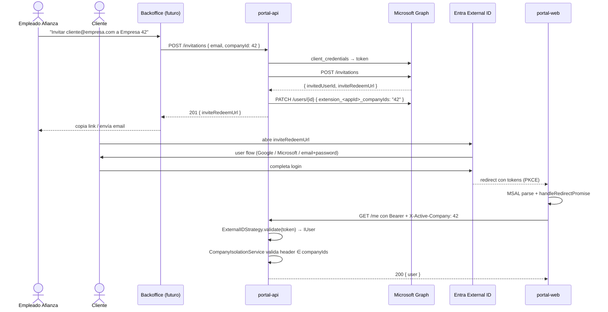

# feat: Portal cliente auth end-to-end (Entra External ID, invitación, federado, email/password)

## Summary

Cablear de extremo a extremo el flujo de autenticación del portal cliente — backend (`mp-service-portalcliente-api`) y frontend (`mp-app-portalcliente-web`) — contra Microsoft Entra External ID, replicando los modos del PoC `pd-poc-idp` pero sin firma propia de JWT y sin tocar la librería compartida `af-nest-module-auth`. El plan continúa el trabajo abierto en PR #3 del portal cliente, no lo reemplaza. Backoffice, SERPA y la librería compartida quedan explícitamente fuera de scope.

**Decisión clave del review 2026-05-19**: el flujo de invitación se ejecuta desde el backoffice del asesor llamando directamente a Microsoft Graph — NO se construye un endpoint `POST /invitations` en este backend. Eso simplifica el plan (U5 entera desaparece), elimina el problema de identidad servicio-a-servicio entre apps, y deja Microsoft Graph + sus credenciales como responsabilidad del plan del backoffice, no de este.

---

## Problem Frame

El portal cliente está siendo construido para clientes de Afianza con tres modos de alta — invitación por empleado, federado Google/Microsoft, email+contraseña — pero hoy el backend solo tiene la mitad de la validación (PR #3 con `ExternalIDStrategy` claims-only) y el frontend está vacío de auth. Sin un flujo extremo a extremo no podemos validar que la configuración del tenant Entra (audience, claims-mapping, federación, App Roles) realmente funciona, ni demostrar el aislamiento por empresa que es la propuesta de valor del portal.

Contexto adicional vive en el brainstorm origen (ver Sources & References). La decisión de no construir un IDP custom (`af-service-auth-idp` descartado 2026-05-06) y de aceptar el lock-in a Entra External ID está consolidada en wiki.

---

## Requirements

- R1. Un cliente invitado por un empleado de Afianza puede abrir el link, autenticarse contra Entra (Google, Microsoft o email+password), y entrar al portal con el `companyId` correcto poblado en el token.
- R2. El backend rechaza con 401 cualquier token cuyo issuer no sea el tenant External ID configurado, cualquier token con audience distinta a la del portal API, y cualquier token sin `preferred_username` o `email` válido.
- R3. El backend rechaza con 403 cualquier request cuyo header `X-Active-Company` no esté en el array `companyIds` del token. Comparación estricta (`includes` con string igual, no `startsWith` ni `split(',')`).
- R4. El frontend redirige al user flow de Entra cuando no hay sesión, muestra estado de carga durante la inicialización de MSAL, y refresca tokens silenciosamente cuando expiran.
- R5. Cuando el cliente pertenece a varias empresas (`companyIds.length > 1`), el frontend muestra un selector y propaga la empresa activa al backend vía header `X-Active-Company`.
- R6. (Reasignado tras review 2026-05-19) — El backend del backoffice del asesor (`pgi-service-pgi-api`) puede invitar a clientes vía Microsoft Graph y asignarles `extension_companyIds`. Este plan no construye ese endpoint; queda como dependencia del plan del backoffice. Aquí solo verificamos que un cliente invitado por ese mecanismo puede entrar al portal y aterrizar con el `companyIds` correcto.
- R7. El usuario puede registrarse por sí mismo con email+contraseña contra el user flow nativo de Entra External ID (sin firma propia de JWT en el backend).
- R8. El frontend del portal cliente sigue el mismo patrón de runtime-config (`window.__APP_CONFIG__` inyectado por nginx) que usa hoy `pgi-app-pgi-web`, sin reconstruir imagen por entorno.
- R9. Toda violación de aislamiento por empresa (403) emite un log estructurado con `userOid`, `requestedCompanyId`, `allowedCompanyIds`, `path` — sin PII (sin email, sin token).
- R10. El smoke test final cubre los 3 modos de entrada (invitación + federado, email+password) y los 2 casos de empresa (single-company, multi-company).

**Actores derivados del origen:** Cliente invitado, Empleado de Afianza, Usuario auto-registrado. (El brainstorm describe estos perfiles en prosa sin IDs formales; el plan no introduce IDs nuevos.)
**Flujos derivados del origen:** Invitación + redemption, Login federado Google/Microsoft, Sign-up email/password, Cambio de empresa activa.

---

## Scope Boundaries

- No se toca `af-nest-module-auth` en esta fase. La consolidación al módulo compartido es follow-up explícito.
- No se modifica el backoffice (`pgi-app-pgi-web` + `pgi-service-pgi-api`). Sigue validando contra Workforce v1 STS como hoy. Cuando entre la integración Graph para invitaciones, vivirá en su propio plan.
- **El endpoint `POST /invitations` queda fuera de scope** (decisión review 2026-05-19): el backoffice del asesor llama Microsoft Graph directamente. Este plan no aloja credenciales de Graph (`GRAPH_CLIENT_ID`/`GRAPH_CLIENT_SECRET`) ni controlador de invitaciones.
- SERPA (frontend y backend) no se diseña ni se toca. El plan solo prepara la base reutilizable.
- BFF (Backend-For-Frontend) con session cookie HttpOnly **no** se implementa. Se documenta como fase 2 con criterios para activarlo.
- Tokens v2 cutover para backoffice queda fuera (depende de cambiar el manifest del App Registration de Workforce).
- Logout coordinado entre apps (front-channel logout) **no** se implementa porque hoy no es fiable con third-party cookies bloqueadas. Se documenta como follow-up cuando back-channel logout sea estable en External ID.
- Continuous Access Evaluation (CAE) y DPoP fuera de scope.
- Backfill de columna `companyId` en entidades existentes — el portal cliente no tiene entidades de negocio todavía (solo el `Sample` placeholder), así que el backfill no aplica ahora.

### Deferred to Follow-Up Work

- Consolidación de auth a la librería compartida `af-nest-module-auth` — solo cuando el portal funcione end-to-end y se decida si extender la lib para multi-issuer o duplicar por servicio definitivamente.
- BFF + cookie HttpOnly del portal cliente — activación condicionada a (a) primer hallazgo de seguridad que aproveche XSS en el portal, (b) requerimiento de compliance, (c) deprecación de refresh tokens por iframe en Chrome.
- SERPA frontend + backend — separado, reutiliza el mismo tenant External ID.
- Backoffice v1 → v2 token cutover — plan dedicado con deploy gate sobre `accessTokenAcceptedVersion`.
- Front-channel logout / back-channel logout — esperar adopción estable.
- Endpoint admin de revocación de sesiones (`POST /users/{id}/revokeSignInSessions` vía Graph) — útil para offboarding, no bloqueante.

---

## Context & Research

### Relevant Code and Patterns

- `mp-service-portalcliente-api/src/application/auth/` — PR #3 ya tiene `ExternalIDStrategy` claims-only, `ExternalIDGuard`, decoradores `@PublicRoute()` y `@PermissionsRequired()`. Punto de partida del backend.
- `pgi-app-pgi-web/src/main.tsx`, `pgi-app-pgi-web/src/config.ts`, `pgi-app-pgi-web/src/contexts/auth/auth-context.tsx`, `pgi-app-pgi-web/src/services/utils/httpClient.ts`, `pgi-app-pgi-web/src/components/shared/protected-route/protected-route.tsx` — plantilla canónica del frontend (MSAL + runtime config + Axios + protected route). Se porta tal cual a `mp-app-portalcliente-web`, cambiando solo la authority (External ID en lugar de Workforce).
- `pd-poc-idp/test-backend/src/controllers/invitationController.ts` — referencia de cómo llamar a Microsoft Graph para crear invitaciones (client_credentials + POST `/invitations`). El servicio real lo hará en NestJS pero la mecánica es idéntica.
- `pd-poc-idp/test-frontend/src/auth/msalConfig.js` — referencia de configuración MSAL contra `clientesafianza.ciamlogin.com` (tenant + knownAuthorities + sessionStorage).
- `pgi-app-pgi-web/nginx/entrypoint.sh` y `Dockerfile` — patrón de inyección runtime de `window.__APP_CONFIG__` que debe replicarse en el portal cliente.

### Institutional Learnings

- Cuatro decisiones de arquitectura validadas por code review en PR #1 de `af-nest-module-auth` (wiki: `08 Resources/wiki/pages/auth-strategy-decisions-entra.md`): mantener `passport-jwt` (no `jose`), modo claims-only explícito por flag, cache de solo resultado DB (no IUser merged), un solo namespace de autorización (`permissions`, no `roles`). Las 4 se respetan en el código del PR #3 actual y deben mantenerse en cualquier cambio.
- Decisión 2026-05-07 (wiki: `idp-azure-decision.md`): Entra External ID es el IDP, asumiendo lock-in. Sin custom IDP service. Sin firma propia de JWT.
- Plan anterior `2026-05-08-001-feat-entra-auth-portal-cliente-plan.md` aporta el diseño del `CompanyIsolationService` y la validación estricta del header `X-Active-Company` — se mantienen sus decisiones de comparación (`includes` con string igual, sin split, sin startsWith).

### External References

Hallazgos clave de la investigación (mayo 2026):

- **`companyIds` debe viajar como string CSV en el token, no como array.** Entra trunca arrays al primer elemento en custom claims y tiene un techo silencioso de ~40 claims. El backend hace split al validar. (Microsoft Q&A "Custom claims not appearing in CIAM tokens"; vandsh "Portal of Lies" 2026-01-08.)
- **El token de `companyIds` es un hint, no la verdad.** Si Afianza añade una empresa a un usuario, el token viejo no se entera hasta el siguiente refresh. Patrón canónico en producción: el backend cruza el array del token con la DB de Afianza por request (defense in depth overlay). Para esta fase 1 el portal cliente no tiene aún tabla de pertenencia empresa↔usuario, así que el token es la única fuente — el overlay queda como follow-up cuando exista la tabla.
- **Multi-issuer JWT con allow-list estática.** Aunque hoy el portal valida un solo issuer, el patrón se documenta para no introducir el antipatrón "infer JWKS URI from token's iss claim" (vector de cache poisoning — WorkOS "How to validate JWT iss claim").
- **MSAL v4 (mismo que backoffice).** `@azure/msal-browser ^4.5` + `@azure/msal-react ^3.0`. Decisión review 2026-05-19: alinear con el backoffice (`pgi-app-pgi-web`) para poder reutilizar literalmente sus patrones de `main.tsx`, `auth-context`, `httpClient`. La migración a v5 será un plan dedicado cuando el backoffice también suba. `knownAuthorities: ['<tenant>.ciamlogin.com']` es obligatorio para External ID. `loginRedirect` (no popup). `cacheLocation: 'sessionStorage'`.
- **Microsoft Graph invitation flow es 2 pasos**: `POST /invitations` crea al usuario invitado y devuelve `inviteRedeemUrl`, luego `PATCH /users/{id}` para sembrar `extension_<appId>_companyIds`. Permisos de la app daemon: `User.Invite.All` + `User.ReadWrite.All` con admin consent. (Microsoft Learn "Create invitation".)
- **Federación Google y Microsoft consumer en Entra External ID**: built-in social identity providers, se configuran en el tenant y se activan por user flow. Pitfalls conocidos: identity-issuer lock-in tras redemption, embedded webviews bloqueados por Google, refresh token de 12h si el proyecto Google no está OAuth-verified.
- **CIAM tiene un único user flow combinado "sign-up & sign-in"**: email+password y social IdPs coexisten en la misma pantalla. No hay flow separado de sign-in.

---

## Key Technical Decisions

- **Tokens en navegador, no BFF, en esta fase.** Replicamos el patrón del backoffice (MSAL.js + sessionStorage) para validar end-to-end con poco coste. BFF se evalúa en fase 2 con criterios de activación explícitos (ver Scope Boundaries / Deferred). Mitigación: Content-Security-Policy estricto en el HTML del portal, tokens de corta duración, sessionStorage (no localStorage).
- **No tocar `af-nest-module-auth`.** El backend del portal usa su propio módulo de auth local (PR #3). La librería compartida se mantiene intacta para no arriesgar el backoffice productivo. La consolidación es follow-up condicionado a que el portal funcione end-to-end.
- **Email+contraseña vía user flow nativo de Entra External ID.** Sin firma propia de JWT en el backend. El backend solo valida tokens de Entra. El registro autónomo abre una página que entra en el mismo user flow del login con `?prompt=create`.
- **`companyIds` como string CSV** en el claim del token. El backend hace `parseCompanyIds()` (ya implementado en el PR #3) que soporta array, CSV y null. Configurable vía env `EXTERNAL_ID_COMPANY_IDS_CLAIM_KEY` por si el claim real lleva prefijo de appId (formato `extension_<appId>_companyIds`).
- **Validación estricta de `X-Active-Company`**: `companyIds.includes(header.trim())` — nunca `startsWith`, nunca `split(',')`. Single-company users pueden omitir el header (el backend resuelve `activeCompanyId = companyIds[0]` por defecto).
- **`CompanyIsolationService` aplicado como APP_GUARD global** (decisión review 2026-05-19): default-deny. Cualquier endpoint que no quiera aislamiento se marca explícitamente con `@SkipIsolation()`. Evita el riesgo de olvidar el guard en un controller nuevo. Healthcheck y endpoints `@PublicRoute()` ya no llegan al guard. `RequireRolesGuard` se mantiene per-decorator (no global) — solo aplica donde un endpoint pida un rol específico.
- **Ventana de revocación 1-24h aceptada y documentada** (decisión review 2026-05-19): cuando un cliente pierde acceso a una empresa (Afianza quita `extension_companyIds`), su token sigue valiendo hasta que expire — access ~1h, refresh hasta 24h con rotación. Sin overlay DB en fase 1 (no hay entidades de negocio con `companyId`). Mitigación operativa documentada en el plan de release: para casos urgentes, llamar `revokeSignInSessions` vía Graph (queda como follow-up de tooling para Afianza Ops).
- **Audit log sin PII**: violaciones de aislamiento emiten `event: 'company_isolation_violation'` con `userOid` (no email, no token), `requestedCompanyId`, `allowedCompanyIds`, `path`. Logger: `@afianza-ac/nest-module-logger`.
- **Response `403` con header `X-Reason: company-isolation`** para que el frontend pueda diferenciar 403 por empresa vs 403 por permisos y enrutar a `/no-access` vs `/forbidden`.
- **Una sola instancia de `PublicClientApplication` en el portal cliente** porque solo necesita autenticar contra External ID. La estrategia multi-PCA (External ID + Workforce) solo aplica cuando una SPA debe aceptar ambos emisores — no es el caso del portal cliente.
- **`main.tsx` async init obligatorio**: `pca.initialize() → handleRedirectPromise() → render(MsalProvider)`. Renderizar `MsalProvider` antes de `initialize()` rompe silenciosamente los redirect flows.
- **Runtime-config con `window.__APP_CONFIG__`**: nginx entrypoint inyecta `EXTERNAL_ID_TENANT`, `EXTERNAL_ID_CLIENT_ID`, `EXTERNAL_ID_AUDIENCE`, `EXTERNAL_ID_REDIRECT_URI`, `PORTAL_API_HOST` al `index.html` al arrancar el contenedor. Mismo patrón que `pgi-app-pgi-web`.
- **CORS en backend portal**: `credentials: false` (Bearer auth no requiere cookies), origen único exacto (no wildcard), `allowedHeaders` incluye `Authorization`, `Content-Type`, `X-Active-Company`.
- **CSP en `nginx/nginx.conf` del frontend** (corregido en review 2026-05-19): el portal-web ya sirve un CSP header desde nginx — el navegador hace caso a la cabecera, no a una meta CSP. La meta del `index.html` no puede relajar la del header, así que el cambio se aplica en `nginx.conf`. Política estricta que permite scripts del propio origen, conexiones al tenant `ciamlogin.com` y al API del portal, y frame al tenant para el silent refresh de MSAL. Es la compensación principal por no ir BFF.
- **Microsoft Graph fuera de este plan** (review 2026-05-19): las invitaciones las dispara el backoffice del asesor llamando Graph directamente. Este backend NO aloja `GRAPH_CLIENT_ID/SECRET/TENANT_ID` ni controlador `POST /invitations`.
- **Páginas de error como placeholder** (review 2026-05-19): `/login`, `/no-access`, `/awaiting-access`, `/forbidden`, `/auth/callback` se crean con copy mínimo funcional. Diseño visual y UX se reservan para un plan de UI específico cuando producto los priorice.

---

## Open Questions

### Resolved During Planning

- ¿Dónde vive el token? — En navegador, sessionStorage, con plan documentado de migrar a BFF si aparecen disparadores específicos.
- ¿Email+password con firma propia o user flow Entra? — User flow Entra. Decisión del usuario, alineada con el brainstorm.
- ¿Lib compartida o local? — Local en el portal cliente, igual que PR #3. La lib no se toca.
- ¿Forma del claim `companyIds`? — CSV string. Parseado server-side. Configurable la clave del claim para acomodar el formato `extension_<appId>_companyIds` que Microsoft Graph genera al registrar la directory extension.
- ¿MSAL v4 o v5? — **v4** (revisado 2026-05-19): alinear con backoffice para copy-paste limpio de patrones. v5 en plan dedicado cuando backoffice migre.
- ¿Una o varias `PublicClientApplication` en portal cliente? — Una (solo emisor External ID).
- (Revisado 2026-05-19) ¿Endpoint de invitaciones aquí o en el backoffice? — En el backoffice. Este plan no construye `POST /invitations`. U5 eliminada.
- (Revisado 2026-05-19) ¿`CompanyIsolation` per-decorator o APP_GUARD global? — Global, default-deny, opt-out con `@SkipIsolation()`.
- (Revisado 2026-05-19) ¿CSP en HTML o nginx? — En `nginx/nginx.conf` (el header del servidor manda sobre meta).

### Preconditions (bloquean inicio de la unit correspondiente)

- **U1** requiere acceso al portal Entra con permisos para gestionar el tenant `clientesafianza` (admin del tenant).
- **U2** requiere U1 completa.
- (U5 eliminada — no aplica precondition.)

### Deferred to Implementation

- Cantidad concreta de App Roles. `ClientUser` solo en fase 1. Más roles cuando aparezcan endpoints que los requieran.
- TTLs concretos de access token y refresh token. Defaults de Entra para empezar (~1h access, ~24h refresh con rotación). Microsoft recomienda 15-30 min para CIAM expuesto a internet — confirmar en U1 si lo aplicamos ya o queda para hardening pre-producción.
- Diseño visual de páginas (login, no-access, awaiting-access, forbidden, switcher). Placeholders funcionales en este plan; diseño real en plan dedicado de UI.
- Lista exacta de scopes que pide MSAL en el access token request. Para External ID con un solo App Registration de API: `[<api-client-id>/.default]` o el GUID directo como audience. Confirmar en U3.

### Pendientes tras review 2026-05-19 (decisión deliberada de aplazar)

- **Microsoft-recommended hardening pre-producción**: MFA + Conditional Access en sign-up y sign-in, WAF (Cloudflare/Akamai/Azure WAF) delante de `ciamlogin.com`, admin del tenant via B2B desde Workforce (no usuarios nativos en External ID), `revokeSignInSessions` cuando Afianza Ops necesite corte inmediato. Detalle en `08 Resources/wiki/pages/azure-recommended-practices-ciam.md`. Lista de verificación a ejecutar en U1 antes de exponer a clientes reales.
- **Goal R4 del brainstorm origen** ("reusar `af-nest-module-auth` extendida a multi-issuer") queda explícitamente no-cumplido por este plan. Sigue abierto como follow-up con trigger: "consolidar antes de implementar SERPA backend". Se documenta como goal del brainstorm sin satisfacer, no como abandonado.
- **`IUser` shape unificado** (kind + roles + companyIds). El PR #3 ya tiene la forma local; cuando se consolide en lib, alinear con el `IUser` que use backoffice.
- **Trazabilidad de las 7 preguntas abiertas del brainstorm origen**: 3 quedan abiertas tras review (TTL compliance, App Roles inventory final, POC reference reconciliation). Las otras 4 resueltas (tenant provisionado, claim shape CSV, switcher UX placeholder, logout per-app).
- **Multi-tab + extension/webview threat model**: documentado como riesgo aceptado en fase 1. Reevaluar si soporte recibe quejas reales.
- **Drift detection del tenant**: follow-up de tooling — snapshot vía Microsoft Graph en CI nightly.

---

## Output Structure

Nuevos artefactos esperados al final del plan:

```
mp-service-portalcliente-api/
├── src/application/auth/
│   ├── auth.module.ts                        (modificar — registrar APP_GUARD CompanyIsolation)
│   ├── external-id.strategy.ts               (ya existe — sin cambios)
│   ├── external-id.guard.ts                  (ya existe — sin cambios)
│   ├── company-isolation.guard.ts            (NEW — APP_GUARD global, default-deny)
│   ├── company-isolation.guard.spec.ts       (NEW)
│   ├── skip-isolation.decorator.ts           (NEW — @SkipIsolation() opt-out)
│   ├── require-roles.decorator.ts            (NEW)
│   └── require-roles.guard.ts                (NEW)
└── src/config/
    ├── default.config.ts                     (modificar — añadir cors)
    └── local.config.ts                       (modificar)

mp-app-portalcliente-web/
├── src/features/auth/
│   ├── presentation/
│   │   ├── auth-context.tsx                  (NEW)
│   │   ├── protected-route.tsx               (NEW)
│   │   └── company-switcher.tsx              (NEW)
│   └── infrastructure/
│       ├── msal-config.ts                    (NEW)
│       └── http-client.ts                    (NEW)
├── src/pages/
│   ├── login.tsx                             (NEW — placeholder funcional)
│   ├── auth-callback.tsx                     (NEW — placeholder funcional)
│   ├── no-access.tsx                         (NEW — placeholder funcional)
│   ├── awaiting-access.tsx                   (NEW — incluye botón "Reintentar" con forceRefresh)
│   └── forbidden.tsx                         (NEW — placeholder funcional)
├── src/main.tsx                              (modificar — async init + try/catch + MsalProvider)
├── src/router.tsx                            (modificar — añadir rutas auth)
├── src/config.ts                             (modificar — runtime config + msal)
├── public/js/config.template.js              (modificar — añadir vars EXTERNAL_ID_*)
├── nginx/entrypoint.sh                       (ya existe — sin cambios; envsubst ya cubre las vars nuevas)
├── nginx/nginx.conf                          (modificar — añadir connect-src ciamlogin + frame-src)
└── Dockerfile                                (ya existe — sin cambios)
```

**Decisiones del review que se reflejan aquí**: el endpoint de invitaciones desaparece, `@ActiveCompany()` se elimina (guard global no lo necesita), `audit-logger.ts` se inline en el guard (no merece módulo propio con un solo consumer), `redeem-invitation.tsx` desaparece (decisión en U1: redirectUri siempre `/auth/callback`). `entrypoint.sh` ya existe con el patrón `envsubst` correcto; el plan original lo describía mal — solo hay que añadir las vars al `config.template.js`.

---

## High-Level Technical Design

> *Esta sección ilustra la forma de la solución y es guía direccional para revisión, no especificación de implementación. El agente que ejecute debe tratarla como contexto, no como código a reproducir.*

### Diagrama de flujo — cliente invitado



### Diagrama de validación — request entrante al backend

```mermaid
flowchart TD
    Req[Request con Bearer + X-Active-Company] --> Guard[ExternalIDGuard]
    Guard -->|OPTIONS| Allow1[200]
    Guard -->|@PublicRoute| Allow2[pasa]
    Guard --> Passport[passport-jwt valida<br/>iss + aud + sig + exp]
    Passport -->|falla| Reject401[401]
    Passport -->|ok| Strategy[ExternalIDStrategy.validate<br/>parse claims → IUser]
    Strategy --> RolesGuard[RequireRolesGuard si aplica]
    RolesGuard -->|falla| Reject403a[403 forbidden]
    RolesGuard -->|ok| Isolation[CompanyIsolationService]
    Isolation -->|companyIds vacío| Reject403b[403 + X-Reason: awaiting-access]
    Isolation -->|header no en array| Reject403c[403 + X-Reason: company-isolation<br/>+ audit log]
    Isolation -->|single + sin header| Default[activeCompany = companyIds 0 ]
    Isolation -->|header ok| Accepted[req.activeCompanyId = header]
    Default --> Controller[Controller / @ActiveCompany]
    Accepted --> Controller
```

---

## Implementation Units

### U1. Configurar tenant Entra External ID + App Registrations + claims-mapping + federación

**Goal:** Dejar el tenant `clientesafianza` listo para que U2 y U3 puedan validar tokens reales: atributo `companyIds` proyectado en tokens, audience del API definida, App Roles creados, federación Google y Microsoft consumer activadas, user flow combinado sign-up/sign-in publicado.

**Requirements:** R1, R2, R6, R7.

**Dependencies:** Ninguna técnica. Bloqueada por acceso administrativo al tenant.

**Files:**
- Documentación: `mp-service-portalcliente-api/docs/entra-tenant-setup.md` (NEW — paso a paso para reproducir el setup, no es código).

**Approach:**
- Confirmar que el tenant `clientesafianza` está provisionado y operativo.
- Crear (o reutilizar) la App Registration `portal-cliente-web` (SPA, redirect URI `https://<dominio>/auth/callback` y `http://localhost:5173/auth/callback`). Marcar **assignment required = Yes**.
- Crear (o reutilizar) la App Registration `portal-cliente-api` (resource, `Expose an API` con identifier URI `api://portal-cliente-api` y un scope `access_as_user`).
- Crear App Registration `portal-cliente-graph-daemon` (confidential client) con permisos de aplicación `User.Invite.All` + `User.ReadWrite.All` con admin consent. Generar client secret. Guardar credenciales en el secret store del entorno.
- Registrar directory extension `companyIds` vía Microsoft Graph (`POST /applications/{id}/extensionProperties`) sobre la app daemon. Anotar el nombre real del claim resultante (`extension_<appIdSinGuiones>_companyIds`) — irá en `EXTERNAL_ID_COMPANY_IDS_CLAIM_KEY`.
- Configurar claims-mapping en el Enterprise Application del `portal-cliente-web` para proyectar el directory extension como claim `extension_companyIds` (o el nombre nativo si la UI no permite renombrar).
- Definir App Roles iniciales en `portal-cliente-web` (`appRoles[]` del manifest): `ClientUser` con `value: 'ClientUser'`. Otros roles se añaden en plans futuros conforme aparezcan endpoints que los requieran.
- Configurar Google como social IdP a nivel tenant (OAuth client en Google Cloud Console, redirect URI `https://login.microsoftonline.com/te/<tenantId>/oauth2/authresp`). Verificar el proyecto OAuth en Google para evitar el límite de 12h del refresh token.
- Microsoft consumer accounts: activar el built-in IdP en el tenant.
- Crear user flow "sign-up and sign-in" en External ID. Activar Google, Microsoft y Email/password como métodos de autenticación. Mapear `preferred_username`, `email`, `name`, `oid`, `roles`, `extension_companyIds` en el token output.
- Verificar con `https://jwt.ms` que un token de prueba lleva los claims esperados (issuer correcto, aud = client_id, roles array, extension claim presente).

**Execution note:** No es código. Es trabajo de configuración manual en el portal de Azure + Microsoft Graph CLI puntual para registrar el directory extension. La salida es un documento de runbook reproducible.

**Patterns to follow:**
- Comandos Graph del runbook del PoC `pd-poc-idp/GUIA_SETUP.md` (sección 2) como base.
- Wiki: `auth-strategy-decisions-entra.md` decisiones 1-4 (siguen aplicando).

**Test scenarios:**
- Happy path: generar un token de prueba vía `jwt.ms` con un usuario asignado al rol `ClientUser` y companyIds `"42"`. Verificar que el token decodificado lleva `iss`, `aud`, `roles: ['ClientUser']`, `extension_companyIds: '42'`.
- Edge case: usuario sin asignación al App Registration. Esperado: Entra rechaza el login con error 70001 ("user is not assigned to a role for the application") antes de emitir token.
- Edge case: usuario con `companyIds` vacío. Esperado: token emitido sin el claim (no string vacío). El backend lo manejará como `companyIds: []` y enrutará a `/awaiting-access`.
- Federación: login con Google → token devuelto. Verificar `iss` = External ID (no Google), `email_verified: true`, `oid` poblado.
- Federación: login con cuenta Microsoft consumer → token devuelto, `iss` = External ID.
- Email+password: registro nuevo desde el user flow → primer login → token devuelto.

**Verification:**
- Documento `docs/entra-tenant-setup.md` existe y un ingeniero distinto puede reproducir el setup desde cero siguiéndolo.
- Tokens generados desde `jwt.ms` con los 3 modos (Google, Microsoft, email+password) llegan al `clientesafianza.ciamlogin.com` con los claims esperados.
- (Eliminado tras review 2026-05-19) — verificación del flujo de invitación pasa al plan del backoffice del asesor; este plan solo prueba que un cliente ya invitado (creado por el backoffice o a mano vía admin portal) puede entrar.

---

### U2. Backend portal cliente — guard global de aislamiento, roles y audit

**Goal:** Ampliar el módulo de auth local de `mp-service-portalcliente-api` (ya iniciado en PR #3) con `CompanyIsolationGuard` aplicado como APP_GUARD global (default-deny), guard de roles per-decorator, audit log y CORS. Resultado: el backend acepta tokens reales del tenant, aplica aislamiento por empresa a todos los endpoints excepto los marcados con `@PublicRoute()` o `@SkipIsolation()`, y CORS permite al frontend del portal hablar con él.

**Requirements:** R2, R3, R9.

**Dependencies:** U1 (tenant configurado para poder validar issuer y audience reales). U1 también crea los roles iniciales (`ClientUser`), prerequisito para que U2 pueda probar `@RequireRoles`.

**Files:**
- Modify: `mp-service-portalcliente-api/src/application/auth/auth.module.ts`
- Modify: `mp-service-portalcliente-api/src/app.module.ts` (cambio explícito por la regla de CLAUDE.md — aprobación documentada en el commit y PR description)
- Modify: `mp-service-portalcliente-api/src/config/default.config.ts`
- Modify: `mp-service-portalcliente-api/src/config/local.config.ts`
- Modify: `mp-service-portalcliente-api/src/main.ts` (CORS allowedHeaders, credentials false)
- Modify: `mp-service-portalcliente-api/.env.example`
- Modify: `mp-service-portalcliente-api/src/application/rest/healthcheck/healthcheck.controller.ts` (añadir `@PublicRoute()` + `@SkipIsolation()` para que liveness/readiness no requieran auth)
- Create: `mp-service-portalcliente-api/src/application/auth/company-isolation.guard.ts`
- Create: `mp-service-portalcliente-api/src/application/auth/skip-isolation.decorator.ts`
- Create: `mp-service-portalcliente-api/src/application/auth/require-roles.decorator.ts`
- Create: `mp-service-portalcliente-api/src/application/auth/require-roles.guard.ts`
- Test: `mp-service-portalcliente-api/src/application/auth/company-isolation.guard.spec.ts`
- Test: `mp-service-portalcliente-api/src/application/auth/require-roles.guard.spec.ts`

**Approach:**
- `CompanyIsolationGuard` es `@Injectable()` (NO request-scoped — el guard se instancia una vez y opera sobre el request del `ExecutionContext`). Se registra como `APP_GUARD` después de `ExternalIDGuard` (orden: autenticación primero, aislamiento después).
- Lógica del guard:
  - Si el handler tiene `@SkipIsolation()` o `@PublicRoute()` → pasa sin validar.
  - Si `req.user` está vacío (no autenticado) → ya lo rechazó `ExternalIDGuard`, no llega aquí.
  - Si `req.user.companyIds.length === 0` → `ForbiddenException` + response header `X-Reason: awaiting-access`. NO emite audit log (es estado intermedio normal post-signup, no violación).
  - Si `companyIds.length === 1` y no hay header `X-Active-Company` → setea `req.activeCompanyId = companyIds[0]` y pasa.
  - Si hay header → comparación estricta `companyIds.includes(header.trim())`. Si OK → setea `req.activeCompanyId = header.trim()`. Si no → `ForbiddenException` + `X-Reason: company-isolation` + audit log (inline, sin wrapper).
  - Si `companyIds.length > 1` y no hay header → `BadRequestException` con mensaje claro pidiendo elegir empresa activa.
- `@SkipIsolation()`: decorator `SetMetadata` con key `skip-isolation`. Para endpoints que no operan sobre datos de empresa (healthcheck, `/me`, callbacks públicos).
- `@RequireRoles('ClientUser')` decorator + `RequireRolesGuard` (NO global, solo donde se decore). Lee `req.user.roles`. Mantiene namespace separado de `permissions` (decisión validada en wiki `auth-strategy-decisions-entra`).
- Audit log inline en el guard (sin módulo wrapper): `logger.warn({ event: 'company_isolation_violation', userOid, requestedCompanyId, allowedCompanyIds, path })`. Si en el futuro hay un segundo consumer de auditoría se extrae a un módulo.
- `app.module.ts`: registrar `{ provide: APP_GUARD, useClass: CompanyIsolationGuard }` después del `APP_GUARD` ya existente (`ExternalIDGuard`). El orden de declaración define el orden de ejecución en NestJS.
- `main.ts`: `app.enableCors({ origin: <PORTAL_WEB_ORIGIN>, credentials: false, allowedHeaders: ['Authorization', 'Content-Type', 'X-Active-Company'] })`. Validar al arrancar que el origin empieza con `https://` o es `http://localhost`.

**Execution note:** Test-first para `CompanyIsolationGuard` — la lógica de ramificación es lo más sensible del backend, se caracteriza con tests antes de tocar el código.

**Patterns to follow:**
- PR #3 ya muestra la convención de path (`src/application/auth/`), naming (`*.strategy.ts`, `*.guard.ts`), tests al lado.
- `pd-poc-idp/test-backend/src/middleware/auth.ts` solo para entender qué claims llegan en cada modo, no la mecánica.
- Plan anterior `2026-05-08-001` líneas 248-302 para los detalles de validación estricta.

**Test scenarios:**
- *Happy path — single company, sin header.* Token con `companyIds: ['42']`, request sin `X-Active-Company`. → guard pasa, `req.activeCompanyId === '42'`.
- *Happy path — multi company, header válido.* Token `['42', '99']`, header `'99'`. → guard pasa, `req.activeCompanyId === '99'`.
- *Edge case — companyIds vacío.* Token `[]`. → `ForbiddenException` con response header `X-Reason: awaiting-access`. NO audit log emitido.
- *Edge case — single company con header equivocado.* Token `['42']`, header `'99'`. → `ForbiddenException` + audit log + `X-Reason: company-isolation`.
- *Edge case — multi-company sin header.* Token `['42', '99']`, request sin header. → `BadRequestException` con mensaje pidiendo elegir empresa. NO audit log.
- *Error path — CSV injection.* Header `'42,99'`, token `['42']`. → `ForbiddenException` (no se interpreta el header como CSV).
- *Error path — prefix match.* Header `'420'`, token `['42']`. → `ForbiddenException` (rechaza `startsWith`).
- *Edge case — espacios.* Header `'  42  '`, token `['42']`. → Pasa (porque hace `.trim()`).
- *Edge case — `@SkipIsolation()` decorator.* Endpoint marcado con `@SkipIsolation()` y token sin `companyIds`. → Pasa sin validar (e.g., `/me`, healthcheck).
- *Edge case — `@PublicRoute()` decorator.* Endpoint público y request sin token. → Pasa (el guard nunca se ejecuta porque `ExternalIDGuard` ya lo deja pasar antes).
- *RequireRolesGuard happy path.* Token con `roles: ['ClientUser']` y endpoint con `@RequireRoles('ClientUser')`. → 200.
- *RequireRolesGuard 403.* Token con `roles: []` y endpoint con `@RequireRoles('ClientUser')`. → 403.
- *RequireRolesGuard no roles requeridos.* Endpoint sin `@RequireRoles`. → No falla, no intercepta.
- *Audit log shape.* Violación de aislamiento → spy de logger recibe payload con exactamente las 4 claves esperadas (`event`, `userOid`, `requestedCompanyId`, `allowedCompanyIds`, `path`), sin `email`, `name`, `token`, ni `preferred_username`.
- *CORS preflight.* `OPTIONS` con `Origin` válido y `Access-Control-Request-Headers: X-Active-Company`. → 200 con `Access-Control-Allow-Headers` que incluye `X-Active-Company`.

**Verification:**
- `npm run lint && npm run build && npm test` pasan en limpio.
- Manual con un token real generado en U1: `curl -H "Authorization: Bearer <token>" -H "X-Active-Company: 42" http://localhost:3000/sample` devuelve 200, mismo curl con `X-Active-Company: 99` devuelve 403 con `X-Reason: company-isolation` en la response.
- `curl http://localhost:3000/healthcheck` sin auth → 200 (gracias a `@PublicRoute()` + `@SkipIsolation()`).
- `curl -H "Authorization: Bearer <token>" http://localhost:3000/sample` con token `companyIds: []` → 403 con `X-Reason: awaiting-access`.

---

### U3. Frontend portal cliente — MSAL + AuthContext + httpClient + ProtectedRoute

**Goal:** Cablear MSAL.js en `mp-app-portalcliente-web` siguiendo el patrón del backoffice. Resultado: un usuario que abre el portal sin sesión es redirigido al user flow de Entra; tras autenticarse vuelve al portal con la sesión activa; las llamadas al API llevan automáticamente `Authorization: Bearer ...` y `X-Active-Company`.

**Requirements:** R4, R8.

**Dependencies:** U1 (tenant + App Registration `portal-cliente-web` con redirect URI registrado).

**Files:**
- Create: `mp-app-portalcliente-web/src/features/auth/infrastructure/msal-config.ts`
- Create: `mp-app-portalcliente-web/src/features/auth/infrastructure/http-client.ts`
- Create: `mp-app-portalcliente-web/src/features/auth/presentation/auth-context.tsx`
- Create: `mp-app-portalcliente-web/src/features/auth/presentation/protected-route.tsx`
- Create: `mp-app-portalcliente-web/src/features/auth/presentation/session-expired-toast.tsx`
- Create: `mp-app-portalcliente-web/src/pages/login.tsx`
- Create: `mp-app-portalcliente-web/src/pages/auth-callback.tsx`
- Modify: `mp-app-portalcliente-web/nginx/nginx.conf` (añadir `connect-src` + `frame-src` para ciamlogin)
- Modify: `mp-app-portalcliente-web/public/js/config.template.js` (añadir vars `EXTERNAL_ID_*` para que `envsubst` las inyecte en runtime)
- Create: `mp-app-portalcliente-web/src/pages/no-access.tsx`
- Create: `mp-app-portalcliente-web/src/pages/awaiting-access.tsx`
- Create: `mp-app-portalcliente-web/src/pages/forbidden.tsx`
- Modify: `mp-app-portalcliente-web/src/main.tsx`
- Modify: `mp-app-portalcliente-web/src/router.tsx`
- Modify: `mp-app-portalcliente-web/src/config.ts`
- Modify: `mp-app-portalcliente-web/index.html` (CSP meta)
- Modify: `mp-app-portalcliente-web/.env.example`
- Modify: `mp-app-portalcliente-web/package.json` (deps)

**Approach:**
- Dependencias nuevas: `@azure/msal-browser@^4.5.1`, `@azure/msal-react@^3.0.5`, `axios@^1`. (Versiones idénticas al backoffice — copy-paste limpio de patrones.)
- `msal-config.ts` lee de `getConfigValue()` (runtime) los valores `EXTERNAL_ID_TENANT`, `EXTERNAL_ID_TENANT_ID`, `EXTERNAL_ID_CLIENT_ID`, `EXTERNAL_ID_AUDIENCE`, `EXTERNAL_ID_REDIRECT_URI`. Compone:
  - `authority: https://${tenant}.ciamlogin.com/${tenantId}`
  - `knownAuthorities: ['${tenant}.ciamlogin.com']`
  - `redirectUri`, `postLogoutRedirectUri`
  - `cache: { cacheLocation: 'sessionStorage' }`
  - `system.allowNativeBroker: false` (nombre v4; en v5 se renombró a `allowPlatformBroker` — irrelevante porque vamos v4).
- `main.tsx` es **async con try/catch a nivel top**:
  ```
  try {
    await pca.initialize();
    await pca.handleRedirectPromise();
    pca.addEventCallback(/* LOGIN_SUCCESS → setActiveAccount */);
    createRoot(root).render(<MsalProvider>...);
  } catch (err) {
    // unhide un div oculto en index.html con copy "No se pudo iniciar sesión, recarga la página o contacta soporte"
    document.getElementById('boot-error').hidden = false;
    document.getElementById('boot-error-detail').textContent = err.message;
    // log a un sink sin React (e.g. window.console + un fetch básico a /telemetry si existe)
  }
  ```
- El `pca` se exporta para que `http-client.ts` pueda importarlo.
- `auth-context.tsx`: `AuthProvider` envuelve la app dentro de `MsalProvider`. Usa `useMsal()` para `instance`/`accounts`/`inProgress`. Estado: `user`, `isLoading`. Cuando hay `accounts[0]`, hace fetch a `GET /me` del backend del portal para obtener el `IUser` server-side (que es solo el de los claims, pero el endpoint da una indirección útil para más adelante).
- `http-client.ts`: Axios con interceptor de request:
  - Llama `pca.acquireTokenSilent({ account, scopes: msalScopes })`.
  - Cachea token en memoria con refresh anticipado (`expiration - 60s`).
  - Inyecta `Authorization: Bearer ...`.
  - Inyecta `X-Active-Company` desde `sessionStorage.getItem('activeCompanyId')` si existe.
  - Catch `InteractionRequiredAuthError` → renderiza `<SessionExpiredToast />` con CTA + auto-dismiss 4s → `pca.loginRedirect()`.
  - Interceptor de response: 401 → `pca.logoutRedirect()`. 403 con `X-Reason: company-isolation` → navega a `/no-access`. 403 con `X-Reason: awaiting-access` → navega a `/awaiting-access`.
- `protected-route.tsx`: lee del context. Si `isLoading` → spinner accesible. Si `!user` → `loginRedirect()`. Si user → children.
- `login.tsx`: si hay sesión, redirige a `/`. Si no, dispara `loginRedirect` inmediatamente. La página visible casi no se ve.
- `auth-callback.tsx`: simplemente espera a que `handleRedirectPromise` resuelva en `main.tsx` y redirige a la ruta que pidió originalmente (state `from`).
- `no-access.tsx`, `forbidden.tsx`: páginas estáticas con copy mínimo funcional (placeholder — diseño visual en plan futuro de UI).
- `awaiting-access.tsx`: **incluye botón "Reintentar"** que llama `pca.acquireTokenSilent({ scopes, forceRefresh: true })`. Si el token nuevo trae `companyIds` poblado → navega a `/`. Si sigue vacío → muestra mensaje + link mailto/contacto a Afianza Ops. Resuelve el problema del usuario invitado que vuelve antes de que su token refresque.
- `config.ts`: extender con `getConfigValue()` runtime para todas las claves de External ID, manteniendo la firma del backoffice.
- **CSP: se aplica en `nginx/nginx.conf` del portal-web, NO en `index.html`** (corrección review 2026-05-19). El nginx actual ya envía un CSP header; el navegador hace caso a la cabecera, no a una meta. Hay que modificar `nginx.conf` para añadir:
  - `connect-src` debe incluir `https://${tenant}.ciamlogin.com` y `https://login.microsoftonline.com`.
  - `frame-src` debe incluir `https://${tenant}.ciamlogin.com` (necesario para silent refresh vía iframe de MSAL).
  - El resto (`default-src 'self'`, `script-src 'self'`, `style-src 'self' 'unsafe-inline'`, `img-src 'self' data:`) se conservan de la CSP existente.
- `router.tsx`: añadir `/login`, `/auth/callback`, `/no-access`, `/awaiting-access`, `/forbidden` como rutas públicas. Resto bajo `<ProtectedRoute>`.
- Accesibilidad: región `aria-live="polite"` en el shell anuncia "Iniciando sesión", "Sesión iniciada", "Sesión caducada".

**Execution note:** El frontend no tiene test runner configurado (per `mp-app-portalcliente-web/.claude/CLAUDE.md`). Verificación manual + smoke test en U8. Si el equipo decide añadir Vitest después, esta unit es candidata clara a backfill de tests de `http-client.ts` interceptors y `auth-context.tsx`.

**Patterns to follow:**
- `pgi-app-pgi-web/src/main.tsx` — orden del init MSAL.
- `pgi-app-pgi-web/src/config.ts` — `getConfigValue()` runtime override.
- `pgi-app-pgi-web/src/contexts/auth/auth-context.tsx` — shape del context, no la lógica de DB lookup.
- `pgi-app-pgi-web/src/services/utils/httpClient.ts` — interceptors, cache de token, refresh anticipado.
- `pd-poc-idp/test-frontend/src/auth/msalConfig.js` — configuración contra `clientesafianza.ciamlogin.com`.
- Regla `mp-app-portalcliente-web/.claude/rules/design-system.md` — tokens del design system para las páginas nuevas.

**Test scenarios:**
- *Test expectation: limited.* No hay runner configurado. Validación es manual + smoke test en U8. Para tener cobertura mínima escrita aunque no se ejecute hoy:
  - Documentar checklist en `mp-app-portalcliente-web/docs/auth-smoke-checklist.md` (NEW) con los escenarios de abajo.
- Casos a cubrir manualmente:
  - *Happy path login.* Visita `/`, sin sesión → redirige a Entra → login con Google → vuelve a `/` autenticado, `accounts[0]` presente, `user` en context.
  - *Happy path refresh silencioso.* Token cerca de expirar (forzar TTL bajo en U1) → llamada al API dispara `acquireTokenSilent` que renueva sin redirect.
  - *Sesión expirada con `InteractionRequiredAuthError`.* Borrar manualmente la cookie de sesión en Entra → siguiente llamada al API → toast aparece → 4s después redirect a login.
  - *Backend 401.* Forzar 401 desde Postman al endpoint mock → frontend hace `logoutRedirect`.
  - *Backend 403 company-isolation.* Llamar con `X-Active-Company` inválida → navega a `/no-access`.
  - *Backend 403 awaiting-access.* Usuario con companyIds vacío → navega a `/awaiting-access`.
  - *Runtime config.* Build de la imagen, levantar con `EXTERNAL_ID_TENANT=clientesafianza ...` en docker env → `window.__APP_CONFIG__` poblado, MSAL arranca contra el tenant correcto sin reconstruir imagen.
  - *CSP no rompe MSAL.* DevTools sin errores de CSP en redirect a Entra, callback, llamada al API.

**Verification:**
- `npm run build` pasa en limpio.
- En local con backend de U2 corriendo: login con cuenta de prueba real (creada en U1) llega a `/` con `user` en contexto y `companyIds` poblado.

---

### U4. Selector de empresa activa (multi-company UX)

**Goal:** Cuando el usuario tiene más de una empresa, el portal muestra un selector que persiste la elección y la propaga al backend.

**Requirements:** R5.

**Dependencies:** U3 (AuthContext + httpClient operativos).

**Files:**
- Create: `mp-app-portalcliente-web/src/features/auth/presentation/company-switcher.tsx`
- Modify: `mp-app-portalcliente-web/src/features/auth/presentation/auth-context.tsx` (exponer `activeCompanyId`, `setActiveCompanyId`, `companies`)
- Modify: `mp-app-portalcliente-web/src/features/auth/infrastructure/http-client.ts` (ya lee de sessionStorage, no requiere cambios si U3 lo dejó completo)
- Modify: la shell/layout principal de la app para alojar el switcher (path exacto depende del estado actual del layout — investigar en ejecución).

**Approach:**
- `AuthContext` lee `user.companyIds` y lo expone como `companies: string[]`.
- Al montar, si `companyIds.length === 0` → navega a `/awaiting-access`. Si `length === 1` → guarda `companyIds[0]` en `sessionStorage.activeCompanyId` automáticamente. Si `length > 1` → comprueba si hay `sessionStorage.activeCompanyId` válida (en el array), si no, usa `companyIds[0]` como default y guarda.
- `CompanySwitcher` es un dropdown que solo se renderiza si `companies.length > 1`. Al cambiar, actualiza `sessionStorage.activeCompanyId`, actualiza el context, e invalida cualquier query de TanStack/Axios cacheada (en esta fase sin TanStack Query: hace `window.location.reload()` como simple fallback, marcado como TODO para cuando entre TanStack Query).
- El nombre de la empresa mostrado no viene del token (solo lleva IDs). Decisión: en fase 1 el switcher muestra los IDs directamente. Cuando exista un endpoint backend que devuelva `{ id, name }` para las empresas del usuario, se sustituye. TODO con comentario en el código.

**Patterns to follow:**
- `pgi-app-pgi-web` no tiene un equivalente directo porque los empleados no tienen multi-empresa. Diseño nuevo siguiendo el design system del portal.
- Regla `mp-app-portalcliente-web/.claude/rules/design-system.md` para los tokens visuales.

**Test scenarios:**
- *Test expectation: limited* (mismo motivo que U3). Checklist manual:
  - Usuario con 1 empresa → no se muestra switcher.
  - Usuario con 3 empresas → switcher visible con las 3 opciones, default = la primera, persistencia tras refresh.
  - Cambiar empresa → siguiente request al API lleva el header nuevo. Backend devuelve datos de la nueva empresa.
  - Manipular `sessionStorage.activeCompanyId` con un valor fuera del array → el AuthContext lo detecta y reescribe al default. No deja un valor inválido vivo.
  - Empresa quitada del usuario (forzar `companyIds: ['42']` después de tener `'99'` en sessionStorage) → el switcher resetea a `'42'`.

**Verification:**
- Manual con dos cuentas: una con `companyIds: '42'`, otra con `'42,99'`. La primera no ve switcher, la segunda sí. Cambiar el switcher en la segunda y ver que el backend responde con los datos correctos.

---

### U5. Endpoint de invitación vía Microsoft Graph

**[U5 ELIMINADA tras review 2026-05-19]**

El plan original incluía un endpoint `POST /invitations` en este backend que llamaba a Microsoft Graph para crear invitaciones y asignar `extension_companyIds`. Tras review, esta responsabilidad se reasigna al backoffice del asesor (`pgi-service-pgi-api`):

- El backoffice ya autentica empleados de Afianza contra el tenant Workforce — son los actores naturales que invitan clientes. Pretender que un cliente con rol `ClientAdmin` en External ID hiciera la invitación cruzaba dominios de identidad y rompía la frontera de scope del plan.
- El backoffice ya tiene credenciales y patrones para llamar a Microsoft Graph (`pd-service-azuread-adapter` está ahí cerca con permisos análogos).
- Eliminar U5 elimina también: el endpoint, el `graph-client.ts` y su spec, el `invitations.service.ts` y su spec, el `invitations.controller.ts` y DTOs, la gestión de `GRAPH_CLIENT_SECRET` en el backend del portal, los riesgos asociados (saga de 2 pasos, idempotencia, enumeración de emails vía 409, rotación de secret con permisos `User.ReadWrite.All`).
- **R6 se reformula**: este plan no construye el flujo de invitación; solo verifica que un cliente invitado por el backoffice puede entrar al portal con `companyIds` poblado. El diseño concreto del flujo Graph + su saga + manejo de fallos parciales vive en el plan del backoffice.
- **Follow-up obligatorio**: documentar en el plan del backoffice (cuando se escriba) las recomendaciones que salieron del review: (a) invertir orden Graph (asignar `extension_companyIds` ANTES de crear invitación) o usar compensating transaction, (b) mapear 409 a respuesta no-diferenciable para evitar enumeración de emails, (c) `inviteRedeemUrl` es bearer URL — política de canales seguros para enviarlo, (d) `GRAPH_CLIENT_SECRET` con expiración ≤90 días + procedimiento de rotación + Azure Key Vault como secret store.

Para fase 1, las invitaciones se hacen a mano vía admin portal de Entra (documentado en U1 runbook). Cuando el plan del backoffice priorice el endpoint Graph, este plan queda intacto.

---

### U6. Página de login con punto de entrada único + decisión de hints (validada en U1)

**Goal:** El frontend tiene UNA página de login que dispara `loginRedirect` y deja que Entra muestre su pantalla de sign-up/sign-in combinada (con los IdPs configurados). Los hints (`domain_hint`, `prompt=create`) son condicionales — solo se añaden si U1 verificó que producen efecto en el user flow real, si no, una sola pantalla.

**Requirements:** R1, R7.

**Dependencies:** U3 (MSAL operativo), U1 (verificación de qué hints aplican).

**Files:**
- Modify: `mp-app-portalcliente-web/src/pages/login.tsx` (creado vacío en U3) — añadir CTAs según resultado de U1.
- Modify: `mp-app-portalcliente-web/src/pages/auth-callback.tsx` — manejar error de redemption.

**Approach:**
- En Entra External ID el user flow es uno solo (sign-up & sign-in combinado). Por defecto: **un solo botón "Iniciar sesión / Crear cuenta"** que dispara `pca.loginRedirect({ scopes })` y Entra muestra todos los IdPs activados en su pantalla.
- **Hints condicionales** (solo si U1 verificó que funcionan):
  - "Continuar con Google" → `domain_hint: 'google.com'` — verificar en U1 contra el IdP configurado.
  - "Continuar con Microsoft" → la nota de research apunta a que `domain_hint: 'live.com'` puede no matchear con el IdP de Microsoft consumer en External ID; U1 debe confirmar el valor real (puede ser el `displayName` del IdP o un identificador específico).
  - "Crear cuenta" → `prompt: 'create'` — verificar que el user flow lo soporta. Si no funciona, fusionar con el botón único.
- Si los hints no funcionan, **se queda un solo botón**. Decisión deliberada para no generar UI redundante que confunda al usuario.
- `auth-callback.tsx` maneja error de redemption (AADSTS165000): muestra mensaje guiado en `/login` con copy "Tu invitación ha expirado o ya se usó. Contacta a Afianza." (placeholder funcional — diseño en plan futuro de UI).

**Execution note:** El primer paso de U6 es ejecutar la verificación de hints en U1 (curl a `https://jwt.ms` con cada combinación de query params). Si el resultado es "los hints no hacen nada distinto", se simplifica a un solo botón y se elimina el resto.

**Patterns to follow:**
- `pd-poc-idp/test-frontend/src/pages/Login.js` — sólo inspiración. La diferencia: PoC tenía 2 botones porque eran 2 tenants distintos (B2C + Workforce); aquí es 1 tenant con varios IdPs internos, semántica distinta.

**Test scenarios:**
- *Manual — happy path único botón.* Click → redirect a Entra → pantalla con todos los IdPs activos → completar → vuelve autenticado.
- *Manual — Google si el hint funciona.* Click "Continuar con Google" → Entra fuerza Google sin pantalla intermedia → vuelve autenticado. Si la pantalla intermedia aparece igual, el hint NO funciona → eliminar el botón.
- *Manual — sign-up.* Si `prompt=create` funciona, click "Crear cuenta" abre Entra en modo sign-up. Si no, único botón cubre el caso.
- *Edge — invitación expirada (AADSTS165000).* Callback ve el error → muestra mensaje guiado.

**Verification:**
- Demo manual: login normal completa el flujo. Si hints funcionan, demo de cada uno. Si no, justificación de por qué solo un botón.

---

### U7. Docker + nginx con runtime config injection

**Goal:** El frontend del portal cliente recibe la configuración de Entra en tiempo de arranque del contenedor vía variables de entorno, sin reconstruir imagen por entorno. **El portal-web YA TIENE ese patrón cableado** (mismo que backoffice): `nginx/entrypoint.sh` con `envsubst` sobre `public/js/config.template.js`. Esta unit solo extiende `config.template.js` con las variables nuevas de Entra y actualiza `nginx.conf` con la CSP.

**Requirements:** R8.

**Dependencies:** U3 (config.ts ya extendido con `getConfigValue`).

**Files:**
- Modify: `mp-app-portalcliente-web/public/js/config.template.js` (añadir `EXTERNAL_ID_TENANT`, `EXTERNAL_ID_TENANT_ID`, `EXTERNAL_ID_CLIENT_ID`, `EXTERNAL_ID_AUDIENCE`, `EXTERNAL_ID_REDIRECT_URI`, `PORTAL_API_HOST`, `PORTAL_WEB_ORIGIN` como placeholders `${VAR_NAME}` para `envsubst`).
- Modify: `mp-app-portalcliente-web/nginx/nginx.conf` (ya hecho en U3 — añadir `connect-src`/`frame-src` ciamlogin a la CSP existente).
- Modify: `mp-app-portalcliente-web/.env.example` (documentar las vars de runtime).
- (`nginx/entrypoint.sh` ya existe con la sustitución correcta — NO se toca.)
- (`Dockerfile` ya existe con multi-stage `node:24-alpine` builder + `nginx:alpine` runtime — NO se toca.)

**Approach:**
- El patrón actual: el `Dockerfile` copia `public/js/config.template.js` al contenedor. `entrypoint.sh` en startup hace `envsubst < /usr/share/nginx/html/js/config.template.js > /usr/share/nginx/html/js/config.js` reemplazando los placeholders `${VAR}` con env-vars del contenedor. `index.html` ya carga `<script src="/js/config.js" type="module" defer></script>` que define `window.__APP_CONFIG__`.
- Para esta unit: editar `config.template.js` añadiendo las 7 keys nuevas. Ejemplo:
  ```js
  window.__APP_CONFIG__ = {
    API_HOST: '${PORTAL_API_HOST}',
    EXTERNAL_ID_TENANT: '${EXTERNAL_ID_TENANT}',
    EXTERNAL_ID_TENANT_ID: '${EXTERNAL_ID_TENANT_ID}',
    EXTERNAL_ID_CLIENT_ID: '${EXTERNAL_ID_CLIENT_ID}',
    EXTERNAL_ID_AUDIENCE: '${EXTERNAL_ID_AUDIENCE}',
    EXTERNAL_ID_REDIRECT_URI: '${EXTERNAL_ID_REDIRECT_URI}',
    PORTAL_WEB_ORIGIN: '${PORTAL_WEB_ORIGIN}',
  };
  ```
- Si una env-var no existe en el contenedor, `envsubst` la deja vacía (`''`). El frontend detecta string vacío en `getConfigValue` y muestra "configuración incompleta" en login.
- `nginx.conf` (modificación heredada de U3): la CSP existente se extiende con `connect-src 'self' https://${tenant}.ciamlogin.com https://login.microsoftonline.com` y `frame-src https://${tenant}.ciamlogin.com`. El resto de directivas (`default-src`, `script-src`, `style-src`, `img-src`) se mantienen como estaban.
- Documentar en `.env.example` qué variables son build-time (ninguna) vs runtime (las 7 de arriba).

**Patterns to follow:**
- `pgi-app-pgi-web/Dockerfile`, `pgi-app-pgi-web/nginx/entrypoint.sh`, `pgi-app-pgi-web/nginx/nginx.conf` — copiar y adaptar nombres de variables.

**Test scenarios:**
- *Happy path build + run local.*
  - `docker build -t portal-web .`
  - `docker run -e EXTERNAL_ID_TENANT=clientesafianza -e EXTERNAL_ID_CLIENT_ID=... -p 8080:8080 portal-web`
  - Abrir `http://localhost:8080`. DevTools console: `window.__APP_CONFIG__` poblado. MSAL inicializa contra el tenant correcto.
- *Edge — variable faltante.* Arrancar sin `EXTERNAL_ID_CLIENT_ID`. El entrypoint loguea warning + `window.__APP_CONFIG__.EXTERNAL_ID_CLIENT_ID = ''`. La SPA detecta y muestra "Configuración incompleta, contacta al administrador" en la página de login.
- *Edge — variables con caracteres especiales.* `EXTERNAL_ID_REDIRECT_URI="https://portal.afianza.com/auth/callback?foo=bar"` — el sed escapa correctamente.

**Verification:**
- Imagen levanta y sirve el portal con MSAL inicializando contra Entra real.
- Cambiar `EXTERNAL_ID_TENANT` a uno inválido y reiniciar el contenedor (sin reconstruir) → la SPA refleja el cambio.

---

### U8. Smoke test end-to-end de los 3 modos

**Goal:** Validar manualmente que los 3 modos del PoC funcionan en los servicios reales: invitación + redemption, login federado Google, login email+password. Producir un checklist reproducible que pueda ejecutar otro ingeniero antes de cualquier release del portal.

**Requirements:** R1, R10.

**Dependencies:** U1, U2, U3, U4, U6, U7 todos completados y desplegados a un entorno (local o staging). (U5 eliminada — invitación se hace a mano vía admin portal en fase 1.)

**Files:**
- Create: `mp-service-portalcliente-api/docs/auth-smoke-checklist.md`

**Approach:**
- Crear un documento de checklist con tres bloques + un bloque transversal de seguridad.
- Cada caso se ejecuta de principio a fin con curl/navegador + observación manual de logs.

**Test scenarios:**

**Matriz a cubrir** (3 modos × 2 casos de empresa + bloque transversal de seguridad). Cada celda firma fecha + ingeniero en el checklist.

**Bloque A — Invitación (R1)**
- Pre-requisito: un empleado creó manualmente una invitación vía admin portal de Entra para `cliente@test.com` con `extension_companyIds` asignada a `42`. (Cuando el plan del backoffice tenga el endpoint Graph, se sustituye este paso por la llamada del backoffice.)
- A1 (single company): cliente abre `inviteRedeemUrl` → Entra → completar redemption → `/auth/callback` → portal cargado. `/me` (o `/sample` con `@SkipIsolation` durante smoke) → 200 con `companyIds: ['42']`. Header `X-Active-Company: 42` auto-añadido (single).
- A2 (multi company): repetir con un usuario invitado a 2 empresas (`'42,99'`). Portal muestra el switcher. Cambio de empresa → siguiente request lleva header nuevo y backend responde 200.

**Bloque B — Login federado Google (R1)**
- B1 (single): cliente con cuenta Google ya pre-asignada a `42`. Click "Continuar con Google" (si hint funciona, si no, botón único) → flow Google → vuelve autenticado. `iss` = External ID. Roles `['ClientUser']`.
- B2 (multi): repetir con Google federada y `companyIds: '42,99'`. Switcher visible y operativo.

**Bloque C — Login federado Microsoft (R1)**
- C1 + C2: análogo a Google con cuenta Microsoft consumer (e.g. `@outlook.com`).

**Bloque D — Email+password (R7)**
- D1 (single): registro autónomo desde `/login` → user flow Entra → completar formulario email+password+atributos → primer login → portal cargado con `companyIds: []` → backend devuelve 403 `awaiting-access` → frontend navega a `/awaiting-access` con botón Reintentar. Empleado asigna `42` vía admin portal. Cliente pulsa Reintentar → `acquireTokenSilent(forceRefresh: true)` → nuevo token con `companyIds: ['42']` → entra al portal.
- D2 (multi): mismo flujo pero con empleado asignando `'42,99'`.

**Bloque E — Aislamiento y seguridad (R2, R3, R9)** (independiente del modo de entrada)
- Bearer alterado (último carácter cambiado) → 401.
- Token con `aud` de otro App Registration → 401.
- Multi-empresa con `companyIds: ['42', '99']` y `X-Active-Company: 7` → 403 + `X-Reason: company-isolation` + log estructurado verificado en stdout del servicio (sin email).
- CSV injection: `X-Active-Company: '42,99'` con token `['42']` → 403.
- Prefix match: `X-Active-Company: '420'` con token `['42']` → 403.
- Sin header con multi-empresa: → 400 (BadRequestException pidiendo elegir empresa).
- Empty companyIds: → 403 con `X-Reason: awaiting-access` → frontend a `/awaiting-access`.
- Endpoint con `@SkipIsolation()` (healthcheck) sin token → 200.

**Verification:**
- Checklist completo ejecutado y firmado (fecha + ingeniero) en el documento.
- Cualquier bloqueo del checklist es un release blocker.

---

## System-Wide Impact

- **Interaction graph:** dos `APP_GUARD` globales en el backend en orden: `ExternalIDGuard` (autenticación) → `CompanyIsolationGuard` (aislamiento, default-deny). `RequireRolesGuard` se aplica per-decorator donde un endpoint declara `@RequireRoles(...)`. Endpoints con `@PublicRoute()` saltan ambos APP_GUARD; con `@SkipIsolation()` saltan solo el de aislamiento. El frontend se integra a través de `MsalProvider` envolviendo el router actual.
- **Error propagation:** 401 desde el backend → `logoutRedirect` en frontend. 403 con `X-Reason: company-isolation` → `/no-access`. 403 con `X-Reason: awaiting-access` → `/awaiting-access` (con botón Reintentar que fuerza refresh). Otros 403 → `/forbidden`. 400 (multi-empresa sin header) → mensaje inline pidiendo seleccionar empresa.
- **State lifecycle risks:** MSAL en frontend cachea en `sessionStorage` — se pierde al cerrar la pestaña (intencional). Tras revocación de acceso a una empresa, ventana de hasta 1h (access token) / 24h (refresh) en la que el cliente aún ve datos de esa empresa. Aceptado para fase 1, documentado para Afianza Ops como riesgo conocido con mitigación operativa (`revokeSignInSessions` vía admin portal).
- **API surface parity:** `mp-service-portalcliente-api` no tenía endpoints autenticados antes. Ahora todo está protegido por dos `APP_GUARD` salvo lo marcado con `@PublicRoute()` (healthcheck) o `@SkipIsolation()` (endpoints sin contexto de empresa como `/me` futuro).
- **Integration coverage:** el smoke test (U8) es la prueba de integración real. No hay tests automatizados E2E hoy.
- **Unchanged invariants:** `af-nest-module-auth` no se modifica — backoffice y `pgi-service-pgi-api` no cambian su comportamiento. PoC `pd-poc-idp` no se toca. SERPA no existe aún. El backoffice frontend no cambia su MSAL ni su httpClient.

---

## Risks & Dependencies

| Riesgo | Mitigación |
|---|---|
| Configuración del tenant Entra mal hecha bloquea el resto del plan. | U1 como primera unit con runbook documentado y verificación vía `jwt.ms` antes de pasar a U2. |
| Microsoft Graph cambia el shape del directory extension claim entre setup y deploy. | `EXTERNAL_ID_COMPANY_IDS_CLAIM_KEY` configurable; cambio sin redeploy. |
| **Ventana de revocación 1-24h** (sin overlay DB en fase 1). | Aceptado y documentado en Key Technical Decisions. Mitigación operativa: `revokeSignInSessions` vía Graph cuando Afianza necesita corte inmediato (queda como tooling follow-up). Cuando entren entidades de negocio con `companyId`, añadir overlay DB. |
| **Aislamiento default-deny puede bloquear endpoints nuevos por olvido de `@SkipIsolation()`** cuando aplique. | Aceptado como tradeoff: fallar cerrado es mejor que abierto. Documentar la regla en `mp-service-portalcliente-api/.claude/CLAUDE.md`: "todo endpoint nuevo evalúa explícitamente si necesita `@SkipIsolation()`". |
| Embedded webviews bloqueados por Google rompen la federación en algún flujo móvil. | Documentar en `/login` que se requiere navegador del sistema. Aceptado para fase 1. |
| Refresh token de Google caduca a las 12h si el proyecto no está OAuth-verified. | U1 incluye paso de "verificar el proyecto Google en OAuth consent screen" — bloqueante antes de exponer a clientes reales. |
| Identity-issuer lock-in tras redimir (usuario invitado con Google, intenta luego Microsoft → silenciosamente vuelve a Google). | Documentar como troubleshooting. Reset mediante `revokeSignInSessions` + reinvitación si el cliente lo pide. |
| Token de invitación (`inviteRedeemUrl`) es bearer URL — quien lo tenga puede redimir. | Mitigación de scope: este plan no genera invitaciones. El plan del backoffice (cuando llegue) define política de canal seguro de envío. Para fase 1 las invitaciones manuales del admin portal envían el link al email del invitado vía Microsoft Graph. |
| Tokens MSAL en `sessionStorage` robados vía XSS. | CSP en `nginx.conf` extendida con `connect-src`/`frame-src` ciamlogin. Sin scripts inline en el bundle. Sin librerías de terceros sin auditar. Tokens de corta duración (TTL Entra por defecto). Migración a BFF como fase 2 si aparecen disparadores documentados. |
| **`main.tsx` async init falla** silenciosamente (network blip, MSAL initialize throws). | Try/catch a nivel top en `main.tsx` (especificado en U3). Pre-React error shell oculto en `index.html` se hace visible si falla. Logging al sink que no requiere React. |
| **Multi-tab redirect race**: dos pestañas en login simultáneo. | Documentado como limitación conocida en `auth-smoke-checklist.md`. MSAL v4 maneja el `InteractionInProgress` con timeouts; en producción raro. Si afecta soporte, considerar BroadcastChannel en fase 2. |
| Cache poisoning vía `iss` del token (multi-issuer futuro). | El backend hoy valida un solo issuer hardcoded. Si se añade un segundo, mantener allow-list estática — nunca derivar JWKS URI del claim. Patrón documentado para SERPA cuando entre. |
| `companyIds` truncado a primer elemento por bug conocido en arrays de Entra. | CSV string, no array. `parseCompanyIds()` soporta ambos por compatibilidad pero el caso productivo es CSV. |
| `app.module.ts` requiere aprobación explícita por regla del CLAUDE.md del repo. | Cambios mínimos. Mencionar en el PR descriptivo y en el commit. |
| Multi-company UX sin nombres de empresa (solo IDs en fase 1). | Aceptado para fase 1, marcado como TODO en el código con referencia explícita a un endpoint backend futuro. |
| **Self-service signup acumula usuarios sin empresa**. | Solo CTA de "Crear cuenta" si U1 verifica que `prompt=create` funciona. Sin endpoint admin de aprobación en fase 1 — Afianza Ops decide a mano por admin portal. Si volumen molesta, fase 2 puede añadir domain allow-list al user flow o esconder el CTA. |
| **Drift del tenant entre staging y prod** sin detection automatizado. | Aceptado para fase 1. Runbook en `docs/entra-tenant-setup.md` se ejecuta en ambos entornos. Follow-up: snapshot del tenant config vía Microsoft Graph en CI nightly. |

---

## Documentation / Operational Notes

- `mp-service-portalcliente-api/docs/entra-tenant-setup.md` (U1) — runbook reproducible del setup del tenant.
- `mp-service-portalcliente-api/docs/auth-smoke-checklist.md` (U8) — checklist de release.
- `mp-app-portalcliente-web/docs/auth-smoke-checklist.md` (U3) — checklist de validación manual frontend.
- Variables nuevas en secret store / docker secrets:
  - Backend portal: `EXTERNAL_ID_TENANT`, `EXTERNAL_ID_AUDIENCE`, `EXTERNAL_ID_COMPANY_IDS_CLAIM_KEY`, `PORTAL_WEB_ORIGIN`. (Variables Graph se reasignan al plan del backoffice.)
  - Frontend portal: `EXTERNAL_ID_TENANT`, `EXTERNAL_ID_TENANT_ID`, `EXTERNAL_ID_CLIENT_ID`, `EXTERNAL_ID_AUDIENCE`, `EXTERNAL_ID_REDIRECT_URI`, `PORTAL_API_HOST`, `PORTAL_WEB_ORIGIN`.
- Monitoring: hay que añadir métricas/alertas para `event: 'company_isolation_violation'` (anómalo si pasa > N veces/hora).
- Logging: todos los logs estructurados pasan por `@afianza-ac/nest-module-logger` (ya integrado). Sin PII en violaciones de aislamiento.
- Capturar al cierre del plan dos páginas nuevas en la wiki (regla `feedback_capture_code_sessions.md`): (a) configuración de federación Google en External ID (sigue siendo hueco no cubierto en wiki), (b) decisión "MSAL v4 en todos los frontends Afianza hasta plan de migración a v5".
- **Regla de proyecto añadida**: en `mp-service-portalcliente-api/.claude/CLAUDE.md` documentar que cada endpoint nuevo evalúa explícitamente si necesita `@SkipIsolation()`. El aislamiento es default-deny.

---

## Sources & References

- **Origin document:** [docs/brainstorms/2026-05-08-entra-multi-app-auth-requirements.md](../brainstorms/2026-05-08-entra-multi-app-auth-requirements.md)
- **Plan relacionado:** [docs/plans/2026-05-08-001-feat-entra-auth-portal-cliente-plan.md](2026-05-08-001-feat-entra-auth-portal-cliente-plan.md) (plan anterior; aporta diseño del `CompanyIsolationService` y validación estricta del header, queda fuera de scope para ejecución pero útil como contexto).
- **PR de partida:** [afianza-ac/pc-service-portalcliente-api#3](https://github.com/afianza-ac/pc-service-portalcliente-api/pull/3) (`feat/external-id-auth`).
- **Wiki — decisiones validadas:** `08 Resources/wiki/pages/auth-strategy-decisions-entra.md`, `idp-azure-decision.md`, `idp-entra-direct-integration.md`.
- **PoC referencia:** `/Users/sito/Documents/pd-poc-idp/` — específicamente `test-backend/src/middleware/auth.ts`, `test-backend/src/controllers/invitationController.ts`, `test-frontend/src/auth/msalConfig.js`, `GUIA_SETUP.md`.
- **Frontend plantilla:** `pgi-app-pgi-web/src/{main.tsx, config.ts, contexts/auth/auth-context.tsx, services/utils/httpClient.ts, components/shared/protected-route/protected-route.tsx}` + `pgi-app-pgi-web/nginx/entrypoint.sh`.
- **Microsoft docs clave:**
  - [Create a user flow (External ID)](https://learn.microsoft.com/en-us/entra/external-id/customers/how-to-user-flow-sign-up-sign-in-customers)
  - [Add attributes to token claims](https://learn.microsoft.com/en-us/entra/external-id/customers/how-to-add-attributes-to-token)
  - [Add Google as identity provider (customers)](https://learn.microsoft.com/en-us/entra/external-id/customers/how-to-google-federation-customers)
  - [Create invitation — Microsoft Graph v1.0](https://learn.microsoft.com/en-us/graph/api/invitation-post?view=graph-rest-1.0)
  - [B2B collaboration API and customization](https://learn.microsoft.com/en-us/entra/external-id/customize-invitation-api)
  - [Caching in MSAL.js](https://learn.microsoft.com/en-us/entra/msal/javascript/browser/caching)
  - [Initialize MSAL.js client apps](https://learn.microsoft.com/en-us/entra/identity-platform/msal-js-initializing-client-applications)
- **Industria — best practices:**
  - [IETF draft-ietf-oauth-browser-based-apps-26 (dic 2025)](https://datatracker.ietf.org/doc/html/draft-ietf-oauth-browser-based-apps)
  - [OWASP Multi-Tenant Security Cheat Sheet](https://cheatsheetseries.owasp.org/cheatsheets/Multi_Tenant_Security_Cheat_Sheet.html)
  - [WorkOS — How to validate JWT iss claim](https://workos.com/blog/how-to-validate-the-jwt-iss-claim)
  - [vandsh — Entra External ID Custom Attributes and the Portal of Lies](https://vandsh.dev/azure/2026/01/08/entra-external-id-custom-attributes.html)
