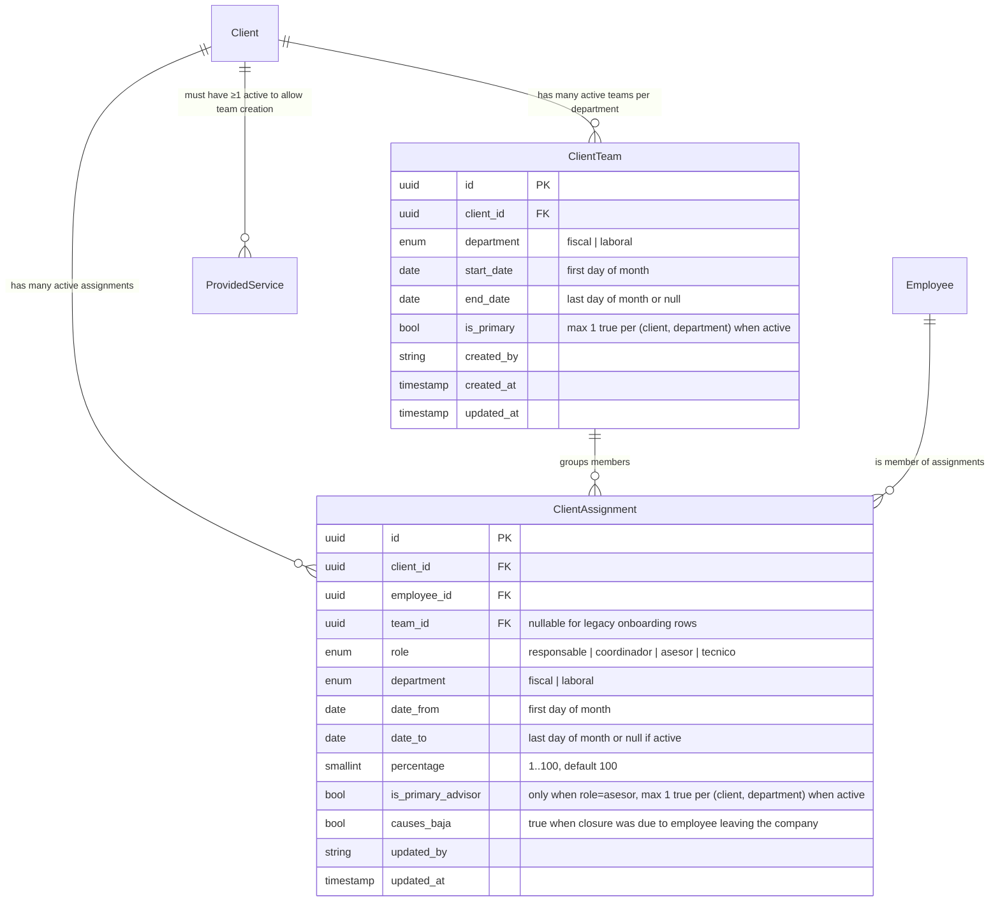

# Data Model — Asignaciones múltiples (DEVPT-518)

**Fase**: 1 (Design & Contracts)

## Diagrama de entidades



## Entities

### ClientTeam

Representa un equipo de trabajo de un cliente en un departamento. Un cliente puede tener N teams activos por departamento (confirmado en frame `08-multi-equipo/01`). No tiene `name` persistido en BD (decisión PO 2026-06-01).

**Atributos**:

| Campo | Tipo | Reglas |
|---|---|---|
| `id` | UUID PK | Generado |
| `clientId` | UUID FK → Client | Required |
| `department` | enum | `fiscal` o `laboral` (cerrado, de `@afianza-ac/lib-core-definitions`) |
| `startDate` | date | Primer día del mes |
| `endDate` | date \| null | Último día del mes, o null si activo |
| `isPrimary` | bool | Default `false`. Máximo uno con `true` por `(clientId, department)` activo |
| `createdBy` | string | Email del actor |
| `createdAt` | timestamp | Auto |
| `updatedAt` | timestamp | Auto (para optimistic concurrency) |

**Constraints**:
- Partial unique opcional: `(client_id, department, is_primary) WHERE is_primary = true AND end_date IS NULL` — máximo un team principal activo por (cliente, departamento).
- No hay unique en `name` (no existe `name`).

**State transitions**:
- `active` → `closed`: setear `endDate`, irreversible (FR-009).
- No reapertura — para reanudar atención crear nuevo team.

### ClientAssignment

Representa la pertenencia de un empleado a un equipo de cliente en un rol. Modelo extendido sobre el existente en `pgi-service-pgi-api`.

**Atributos**:

| Campo | Tipo | Reglas |
|---|---|---|
| `id` | UUID PK | Generado |
| `clientId` | UUID FK → Client | Required |
| `employeeId` | UUID FK → Employee | Required |
| `teamId` | UUID FK → ClientTeam | **Nullable** (legacy `system:onboarding` puede crear sin team) |
| `role` | enum | `responsable` \| `coordinador` \| `asesor` \| `tecnico` |
| `department` | enum | `fiscal` \| `laboral` |
| `dateFrom` | date | Primer día del mes |
| `dateTo` | date \| null | Último día del mes, o null si activo |
| `percentage` | smallint | 1..100, default 100 (CHECK constraint ya existe) |
| `isPrimaryAdvisor` | bool | Default `false`. Solo aplica si `role = asesor`. Máximo uno con `true` por `(clientId, department)` activo |
| `causesBaja` | bool | Default `false`. Se setea a `true` al cerrar si el responsable indica que el empleado deja la empresa (dispara reasignación a sucesor) |
| `updatedBy` | string | Email del actor o `system:onboarding` |
| `updatedAt` | timestamp | Auto (optimistic concurrency) |

**Constraints**:
- Existente: `(client, employee, role, department, dateFrom) UNIQUE` (sin cambios).
- **NUEVO partial unique**: `(client_id, employee_id) WHERE date_to IS NULL` — una persona puede tener máximo UNA asignación activa al mismo cliente (FR-016 + FR-021 — decisión PO 2026-06-01 opción B). Esto refuerza la regla de "un empleado, un equipo por cliente, ni siquiera entre departamentos". **NOTA T1**: este constraint requiere que `applyFromClientOnboarding` cierre la fila activa existente (con `dateTo`) ANTES de insertar la nueva — ver sección "Onboarding bridge" abajo y test de regresión obligatorio.
- Existente: CHECK `percentage >= 1 AND percentage <= 100` (sin cambios).
- Partial unique nuevo: `(client_id, department, is_primary_advisor) WHERE is_primary_advisor = true AND date_to IS NULL` — máximo un asesor principal activo por (cliente, departamento).
- **NUEVO CHECK T2a**: `CHECK (is_primary_advisor = false OR role = 'asesor')` — flag solo aplica a asesores. Evita que un bug en el servicio marque coordinador/técnico como principal silenciosamente.
- **NUEVO CHECK T2b**: `CHECK (causes_baja = false OR date_to IS NOT NULL)` — `causesBaja` solo significa algo en una asignación cerrada. Una fila activa con `causes_baja=true` es estado inválido.

**Reglas de validación a nivel servicio (no BD)**:
- `isPrimaryAdvisor = true` solo permitido si `role = asesor` (CHECK BD lo garantiza también — ver T2a arriba).
- Si se cierra una asignación con `causesBaja = true`, el servicio dispara `reassignOpenTasksToSuccessor(employeeId, clientId, department)`. **El payload de cierre DEBE incluir `successorId` cuando `causesBaja=true`** (resolución T3 — el sucesor es decisión explícita del responsable, no inferencia silenciosa). Si `successorId` es null en el cierre con baja, el endpoint devuelve `400 SUCCESSOR_REQUIRED` con un campo `suggestedSuccessorId` calculado por temporalidad (asesor con `dateFrom > current.dateTo` más antiguo en el mismo `(client, department)`). El frontend puede pre-rellenar el diálogo con esa sugerencia.
- **Cierre de team — transactionality (T4)**: el endpoint `POST /teams/{id}/close` (ver `contracts/client-teams-api.md`) DEBE ejecutar la mutación (team.endDate + N assignments.dateTo) dentro de un único `em.transactional(async txEm => { ... })`. AMQP publish va **post-commit** (en el `.then()` del transactional o vía outbox cuando D-005 se resuelva). Si falla el commit, no se emite ningún evento.
- **Cálculo de DepartmentBucketStatus — locking (T8)**: el cómputo del estado del bucket dentro de una transacción que puede disparar transición `incomplete → active` DEBE adquirir `SELECT ... FOR UPDATE` sobre la fila padre `client` antes de leer las asignaciones. Esto serializa concurrent PATCH /members sobre el mismo cliente+departamento y garantiza "exactamente un evento por transición".
- **At-least-one primary team (T6)**: al crear el PRIMER `ClientTeam` para un `(clientId, department)`, el servicio DEBE marcar `isPrimary = true` automáticamente. Subsequent teams default `false`. El responsable puede demote/promote después vía PATCH. Esto garantiza que jira-adapter siempre tiene un team principal que sincronizar (FR-020).

**State transitions**:
- `active` (date_to IS NULL) → `closed` (date_to populated). Inmutable después.

### DepartmentBucketStatus (derived — no entity)

Estado derivado calculado por el servicio. No es entidad — vive solo en respuesta API y en cache frontend.

**Cálculo**:

```typescript
function getDepartmentBucketStatus(clientId, department): {
  asesoresSum: number;       // suma % asesores activos en TODOS los teams del dept
  asesoresStatus: 'incomplete' | 'complete' | 'overflow'; // < 100 | === 100 | > 100
  tecnicosSum: number;       // ídem técnicos
  tecnicosStatus: 'incomplete' | 'complete' | 'overflow' | 'not-applicable';
  // tecnicos = not-applicable cuando NO hay ningún técnico activo en ningún team del dept
  hasPrimaryAdvisor: boolean;
  globalStatus: 'active' | 'incomplete'; // active iff asesores=100 + tecnicos in {100, not-applicable} + hasPrimary
}
```

## Migrations

### Migration M1a — pgi-service-pgi-api (DDL columnas + CHECK, sin partial uniques bloqueantes)

```sql
-- Add columns (zero-downtime)
ALTER TABLE client_assignment
  ADD COLUMN is_primary_advisor boolean NOT NULL DEFAULT false,
  ADD COLUMN causes_baja boolean NOT NULL DEFAULT false;

ALTER TABLE client_team
  ADD COLUMN is_primary boolean NOT NULL DEFAULT false;

-- CHECK constraints (T2 — invariantes a nivel BD)
ALTER TABLE client_assignment
  ADD CONSTRAINT chk_primary_advisor_only_asesor
    CHECK (is_primary_advisor = false OR role = 'asesor'),
  ADD CONSTRAINT chk_causes_baja_only_when_closed
    CHECK (causes_baja = false OR date_to IS NOT NULL);
```

### Backfill (DML idempotente — corre como parte de M1a en MikroORM migration class)

```sql
-- Per Constitution III + ADR D-003, backfill vive en la misma MikroORM migration que la DDL
-- de M1a, dentro del mismo método `async up(em: EntityManager) { ... }`. Esto garantiza:
--   - Atomicidad: si la DDL se aplica pero el backfill falla, transacción rollback completa.
--   - Antes de crear los partial unique de M1b: garantiza que la BD ya está en estado consistente.

-- (1) Backfill is_primary_advisor: promueve el asesor más antiguo por (cliente, dept) si no hay ninguno marcado.
UPDATE client_assignment ca SET is_primary_advisor = true
WHERE ca.id IN (
  SELECT DISTINCT ON (client_id, department) id
  FROM client_assignment
  WHERE role = 'asesor'
    AND date_to IS NULL
    AND (client_id, department) NOT IN (
      SELECT client_id, department FROM client_assignment
      WHERE is_primary_advisor = true AND date_to IS NULL
    )
  ORDER BY client_id, department, date_from ASC
);

-- (2) Backfill is_primary en client_team: promueve el team más antiguo por (cliente, dept) si no hay ninguno marcado.
UPDATE client_team ct SET is_primary = true
WHERE ct.id IN (
  SELECT DISTINCT ON (client_id, department) id
  FROM client_team
  WHERE end_date IS NULL
    AND (client_id, department) NOT IN (
      SELECT client_id, department FROM client_team
      WHERE is_primary = true AND end_date IS NULL
    )
  ORDER BY client_id, department, start_date ASC
);

-- (3) Audit query (no-op DML, solo asegurar que no hay duplicados activos por (client, employee))
-- Si esta query devuelve >0 filas, ABORT la migración:
--   los datos legacy violan FR-021 y deben limpiarse manualmente con PO antes de crear el partial unique en M1b.
DO $$
DECLARE violators int;
BEGIN
  SELECT count(*) INTO violators FROM (
    SELECT client_id, employee_id FROM client_assignment
    WHERE date_to IS NULL
    GROUP BY client_id, employee_id HAVING count(*) > 1
  ) v;
  IF violators > 0 THEN
    RAISE EXCEPTION 'M1a abort: % (client, employee) pairs have >1 active assignment — clean manually with PO before M1b', violators;
  END IF;
END $$;
```

### Migration M1b — pgi-service-pgi-api (partial uniques DESPUÉS del backfill)

```sql
-- Partial unique: one person, one active assignment per client (FR-021)
CREATE UNIQUE INDEX client_assignment_active_unique_per_client
  ON client_assignment (client_id, employee_id)
  WHERE date_to IS NULL;

-- Partial unique: one primary advisor per (client, department) active
CREATE UNIQUE INDEX client_assignment_primary_advisor_unique
  ON client_assignment (client_id, department)
  WHERE is_primary_advisor = true AND date_to IS NULL;

-- Partial unique: one primary team per (client, department) active
CREATE UNIQUE INDEX client_team_primary_unique
  ON client_team (client_id, department)
  WHERE is_primary = true AND end_date IS NULL;
```

**Por qué dos migraciones separadas (T10)**: M1a (DDL + backfill + audit) garantiza que cuando los partial uniques de M1b se crean, los datos ya cumplen los invariantes. Si se hiciera todo en una sola migración con los uniques al final, el CREATE INDEX podría fallar a mitad y dejar la BD en estado parcial.

### Migration M2 — pd-service-data-factory

```sql
ALTER TABLE client_assignment
  ADD COLUMN team_id uuid NULL,
  ADD COLUMN percentage smallint NOT NULL DEFAULT 100,
  ADD COLUMN is_primary_advisor boolean NOT NULL DEFAULT false,
  ADD COLUMN causes_baja boolean NOT NULL DEFAULT false;

-- No FK constraint sobre team_id: cross-service team_id es logical only.
-- Ver ADR-0011 para política completa de huérfanos.
-- No backfill: filas existentes reciben defaults; serán re-pobladas cuando pgi-api re-emita eventos.
```

**Por qué M2 ahora incluye `is_primary_advisor` y `causes_baja`** (resuelve sub-finding del reviewer bucket-9 sobre split migration): aunque US4 (cierre + reasignación con `causesBaja`) podría implementarse después, añadir las columnas ahora elimina una segunda migración de data-factory en el futuro. Coste cero hoy (columnas con default), evita coordinación cross-service futura.

### Onboarding bridge — fix mandatory para T1

`applyFromClientOnboarding(...)` en `pgi-service-pgi-api/src/domain/services/client-assignments/` MUST cambiarse para mantener compat con el nuevo partial unique. Pseudo-código del fix:

```typescript
async applyFromClientOnboarding(onboarding) {
  await this.em.transactional(async txEm => {
    for (const service of onboarding.services) {
      for (const { role, employeeId } of service.roles) {
        // 1. Cerrar fila activa existente (si la hay) para este (cliente, empleado).
        const existing = await txEm.findOne(ClientAssignment, {
          client: onboarding.clientId,
          employee: employeeId,
          dateTo: null,
        }, { disableIdentityMap: true });

        if (existing) {
          existing.dateTo = endOfPreviousMonth(now);
          existing.updatedBy = 'system:onboarding';
          await txEm.persistAndFlush(existing);
        }

        // 2. Insertar la nueva fila activa.
        await txEm.upsert(ClientAssignment, {
          client: onboarding.clientId,
          employee: employeeId,
          role,
          department: mapServiceToDepartment(service),
          dateFrom: firstOfCurrentMonth(now),
          percentage: 100,        // legacy default
          teamId: null,           // pendiente D10
          updatedBy: 'system:onboarding',
        });
      }
    }
  });
}
```

**Test de regresión obligatorio** (recordatorio para tasks.md): `apply-from-client-onboarding.regression.spec.ts` debe cubrir el caso "empleado ya activo en otro rol del mismo cliente" — verifica que el partial unique NO se viola.

## Open data-model questions

Pendientes hasta resolución PO:

- **D5 (routing tareas por rol)**: si la PO decide que cada `ObligationCategory` mapea a un rol concreto, habrá que añadir un campo `Obligation.roleResponsible` y extender el query de routing. No bloquea el MVP — assumption: todo va al asesor principal.
- **D10 (onboarding ↔ team)**: si la PO confirma la opción C (crear team por defecto), `applyFromClientOnboarding` se modifica para crear el `ClientTeam` antes de las asignaciones. No cambia el esquema.
