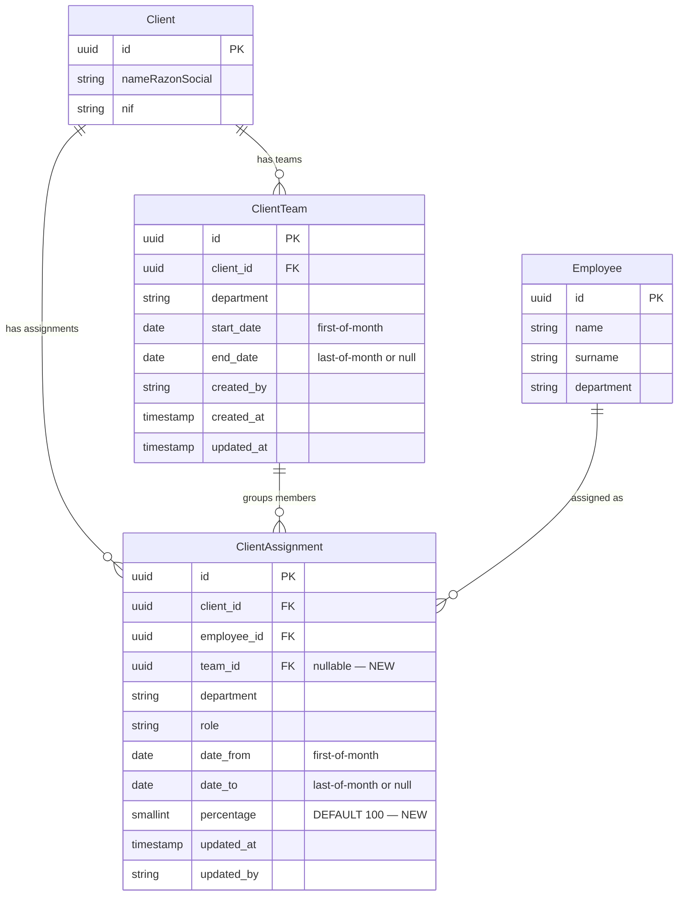
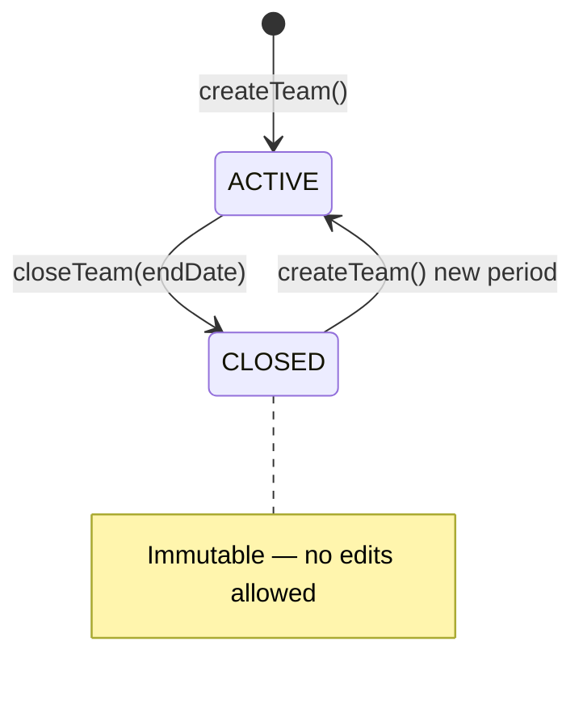

# Data Model: Asignaciones Múltiples en Ficha de Cliente

**Feature**: 001-client-team-assignments | **Date**: 2026-05-25

---

## Overview

This feature adds a `ClientTeam` entity (team header per client+department) and extends the existing `ClientAssignment` entity with `percentage` and a `team` foreign key. No other existing entities change.



---

## Entities

### `ClientTeam` (new)

Represents the team header for a given client and department. One active team per client+department at any time.

| Field | Type | Constraints | Notes |
|---|---|---|---|
| `id` | uuid | PK | Generated via `uuidv4()` |
| `client` | FK → Client | NOT NULL | Which client this team serves |
| `department` | Department (enum) | NOT NULL | FISCAL or LABORAL |
| `startDate` | date | NOT NULL | Must be first day of month (enforced by service) |
| `endDate` | date | NULL | Must be last day of month when set; null = team is active |
| `createdBy` | varchar | NOT NULL | Email of responsable who created the team |
| `createdAt` | timestamptz | NOT NULL | Auto-set at creation |
| `updatedAt` | timestamptz | NOT NULL | Auto-updated on any change |

**Uniqueness**: Partial unique index on `(client_id, department) WHERE end_date IS NULL` — only one active team per client+department.

**State transitions**:



Closed teams are immutable (no edits allowed). Creating a new team after closure starts fresh.

---

### `ClientAssignment` (extended)

Existing entity extended with two new columns. All existing rows retain `team = null` and `percentage = 100` as defaults.

| Field | Type | Constraints | Change |
|---|---|---|---|
| `id` | uuid | PK | Existing |
| `client` | FK → Client | NOT NULL | Existing |
| `employee` | FK → Employee | NOT NULL | Existing |
| `department` | Department (enum) | NOT NULL | Existing |
| `role` | ClientAssignmentRole (enum) | NOT NULL | Existing |
| `dateFrom` | date | NOT NULL | Existing. First-of-month for new records (service validates) |
| `dateTo` | date | NULL | Existing. Last-of-month when set |
| `percentage` | smallint | NOT NULL, DEFAULT 100, CHECK 1–100 | **NEW** |
| `team` | FK → ClientTeam | NULL | **NEW** — null for legacy rows |
| `updatedAt` | timestamptz | NOT NULL | Existing |
| `updatedBy` | varchar | NOT NULL | Existing |

---

## Enums (no changes to `@afianza-ac/lib-core-definitions`)

```typescript
// Already exists — no changes needed
enum ClientAssignmentRole {
  RESPONSABLE = 'responsable',
  COORDINADOR = 'coordinador',
  ASESOR      = 'asesor',
  TECNICO     = 'tecnico',
}

enum Department {
  FISCAL  = 'FISCAL',
  LABORAL = 'LABORAL',
}
```

---

## Validation Rules

| Rule | Scope | When | Error |
|---|---|---|---|
| `dateFrom` is first day of month | ClientTeam + ClientAssignment (new records) | create/update | `DATE_NOT_MONTH_BOUNDARY` |
| `dateTo` is last day of month (when set) | ClientTeam + ClientAssignment | create/update | `DATE_NOT_MONTH_BOUNDARY` |
| `dateTo >= dateFrom` | ClientAssignment | create/update | `DATE_RANGE_INVALID` |
| At most 1 active team per client+department | ClientTeam | createTeam | `ACTIVE_TEAM_EXISTS` |
| All-member percentages sum to 100% | Team's active members (ASESOR + TECNICO; RESPONSABLE & COORDINADOR excluded) | commit | `PERCENTAGE_VALIDATION_FAILED` |
| Team must have ≥ 1 active ASESOR | Team | commit | `MIN_ASESOR_REQUIRED` |
| RESPONSABLE max 1 per team | Team | addMember | `ROLE_ALREADY_FILLED` |
| COORDINADOR max 1 per team | Team | addMember | `ROLE_ALREADY_FILLED` |
| COORDINADOR ≠ RESPONSABLE (same person) | Team | addMember | `ROLE_CONFLICT` |
| `percentage` in 1–100 | ClientAssignment | create/update | `PERCENTAGE_OUT_OF_RANGE` |
| Cannot add member to closed team | ClientTeam | addMember | `TEAM_CLOSED` |
| Cannot edit closed team | ClientTeam | update | `TEAM_CLOSED` |

---

## AssignmentPeriod (logical concept — no new entity)

> **Scope note**: `AssignmentPeriod` is a conceptual view, not a stored entity. It is exposed fully by **US3 (history accordion)**. For US1, it is implicit: every `ClientAssignment` row is an open period (`dateTo IS NULL`) within the active team. The history query below already returns the right shape; US1 just doesn't surface a UI for it.

The spec's "AssignmentPeriod" is represented by `ClientAssignment` rows with a non-null `dateTo`. The period becomes immutable once closed (service rejects edits to assignments where `dateTo < today` AND `team.endDate IS NOT NULL`).

**History query**: `SELECT * FROM client_assignment WHERE client_id = ? AND department = ? ORDER BY dateFrom DESC` — returns both active (dateTo = null) and historical (dateTo set) records.

---

## Future evolution (Modelo B — reusable teams)

OQ-005 was resolved as **Modelo A** (teams scoped to a single client, created from the client ficha). A possible future Modelo B would let a single team serve multiple clients via a dedicated team-management screen.

The current schema does not block this evolution:

- `ClientTeam` is already a first-class entity with FK `client_id` (1:1 with a client today).
- To enable N:M (one team ↔ many clients), introduce an additive pivot table `team_assignment (team_id, client_id, started_at, ended_at)` and gradually drop the `client_id` on `ClientTeam` if/when all teams have migrated to the pivot. No destructive change to existing columns or constraints is required.
- The current APIs (`/v1/client-teams/:clientId/...`) survive as a convenience shortcut "create team + assign to this client in one call"; Modelo B would add new endpoints under a different base path without breaking these.

---

## Database Migration

**One migration** in `pgi-service-pgi-api`:

```sql
-- 1. New table
CREATE TABLE client_team (
  id          uuid PRIMARY KEY,
  client_id   uuid NOT NULL REFERENCES client(id),
  department  varchar NOT NULL,
  start_date  date NOT NULL,
  end_date    date,
  created_by  varchar NOT NULL,
  created_at  timestamptz NOT NULL DEFAULT now(),
  updated_at  timestamptz NOT NULL DEFAULT now()
);

CREATE UNIQUE INDEX idx_client_team_active
  ON client_team (client_id, department)
  WHERE end_date IS NULL;

-- 2. Extend client_assignment
ALTER TABLE client_assignment
  ADD COLUMN percentage smallint NOT NULL DEFAULT 100
    CHECK (percentage >= 1 AND percentage <= 100),
  ADD COLUMN team_id uuid REFERENCES client_team(id);
```

**No data migration needed** — existing rows get `percentage = 100` and `team_id = null`.

---

## RabbitMQ Event Schemas

### Extended: `backoffice-api.v1.client-assignment.updated`

```typescript
interface ClientAssignmentUpdatedEvent {
  id: string;
  employeeId: string;
  clientId: string;
  department: Department;
  role: ClientAssignmentRole;
  dateFrom: string; // ISO date
  dateTo: string | null;
  percentage: number; // NEW field — backward-compatible addition
  updatedAt: string;
  updatedBy: string;
}
```

### New: `backoffice-api.v1.task-reassignment.requested`

```typescript
interface TaskReassignmentRequestedEvent {
  clientId: string;
  department: Department;
  fromEmployeeId: string;
  toEmployeeId: string;
  taskIds: string[] | null; // null = all PENDING tasks for client+dept+fromEmployee
  requestedBy: string; // email of coordinator/responsable
  requestedAt: string; // ISO datetime
}
```

Routing key: `backoffice-api.v1.task-reassignment.requested`
Queue (obligations-api): `obligations-api:task-reassignment:process`

---

## Frontend Domain Model Extensions

```typescript
// Extended domain model (pgi-app-pgi-web)
type ClientTeam = {
  id: string;
  clientId: string;
  department: Department;
  startDate: Date;
  endDate?: Date;
  isActive: boolean; // derived: endDate == null
  createdBy: string;
  createdAt: Date;
};

// Extended ClientAssignment domain model
type ClientAssignment = {
  id: string;
  clientId: string;
  employee: { id: string; name: string; surname?: string };
  department: Department;
  role: ClientAssignmentRole;
  dateFrom: Date;
  dateTo?: Date;
  percentage: number;           // NEW
  teamId?: string;              // NEW
  updatedAt: Date;
  updatedBy: string;
};
```
