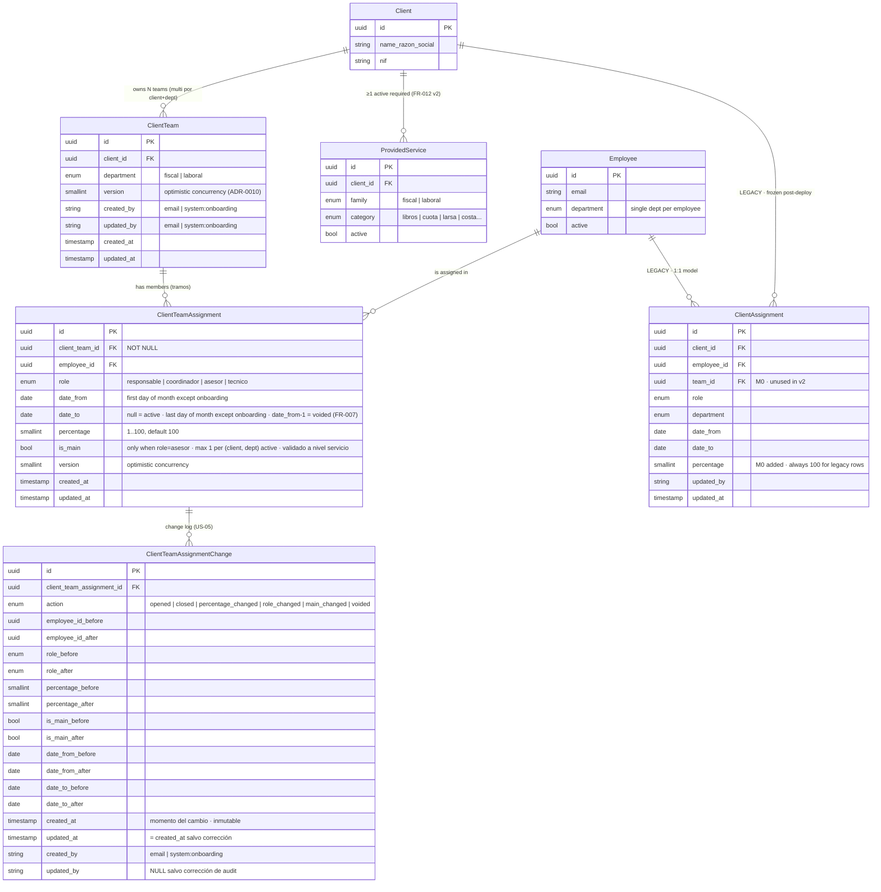

# ER Diagram — DEVPT-518 v2 (modelo autoritativo)

**Created**: 2026-06-02
**Locked v1**: 2026-06-04 (modelo "extensión in-place" → superseded)
**Locked v2**: 2026-06-04 (modelo temporal con tablas nuevas — esta versión)
**Status**: Accepted — modelo autoritativo de la feature. Manda sobre cualquier descripción anterior en `_archive/` y debe ser respetado por `data-model.md`, `tasks.md` y `decisions.md` ADRs vigentes.

> **Resumen v2** vs. v1: schema simplificado — `ClientTeam` sin `start_date`/`end_date`, `ClientTeamAssignment` sin denormalizados (`client_id`/`department`), `is_primary_advisor` renombrado a `is_main`, `causes_baja` eliminado. La autoridad funcional es `spec.md` v2.

## Diagrama

## Notas clave (v2)

1. **`ClientTeam` sin temporalidad propia**. Eliminados `start_date`/`end_date`. La "vida" del team se infiere de la presencia o ausencia de asignaciones activas. Multi-equipo por `(client_id, department)` sigue permitido.

2. **`ClientTeamAssignment` sin denormalizados**. Eliminados `client_id` y `department` de la fila — se acceden vía JOIN con `client_team`. Implicaciones:
   - El partial unique de unicidad empleado-cliente (FR-021 v1) **ya no existe**, ni a nivel BD ni a nivel servicio: spec v2 FR-013 elimina esta restricción explícitamente (decisión PO 2026-06-04 — minimal constraints).
   - El partial unique de "1 asesor main por (client, dept)" no se enforce a nivel BD (no hay columnas para indexar sin JOIN). Validación a nivel servicio (spec v2 FR-011).
   - El único CHECK constraint que sobrevive es `is_main = false OR role = 'asesor'`.

3. **`is_main` reemplaza a `is_primary_advisor`** — nombre más neutro. Misma semántica: marca al asesor principal del par `(client, department)`.

4. **Fechas — granularidad mensual normalizada (excepto onboarding)**:
   - Vía API normal, `date_from` = primer día del mes pedido; `date_to` (si presente) = último día del mes.
   - Vía subscriber AMQP de onboarding (routing key `client-onboarding-assignment`), las fechas se persisten **tal cual las recibe** del producer — único camino para tramos con `date_from` que no sea primer día de mes.
   - Cambios con `dateFrom` en mes pasado son rechazados (HTTP 422).
   - Múltiples cambios en el mismo mes en curso se machacan (FR-007 v2): si el miembro sigue, UPDATE in-place; si sale, **void** (`date_to = date_from - 1 día`) — fila persiste pero invisible. El log registra cada operación.

5. **`causes_baja` ya no existe**. El cierre con baja del asesor + reasignación de tareas a obligations se infiere automáticamente del flujo close+open vía AMQP, sin flag explícito ni endpoint dedicado. ADR-0017 queda **Superseded**.

6. **`ClientTeamAssignmentChange` promovida a US-05**. Shape cerrado 2026-06-04 (OQ-003 resuelta): columnas explícitas before/after por campo, `action` enum incluye `voided` para FR-007, audit propio (`created_at`, `created_by`, `updated_at`, `updated_by`). El "quién" del cambio vive aquí — `client_team_assignment` ya no tiene `created_by`/`updated_by`.

7. **`ClientAssignment` legacy queda congelada sin migración explícita**:
   - Mantiene FK a Client y Employee tal cual.
   - El servicio deja de escribir en esta tabla post-deploy.
   - Las asignaciones activas de un cliente se vuelven a meter desde la UI nueva cuando un responsable abra la ficha por primera vez (o vía evento de onboarding si llega). **Sin script de migración**, sin banner, sin `migrated_from_legacy`.

## Lo que NO está en el diagrama

- **`DepartmentCoverageStatus`** — derivado, no persiste. Se calcula con query agregada sobre `ClientTeamAssignment` JOIN `ClientTeam` filtrando por `(client_id, department)`.
- **`inClientSince`** (antigüedad del empleado en el cliente, renombrado desde `tenureSince`) — derivado server-side. Calculado al leer sobre el histórico de tramos no voided del par `(client_id, employee_id)`. No persiste.
- **`Obligation` / `Task`** (de `pd-service-obligations-api`) — viven en otro servicio. Se conectan vía AMQP, no FK. La reasignación automática se infiere de los eventos `client-team-assignment.opened`/`.closed`.
- **`BackofficeUser`** — actor de auditoría, representado como `string` (email) en los campos `created_by` / `updated_by` / `actor`.

## Relaciones cross-service

- **Producer AMQP**: pgi-api emite `pgi-api.v1.client-team-assignment.opened` y `.closed` en cada INSERT/UPDATE de cierre/machaque sobre `ClientTeamAssignment`. Payload mínimo: `assignmentId`, `clientId` (vía JOIN), `department` (vía JOIN), `role`, `employeeId`, `percentage`, `effectiveDate` (`date_from` u `date_to`), `isMain`, `version`. Solo se publica cuando el equipo es `complete` (FR-015 v2).
- **Consumer AMQP**: pgi-api consume `client-onboarding-assignment` (nombre exacto pendiente — OQ-005 en spec). Materializa tramos conservando fechas.
- **`pd-service-obligations-api`** consume y reasigna tareas automáticamente según fecha de vencimiento + asesor vigente. Sin flag de baja.
- **`pd-service-data-factory`** y **`pd-service-jira-adapter`** mantienen sus copias propias del modelo nuevo (con su propio `team_id` lógico). ADR-0011 sigue aplicando sobre el modelo v2. Política de sync de jira-adapter pendiente.

## Artefactos alineados con este ER

| Artefacto | Estado |
|---|---|
| `spec.md` v2 | **Autoridad funcional**. Define todos los FRs y ejemplos. |
| `er-diagram.md` (este doc) | **Autoridad de modelo de datos**. |
| `data-model.md` | **Desincronizado** — describe modelo intermedio con `client_id`/`department` denormalizados y `is_primary_advisor`. Requiere rewrite alineado a este ER. |
| `_archive/` | v1 congelada (spec, plan, tasks, data-model, research, quickstart, contracts, checklists). |
| `decisions.md` | ADRs heredados; ver tabla a continuación para estado por ADR. |
| `tasks.md` | No existe en v2 — se regenera con `/speckit-tasks` cuando se cierre el plan. |
| `contracts/` | No existe en v2 — se regenera con `/speckit-plan` cuando se cierren las decisiones. |

## Estado de los ADRs heredados (rápido)

| ADR | Topic | Estado en v2 |
|---|---|---|
| ADR-0007 | Borrador + commit | Superseded (ya en v1 — sigue) |
| ADR-0008 | Single bucket | Superseded por ADR-0012 (ya en v1) |
| ADR-0009 | Legacy data migration | **Superseded** por spec v2 — sin migración explícita. Marcar |
| ADR-0010 | Optimistic concurrency | Vigente — `version` aplica a las dos tablas nuevas |
| ADR-0011 | Cross-service replication sin FK | Vigente — ahora sobre el modelo v2 |
| ADR-0012 | Dos coberturas por departamento | Vigente |
| ADR-0013 | Persistencia inmediata sin draft | Vigente |
| ADR-0014 | CHECK constraints | **Parcialmente superseded** — solo sobrevive `is_main = false OR role = 'asesor'`. El `chk_causes_baja_only_when_closed` no aplica. Marcar |
| ADR-0015 | Bucket locking / transactionality | Vigente — el FOR UPDATE sigue siendo necesario para serializar transiciones |
| ADR-0016 | Migration sequencing M1a/M1b | **Superseded** por spec v2 — no hay migración legacy. Marcar |
| ADR-0017 | Successor required on causes_baja | **Superseded** por spec v2 — flujo absorbido en close+open automático |
| ADR-0018 | TanStack Query | Vigente |
| OPEN-001 | Change log shape | **Resuelto** 2026-06-04 — columnas before/after explícitas, audit propio, `voided` en enum. Ver OQ-003 en spec.md y §1.3 en data-model.md. |
| NOTE-001 | AMQP versioning | **Resuelto** — el routing key nuevo es v1 de una entidad nueva (`client-team-assignment`). Marcar cerrada |

> Los ADRs marcados con **Superseded** deben actualizar su `**Status**:` en `decisions.md` pero el body se conserva como histórico.
