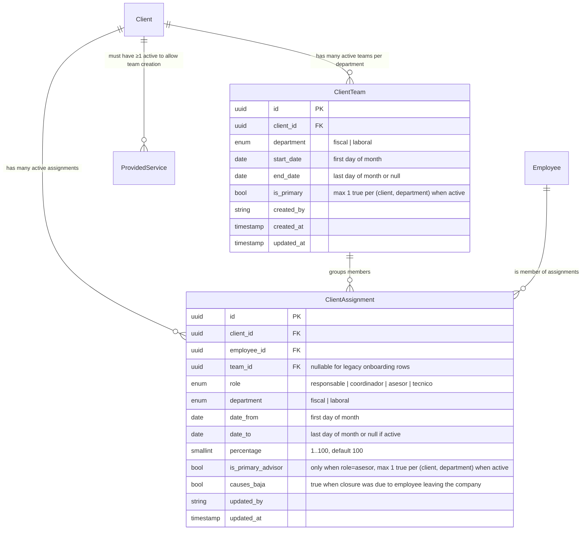

# Implementation Plan: PGI · Asignaciones múltiples por porcentajes (DEVPT-518)

**Branch**: `feat/001-client-team-assignments`  ·  **Date**: 2026-06-01  ·  **Spec**: [spec.md](./spec.md)

**Input**: Feature specification from `/specs/001-client-team-assignments/spec.md` (848 líneas, 39 FRs, 12 entradas de Clarifications, 11 Open Questions PO con 7 resueltas).

## Summary

Evolucionar las asignaciones cliente↔empleado desde el modelo legacy 1:1 (un empleado por rol y departamento) a un modelo **multi-equipo con porcentajes**: cada cliente puede tener N `ClientTeam` activos por departamento, cada team agrupa miembros con `role` (responsable / coordinador / asesor / técnico), porcentaje de dedicación y un asesor principal. La validación del 100% se calcula **por bucket de rol** (asesores / técnicos) **y por departamento del cliente** (agregando entre todos los teams del mismo departamento), no por equipo individual.

Stack confirmado en el polyrepo: NestJS 10 + MikroORM 6 + PostgreSQL 17 (backend), React 19 + Vite (frontend), RabbitMQ para coordinación cross-service. Tres servicios backend y un frontend tocados: `pgi-service-pgi-api` (owner), `pgi-app-pgi-web` (UI), `pd-service-data-factory` (consumer del evento `client-assignment` para informes), `pd-service-jira-adapter` (consumer + sync a Jira Assets).

## Technical Context

**Language/Version**: TypeScript 5.7 (todos los servicios).

**Primary Dependencies**: NestJS 10, MikroORM 6 (PostgreSQL), `@afianza-ac/nest-module-rabbitmq` (AMQP wrapper), `@afianza-ac/lib-core-definitions` (enums + shared types: `Department`, `ClientAssignmentRole`, `ServiceFamily`, `ServiceCategory`), React 19 + Vite + TanStack Query (frontend).

**Storage**: PostgreSQL 17 (esquema compartido por servicio).

**Testing**: Jest + `@testcontainers/postgresql` con `postgres:17-alpine` (integration), Jest mocks para servicios sin EntityManager, Supertest para controllers, Vitest para frontend.

**Target Platform**: Linux (AKS) para backend; web browser moderno (Chrome/Edge corporativo) para frontend.

**Project Type**: Multi-service web — backend NestJS + frontend React, comunicación entre servicios vía AMQP.

**Performance Goals**:
- Sincronización a Plataforma del Dato vía AMQP en <5 min desde el cambio (FR-014, ya existente).
- Carga de "Asignaciones actuales" en la ficha de cliente <500 ms incluso con 4+ teams activos (degradación aceptable hasta 800 ms en p95).
- Validación de suma 100% por departamento sincrónica al guardar miembro (<200 ms).

**Constraints**:
- Optimistic concurrency vía `updatedAt` en `ClientTeam` y `ClientAssignment` (FR-022) — HTTP 409 al conflicto.
- Backward-compat con pipeline `client_onboarding_persisted` existente (FR-017 onboarding sigue creando filas legacy hasta resolver D10).
- Validación cross-service: cualquier nueva regla aplicada en UI MUST replicarse en backend (decisión PO 2026-06-01).
- Migración no destructiva, idempotente, sin afectar registros históricos.
- ⚠️ D10 (onboarding ↔ ClientTeam) y D11 (asignación tareas por rol) siguen abiertas — assumption MVP: onboarding sigue creando legacy + reagrupación manual / todas las tareas van al asesor principal.

**Scale/Scope**: ~3-4k clientes activos · ~150 empleados · ~2 departamentos (Fiscal + Laboral, enum cerrado) · 4 user stories (P1-P4) · 4 servicios tocados.

## Compliance & Security Surface *(mandatory — Afianza preset)*

- **Datos sensibles tocados**: porcentajes de dedicación (≈ retribución implícita por cliente), histórico de cambios de asignación con autoría (`updatedBy`). Acceso restringido por rol (responsable/coordinador = edición; asesor/técnico = lectura).
- **Auth**: Azure AD via `@afianza-ac/nest-module-auth` en todos los endpoints. JWT con claims de rol.
- **Authorization**: validación de rol en cada endpoint de escritura (composición mínima + permiso de edición). Defense in depth: UI oculta CTA + backend rechaza 403 si el rol no encaja.
- **OWASP**:
  - Input validation via `class-validator` en DTOs (límites de porcentaje 1-100, enums cerrados, fechas válidas).
  - SQL injection: ORM (MikroORM) — no se usan queries raw.
  - Authorization bypass: tests específicos en controllers verificando 403 para roles sin permiso.
- **Histórico**: las filas de `ClientAssignment` con `dateTo` no se borran (preserva auditoría — decisión PO).
- **Logs**: cambios de asignación generan eventos AMQP que data-factory ingiere para auditoría.

## Constitution Check

*GATE: Must pass before Phase 0 research. Re-check after Phase 1 design.*

| Principio | Estado | Notas |
|---|---|---|
| I · 3-layer arch | ✅ Pass | Endpoints en `application/rest/`, lógica en `domain/services/`, persistencia via MikroORM `domain/models/`. AMQP subscribers en `application/amqp/` sin lógica de negocio. |
| II · Real-container testing | ✅ Pass | Integration tests con `@testcontainers/postgresql` para `ClientAssignmentsService`, `ClientTeamsService`, AMQP subscribers. Sin mocks del EntityManager. |
| III · MikroORM UoW | ✅ Pass | AMQP subscribers usan `em.fork()` + `em.transactional` para inserciones masivas. `em.upsert()` en `applyFromClientOnboarding`. `disableIdentityMap: true` en queries de validación. |
| IV · Event-driven | ✅ Pass | Cross-service vía AMQP (`client-assignment` ampliado con `teamId`+`percentage`, `client_onboarding_persisted` sin cambios). Sin llamadas HTTP entre servicios. |
| V · Simplicity | ✅ Pass | No se introduce ningún patrón nuevo (Repository, Factory, etc.). Reuso de `RabbitMQService`, `BackofficeUser` actor pattern, `MikroOrmModule`. Sin abstracciones especulativas. |

## Project Structure

### Documentation (this feature)

```text
specs/001-client-team-assignments/
├── plan.md                   # Este fichero
├── research.md               # Phase 0: decisiones técnicas resueltas (NEEDS CLARIFICATION → answers)
├── data-model.md             # Phase 1: entidades + migraciones
├── quickstart.md             # Phase 1: cómo arrancar este feature en local
├── contracts/                # Phase 1: contratos API + AMQP events
│   ├── client-teams-api.md
│   ├── client-assignments-api.md
│   └── client-assignment-event.md
├── decisions/                # ADRs existentes — se añadirá ADR-0010
├── spec.md                   # Spec (input)
└── tasks.md                  # Phase 2 output (/speckit-tasks)
```

### Source Code (polyrepo — afecta a 4 servicios)

```text
afianza/                                  # workspace root
├── asesores/
│   ├── pgi-service-pgi-api/              # OWNER · backend principal
│   │   ├── src/
│   │   │   ├── application/
│   │   │   │   ├── rest/
│   │   │   │   │   ├── client-teams/            # NEW · controller + DTOs equipos
│   │   │   │   │   └── client-assignments/      # MODIFY · añadir endpoints de % + isPrimary
│   │   │   │   └── amqp/
│   │   │   │       ├── client-subscriber/       # MODIFY · onboarding consumer (D10 partial)
│   │   │   │       └── client-assignment-publisher/  # NEW · publica `client-assignment` ampliado
│   │   │   └── domain/
│   │   │       ├── models/
│   │   │       │   ├── client-team.ts           # MODIFY · añadir `isPrimary`, validation por dept
│   │   │       │   └── client-assignment.ts     # MODIFY · añadir `isPrimary` (asesor), `causesBaja`, unique constraint nuevo
│   │   │       └── services/
│   │   │           ├── client-teams/            # NEW · CRUD + validation 100% por dept
│   │   │           └── client-assignments/      # MODIFY · routing tareas + reasignación al sucesor
│   │   └── migrations/                    # NEW · migración aditiva FR-013 + nuevos constraints
│   └── pgi-app-pgi-web/                   # FRONTEND
│       └── src/features/client-assignments/
│           ├── presentation/components/   # MODIFY · modal lateral con multi-rol + slider %
│           ├── application/use-cases/     # MODIFY · validate composition + 100% por dept
│           └── infrastructure/            # MODIFY · DTOs alineados con nuevos contratos
├── plataforma-del-dato/
│   ├── pd-service-data-factory/           # MODIFY · alineación modelo + consumer client-assignment
│   │   ├── src/domain/models/
│   │   │   └── client-assignment.ts       # MODIFY · añadir `team_id` + `percentage`
│   │   └── src/application/amqp/          # MODIFY · subscriber consume nuevos campos
│   │   └── migrations/                    # NEW · añadir columnas
│   └── pd-service-jira-adapter/           # MODIFY · sync solo principal a Jira Assets
│       └── src/domain/services/client-assignment/  # MODIFY · seleccionar `isPrimary=true` + team principal
└── specs/001-client-team-assignments/     # docs
```

**Structure Decision**: Polirepo existente — no se crea ningún servicio nuevo. La feature se reparte entre 4 repos siguiendo el patrón cross-service via AMQP existente (`internal` exchange, `data_platform` vhost). Cada servicio mantiene su 3-layer arch y migraciones locales. No hay nuevo módulo NestJS (Constitution I: monolithic AppModule).

## Complexity Tracking

> Fill ONLY if Constitution Check has violations that must be justified.

| Violation | Why Needed | Simpler Alternative Rejected Because |
|-----------|------------|-------------------------------------|
| (ninguna) | — | — |

Ningún principio constitucional se rompe. No se introduce abstracción nueva (`ClientTeamsService` y `ClientAssignmentsService` ya existen — se amplían). Migración aditiva, sin destructive changes. Reuso de patterns existentes para AMQP + onboarding subscriber.

## Phase Plan

### Phase 0 — Research (genera `research.md`)

Resolver dudas técnicas surgidas del spec + open questions parcialmente respondidas:

1. **Migración 1:1 → multi-equipo**: ¿cómo asignar `team_id` a las filas existentes sin team? Crear un `ClientTeam` por (cliente, departamento) con miembros existentes al 100% — idempotente.
2. **AMQP message ampliado**: estructura exacta del payload `client-assignment.v1.updated` con los nuevos campos `teamId`, `percentage`, `isPrimary`.
3. **Consumer alignment**: pasos para que `pd-service-data-factory` y `pd-service-jira-adapter` deserialicen los nuevos campos sin romper compat con productores legacy (rolling deploy).
4. **Validación 100% por departamento — implementación**: query agregada vs cálculo en memoria; ¿forzar transacción para evitar race con AMQP subscriber paralelo?
5. **Onboarding bridge (D10 partial)**: documentar la assumption de que `applyFromClientOnboarding` sigue creando filas con `team_id = NULL` hasta resolución PO; añadir test de regresión para asegurar que no rompe.
6. **Frontend state model**: TanStack Query vs Zustand para el modal de composición de equipo con validación reactiva del 100% por departamento.

### Phase 1 — Design & Contracts

**Artefactos a generar**:

1. **`data-model.md`** — entidades y migraciones:
   - `ClientTeam` (modificar): añadir `isPrimary: boolean = false` por departamento del cliente (max 1 con `true`).
   - `ClientAssignment` (modificar): añadir `isPrimaryAdvisor: boolean = false` (solo aplica si `role: asesor`, max 1 por team), `causesBaja: boolean = false`. Constraints nuevos:
     - Mantener actual: `(client, employee, role, department, dateFrom) UNIQUE`.
     - Añadir: `(client_id, employee_id) WHERE dateTo IS NULL` partial unique (FR-021 — opción B PO: una persona, un equipo por cliente).
     - Mantener CHECK `percentage >= 1 AND percentage <= 100`.
   - Nuevo concepto: validación derivada (no entidad) `DepartmentBucketState` calculada en `ClientTeamsService.getDepartmentBucketStatus(clientId, department)`.

2. **`contracts/client-teams-api.md`** — endpoints REST para gestión de equipos:
   - `POST /clients/{clientId}/teams` (crear team)
   - `PATCH /clients/{clientId}/teams/{teamId}` (modificar nombre / `isPrimary`)
   - `POST /clients/{clientId}/teams/{teamId}/close` (cerrar con fecha fin)
   - Headers: `If-Match: <updatedAt>` para optimistic concurrency.

3. **`contracts/client-assignments-api.md`** — endpoints de miembros:
   - `POST /clients/{clientId}/teams/{teamId}/members` (añadir miembro)
   - `PATCH /clients/{clientId}/teams/{teamId}/members/{memberId}` (ajustar % / `isPrimary`)
   - `DELETE /clients/{clientId}/teams/{teamId}/members/{memberId}` (alias semántico de "cerrar" — pone `dateTo = hoy` y abre diálogo causa baja).
   - `GET /clients/{clientId}/department/{dept}/bucket-status` (devuelve estado del 100% por dept).

4. **`contracts/client-assignment-event.md`** — schema del evento AMQP ampliado:
   - Topic: `internal`, routing key `pgi-api.v1.client-assignment.updated`.
   - Payload: `{ clientId, teamId, teamId, employeeId, role, department, dateFrom, dateTo?, percentage, isPrimaryAdvisor, updatedAt, updatedBy }`.
   - Backward compat: campos nuevos como nullable, consumers actuales no rompen.

5. **`quickstart.md`** — cómo arrancar el dev local:
   - Migración inicial pgi-api.
   - Migración aditiva data-factory.
   - Verificación AMQP local (RabbitMQ in docker-compose).
   - Comando de regresión onboarding (consumer de `client_onboarding_persisted` sigue funcionando).

6. **ADR-0010 — Supersede ADR-0008** (single-bucket → two-bucket-por-departamento), documentando la decisión PO 2026-06-01.

7. **Agent context update**: actualizar el bloque `<!-- SPECKIT START --> ... <!-- SPECKIT END -->` en CLAUDE.md root para apuntar a este plan.

### Phase 2 — Tasks (manejado por `/speckit-tasks`)

Plan generará una `tasks.md` ordenada por user story con secciones por servicio:

```text
- US1 (Crear equipo)
  - pgi-api: model, service, controller, tests, migration
  - frontend: modal lateral, validation, mutation TanStack
- US2 (Distribución %)
  - backend: bucket status endpoint, validation logic
  - frontend: slider, live stats
- US3 (Histórico)
  - backend: query histórico
  - frontend: panel lateral timeline
- US4 (Cierre + reasignación)
  - backend: closure logic, successor inference, AMQP reassignment publish
  - frontend: dialog cierre, alert sucesor
- Cross-cutting
  - data-factory: model alignment, migration, subscriber update
  - jira-adapter: select primary, sync filtered
- Regression
  - onboarding pipeline preserved
```

## Re-check Constitution post-design

| Principio | Post-Phase 1 |
|---|---|
| I · 3-layer | ✅ Ningún cambio en arquitectura. |
| II · Real-container | ✅ Tests previstos con testcontainers. |
| III · MikroORM UoW | ✅ Forks + transactional en consumers AMQP. |
| IV · Event-driven | ✅ Sin HTTP cross-service nuevo. |
| V · Simplicity | ✅ Sin nuevas abstracciones. |

## Technical Challenge resolutions (2026-06-01)

`/speckit-challenge technical` detectó 6 BLOCKERs + 2 ADRs. Todos abordados antes de `/speckit-tasks`:

| ID | Finding | Resolución |
|----|---------|------------|
| T1 | Onboarding `upsert` vs nuevo partial unique | `applyFromClientOnboarding` cierra fila activa existente antes de insertar (pseudo-código + test de regresión en `data-model.md > Onboarding bridge`) |
| T2 | Faltaban CHECK constraints | Añadidos `chk_primary_advisor_only_asesor` y `chk_causes_baja_only_when_closed` en migración M1a |
| T3 | Sucesor no modelado | `successorId` REQUIRED en DELETE/close con `causesBaja=true`. Backend devuelve 400 SUCCESSOR_REQUIRED con `suggestedSuccessorId` calculado por temporalidad. Sin nuevo schema |
| T4 | Cierre de team sin transactionality | Contrato POST close ahora dice `em.transactional` + AMQP publish post-commit. Referencia a D-005 PENDING (outbox) |
| T5 | `updatedAt` para optimistic concurrency | **ADR-0010** — cambio a columna `version: integer` (`@Property({version: true})`) |
| T6 | At-least-one primary team no garantizado | Service auto-promotes el primer team de `(client, dept)` a `isPrimary=true`. Documentado en data-model lifecycle |
| T7 | `team_id` en data-factory sin FK justificado | **ADR-0011** — logical FK only, política de huérfanos documentada |
| T8 | Race en cómputo bucket status + publish | `SELECT ... FOR UPDATE` sobre fila padre `client` en la transacción que puede emitir transición |
| T10 | Backfill ordenado después del partial unique | Migración partida en **M1a (DDL + CHECKs + backfill + audit)** → **M1b (partial uniques)**. Si los datos legacy violan FR-021, M1a aborta con mensaje claro antes de crear el unique |

T9 (QUESTION-PO sobre OQ-008) sigue abierta pero **no bloquea el MVP** — ver assumption documentada en `quickstart.md > Limitaciones`.

Sub-findings del reviewer bucket-9 (que devolvió formato incorrecto y fue descartado) parcialmente cubiertos:
- M2 ahora añade también `is_primary_advisor` y `causes_baja` para evitar split migration cuando US4 ship later.
- Recordatorio explícito de test de regresión `apply-from-client-onboarding` en `data-model.md`.
- Coordinación de `@afianza-ac/lib-core-definitions` bump pendiente — se aborda en `tasks.md` cuando se genere.

---

# Anexo A · Research (Phase 0)


**Fase**: 0 (Outline & Research) — todas las `NEEDS CLARIFICATION` del plan resueltas aquí.

### R1 · Estrategia de migración legacy 1:1 → multi-equipo

**Decisión**: una sola migración SQL aditiva ejecutada en `pgi-service-pgi-api` que (a) añade columnas `is_primary_advisor`, `causes_baja` a `client_assignment`, (b) añade columnas `is_primary` a `client_team`, (c) añade el partial unique `(client_id, employee_id) WHERE date_to IS NULL`. **Sin backfill destructivo**: las filas existentes ya tienen `team_id` (la columna se creó en una iteración previa) y `percentage` (con default 100). El bool `is_primary_advisor` se calcula post-deploy con un script idempotente que marca el primer asesor de cada (cliente, departamento) si no hay ninguno marcado.

**Rationale**: la migración aditiva no rompe filas existentes ni el flujo `applyFromClientOnboarding`. El backfill por separado permite rollback sin perder datos. La cláusula `WHERE date_to IS NULL` del partial unique solo cubre filas activas, así que filas históricas no chocan.

**Alternativas consideradas**: migración con backfill atómico (rechazada — riesgo si falla a mitad), reescritura del modelo (rechazada — destructive y rompe el onboarding subscriber existente).

### R2 · Estructura del payload AMQP `client-assignment.v1.updated`

**Decisión**: extender el payload existente añadiendo campos opcionales (nullable) para preservar backward-compat con consumers desplegados antes del nuevo deploy. Schema final:

```typescript
{
  // Existentes (mantenidos)
  clientId: string;
  employeeId: string;
  role: 'responsable' | 'coordinador' | 'asesor' | 'tecnico';
  department: 'fiscal' | 'laboral';
  dateFrom: string; // ISO date (primer día del mes)
  dateTo: string | null; // ISO date (último día del mes) o null si activo
  updatedAt: string; // ISO timestamp
  updatedBy: string; // email
  // Nuevos (opcionales hasta que todos los consumers estén alineados)
  teamId?: string;
  percentage?: number; // 1-100
  isPrimaryAdvisor?: boolean;
  causesBaja?: boolean;
}
```

**Rationale**: los nuevos campos son opcionales en JSON, así que `pd-service-data-factory` y `pd-service-jira-adapter` con la versión vieja del consumer ignoran los campos extra (Postel's law — tolerante). Cuando ambos consumers se actualicen, la información estará disponible para informes y sync Jira Assets.

**Alternativas consideradas**: bump de routing key a `v2.client-assignment.updated` (rechazado — duplica complejidad de routing y migración de queues sin ganancia: los campos son aditivos), versionado en payload con discriminator (rechazado — over-engineering).

### R3 · Alineación de consumers cross-service (deploy plan)

**Decisión**: deploy en este orden para evitar perder eventos durante la ventana de transición:

1. **`pd-service-data-factory`** primero — desplegar la versión que añade `team_id` y `percentage` al modelo + subscriber que lee los nuevos campos cuando vienen. Sigue funcionando con eventos legacy.
2. **`pd-service-jira-adapter`** segundo — desplegar la versión que filtra a `isPrimaryAdvisor=true` antes de sincronizar a Jira Assets. Sigue tratando eventos legacy como "ese es el único, es el principal".
3. **`pgi-service-pgi-api`** último — desplegar el publisher con los nuevos campos. A partir de ahora los eventos llevan datos completos.

**Rationale**: este orden garantiza que cuando pgi-api empieza a emitir los nuevos campos, los consumers ya están preparados para procesarlos. Si se invirtiera el orden, los consumers nuevos esperarían campos que aún no llegan y procesarían los legacy con valores por defecto incorrectos.

**Alternativas consideradas**: feature flag en el publisher (rechazado — añade complejidad de configuración para algo que se resuelve con orden de deploy).

### R4 · Validación del 100% por departamento — implementación

**Decisión**: query agregada SQL ejecutada dentro de la transacción del save, con `SELECT ... FOR UPDATE` sobre `client_assignment` filtrado por `(client_id, department)` y `dateTo IS NULL`. La query suma `percentage` agrupando por `role` (filtrado a asesor / técnico). Si suma ≠ 100% en alguno de los buckets, el team queda en estado `incomplete` (no rechaza, advisory). Si la composición mínima no se cumple (no hay responsable o 0 asesores en el team siendo modificado), rechaza con HTTP 400.

**Rationale**: usar `FOR UPDATE` evita race entre dos peticiones simultáneas. También evita race con el AMQP subscriber del onboarding: si el onboarding está creando filas mientras el responsable edita desde UI, ambos lockean la misma fila y serializan.

**Alternativas consideradas**: cálculo en memoria post-flush (rechazado — no detecta race entre transacciones), trigger BD (rechazado — Constitution V simplicity: la lógica vive en el servicio, no en la BD).

### R5 · Onboarding bridge (D10 sigue parcial)

**Decisión MVP**: `applyFromClientOnboarding` sigue creando filas en `client_assignment` con los valores actuales **con `team_id = NULL`** hasta que PO resuelva D10. Si se decide después que el onboarding debe crear un `ClientTeam` por defecto, se implementa como cambio aditivo en una segunda iteración sin afectar al modelo principal del MVP.

**Acción inmediata**: añadir test de regresión `applyFromClientOnboarding.regression.spec.ts` que verifica que el consumer sigue creando filas legacy correctamente.

**Rationale**: no bloquear el MVP por D10. El usuario verá filas huérfanas (sin team) en la vista del cliente — los onboardings nuevos requerirán que un responsable las agrupe manualmente. Se documenta como limitación conocida en `quickstart.md`.

**Alternativas consideradas**: implementar D10-C como assumption antes de PO confirmation (rechazado — riesgo de retrabajo si PO elige otra opción).

### R6 · State management frontend

**Decisión**: **TanStack Query** para queries y mutations de equipos y miembros, con `optimisticUpdate` para el slider de porcentaje. **Sin Zustand** — la composición del equipo es state servidor cacheado. El bucket-status (suma % por departamento) se calcula client-side a partir del query cache para mostrar la barra advisory en vivo, pero la validación dura es server-side.

**Rationale**: TanStack Query ya es convención en `pgi-app-pgi-web`. Optimistic update aplica bien al slider. Sin necesidad de store cliente para state que es inherentemente servidor.

**Alternativas consideradas**: Zustand para borrador de team antes de commit (rechazado — la decisión PO 2026-05-29 dice persistencia inmediata, no hay borrador), Redux (rechazado — over-engineering).

---

### Resumen de decisiones

| ID | Tema | Decisión |
|---|---|---|
| R1 | Migración | Aditiva, idempotente, backfill por script separado |
| R2 | AMQP payload | Campos nuevos opcionales, sin bump de versión |
| R3 | Deploy order | data-factory → jira-adapter → pgi-api |
| R4 | Validación 100% | Query agregada con `FOR UPDATE` en transacción |
| R5 | Onboarding | MVP mantiene legacy (sin team_id); D10 se resolverá después |
| R6 | Frontend state | TanStack Query + optimistic update para slider |

Todas las `NEEDS CLARIFICATION` técnicas resueltas. Las que dependen de PO (D5 routing por rol, D10 onboarding) tienen assumption MVP documentada y no bloquean.
---

# Anexo B · Quickstart dev


Pasos para arrancar la feature en desarrollo local. Asume conocimiento previo del workflow de cada servicio (ver `CLAUDE.md` de cada uno).

### Prerequisitos

- Docker corriendo (para PostgreSQL + RabbitMQ).
- Node 20 + npm.
- Acceso a las 4 ramas: `feat/001-client-team-assignments` en cada uno de los 4 servicios afectados.

### Orden de arranque

#### 1. `pgi-service-pgi-api` (owner)

```bash
cd asesores/pgi-service-pgi-api
npm install
npm run infra:up                      # PostgreSQL + RabbitMQ
npm run migrations:up                 # aplica migration M1 (FR-016, FR-021)
npm run backfill:primary-advisor      # script idempotente — promueve primer asesor a principal por (cliente, dept)
npm run start:dev
```

Verificar logs: el endpoint `/api/v1/clients/{id}/teams` debe responder. Los endpoints REST nuevos están en `src/application/rest/client-teams/` y `src/application/rest/client-assignments/`.

#### 2. `pd-service-data-factory`

```bash
cd plataforma-del-dato/pd-service-data-factory
npm install
npm run infra:up
npm run migrations:up                 # aplica migration M2 (añade team_id + percentage)
npm run start:dev
```

El subscriber AMQP escucha en `data-factory:client-assignment:process` queue.

#### 3. `pd-service-jira-adapter`

```bash
cd plataforma-del-dato/pd-service-jira-adapter
npm install
npm run start:dev
```

Sin migraciones nuevas (sólo cambio de lógica en el filtro a `isPrimaryAdvisor=true`).

#### 4. `pgi-app-pgi-web` (frontend)

```bash
cd asesores/pgi-app-pgi-web
npm install
npm run dev                           # Vite en :5173
```

Acceder a `http://localhost:5173/clientes/{clientId}` para ver la nueva ficha con composición multi-equipo.

### Comandos de regresión obligatorios

Antes de pushear cualquier cambio:

#### Onboarding pipeline preserved

El consumer `client_onboarding_persisted` NO debe romperse. Test específico:

```bash
cd asesores/pgi-service-pgi-api
npx jest --testPathPattern=apply-from-client-onboarding.regression
```

Debe pasar — verifica que `applyFromClientOnboarding` sigue creando filas legacy (`team_id = NULL`, `percentage = 100`) sin tocar la nueva lógica.

#### Cross-service AMQP contract

```bash
cd plataforma-del-dato/pd-service-data-factory
npx jest --testPathPattern=client-assignment-subscriber.contract
```

Verifica que un payload legacy (sin `teamId`/`percentage`/`isPrimaryAdvisor`) se procesa sin error.

#### Unique constraints

```bash
cd asesores/pgi-service-pgi-api
npx jest --testPathPattern=client-assignment.unique-constraints
```

Verifica que `(client, employee) WHERE date_to IS NULL` bloquea la doble asignación activa (FR-021).

### Limitaciones conocidas del MVP

1. **D5 (routing tareas por rol)** sin resolver — todas las tareas auto siguen yendo al asesor principal del dept. Si la PO define mapping por `ObligationCategory`, se aborda en sprint siguiente.
2. **D10 (onboarding ↔ team)** parcial — onboarding sigue creando filas con `team_id = NULL`. El responsable verá filas huérfanas en la vista del cliente hasta agruparlas. Pendiente decisión PO sobre crear "Equipo inicial" automático.
3. **Pantalla "Mis Clientes" y buscador del PGI** fuera de scope (FR-015). Sólo la ficha de cliente refleja la nueva composición.
4. **TaxDown / subcontratados** — no contemplado.
5. **Vista de anomalías** (clientes con servicio sin equipo válido) — backlog futuro.

### Troubleshooting

- **Error `PERSON_ALREADY_ACTIVE_IN_CLIENT` al añadir miembro**: la persona ya tiene otra asignación activa en este cliente (incluso en otro dept). Cerrar la anterior primero. Esto es FR-021 (decisión PO 2026-06-01: opción B).
- **Banner amarillo "no 100%" persistente**: comprobar `/api/v1/clients/{id}/department/{dept}/bucket-status` — el bucket de asesores o técnicos del dept está incompleto. La validación es por dept, no por team individual.
- **Eventos AMQP no llegan a data-factory**: revisar orden de deploy (R3 de research.md). Si data-factory tiene la versión vieja del subscriber, los nuevos campos se ignoran silenciosamente.

### Siguientes pasos

Una vez merged este MVP:
- Llevar D5 y D10 a la siguiente sesión PO.
- Evaluar si el feature de "asignaciones múltiples masivas" (mover carteras) entra en DEVPT-518 o se hace una épica aparte.
- Plan técnico para informes en `pd-service-data-factory` que aprovechen `team_id` + `percentage` (no en scope DEVPT-518).
---

# Anexo C · Modelo de datos


**Fase**: 1 (Design & Contracts)

### Diagrama de entidades



### Entities

#### ClientTeam

Representa un equipo de trabajo de un cliente en un departamento. Un cliente puede tener N teams activos por departamento (confirmado en frame `08-multi-equipo/01`). No tiene `name` persistido en BD (decisión PO 2026-06-01).

**Atributos**:

| Campo | Tipo | Reglas |
|---|---|---|
| `id` | UUID PK | Generado |
| `clientId` | UUID FK → Client | Required |
| `department` | enum | `fiscal` o `laboral` (cerrado, de `@afianza-ac/lib-core-definitions`) |
| `startDate` | date | Primer día del mes |
| `endDate` | date \| null | Último día del mes, o null si activo |
| `isPrimary` | bool | Default `false`. Máximo uno con `true` por `(clientId, department)` activo |
| `createdBy` | string | Email del actor |
| `createdAt` | timestamp | Auto |
| `updatedAt` | timestamp | Auto (para optimistic concurrency) |

**Constraints**:
- Partial unique opcional: `(client_id, department, is_primary) WHERE is_primary = true AND end_date IS NULL` — máximo un team principal activo por (cliente, departamento).
- No hay unique en `name` (no existe `name`).

**State transitions**:
- `active` → `closed`: setear `endDate`, irreversible (FR-009).
- No reapertura — para reanudar atención crear nuevo team.

#### ClientAssignment

Representa la pertenencia de un empleado a un equipo de cliente en un rol. Modelo extendido sobre el existente en `pgi-service-pgi-api`.

**Atributos**:

| Campo | Tipo | Reglas |
|---|---|---|
| `id` | UUID PK | Generado |
| `clientId` | UUID FK → Client | Required |
| `employeeId` | UUID FK → Employee | Required |
| `teamId` | UUID FK → ClientTeam | **Nullable** (legacy `system:onboarding` puede crear sin team) |
| `role` | enum | `responsable` \| `coordinador` \| `asesor` \| `tecnico` |
| `department` | enum | `fiscal` \| `laboral` |
| `dateFrom` | date | Primer día del mes |
| `dateTo` | date \| null | Último día del mes, o null si activo |
| `percentage` | smallint | 1..100, default 100 (CHECK constraint ya existe) |
| `isPrimaryAdvisor` | bool | Default `false`. Solo aplica si `role = asesor`. Máximo uno con `true` por `(clientId, department)` activo |
| `causesBaja` | bool | Default `false`. Se setea a `true` al cerrar si el responsable indica que el empleado deja la empresa (dispara reasignación a sucesor) |
| `updatedBy` | string | Email del actor o `system:onboarding` |
| `updatedAt` | timestamp | Auto (optimistic concurrency) |

**Constraints**:
- Existente: `(client, employee, role, department, dateFrom) UNIQUE` (sin cambios).
- **NUEVO partial unique**: `(client_id, employee_id) WHERE date_to IS NULL` — una persona puede tener máximo UNA asignación activa al mismo cliente (FR-016 + FR-021 — decisión PO 2026-06-01 opción B). Esto refuerza la regla de "un empleado, un equipo por cliente, ni siquiera entre departamentos". **NOTA T1**: este constraint requiere que `applyFromClientOnboarding` cierre la fila activa existente (con `dateTo`) ANTES de insertar la nueva — ver sección "Onboarding bridge" abajo y test de regresión obligatorio.
- Existente: CHECK `percentage >= 1 AND percentage <= 100` (sin cambios).
- Partial unique nuevo: `(client_id, department, is_primary_advisor) WHERE is_primary_advisor = true AND date_to IS NULL` — máximo un asesor principal activo por (cliente, departamento).
- **NUEVO CHECK T2a**: `CHECK (is_primary_advisor = false OR role = 'asesor')` — flag solo aplica a asesores. Evita que un bug en el servicio marque coordinador/técnico como principal silenciosamente.
- **NUEVO CHECK T2b**: `CHECK (causes_baja = false OR date_to IS NOT NULL)` — `causesBaja` solo significa algo en una asignación cerrada. Una fila activa con `causes_baja=true` es estado inválido.

**Reglas de validación a nivel servicio (no BD)**:
- `isPrimaryAdvisor = true` solo permitido si `role = asesor` (CHECK BD lo garantiza también — ver T2a arriba).
- Si se cierra una asignación con `causesBaja = true`, el servicio dispara `reassignOpenTasksToSuccessor(employeeId, clientId, department)`. **El payload de cierre DEBE incluir `successorId` cuando `causesBaja=true`** (resolución T3 — el sucesor es decisión explícita del responsable, no inferencia silenciosa). Si `successorId` es null en el cierre con baja, el endpoint devuelve `400 SUCCESSOR_REQUIRED` con un campo `suggestedSuccessorId` calculado por temporalidad (asesor con `dateFrom > current.dateTo` más antiguo en el mismo `(client, department)`). El frontend puede pre-rellenar el diálogo con esa sugerencia.
- **Cierre de team — transactionality (T4)**: el endpoint `POST /teams/{id}/close` (ver `contracts/client-teams-api.md`) DEBE ejecutar la mutación (team.endDate + N assignments.dateTo) dentro de un único `em.transactional(async txEm => { ... })`. AMQP publish va **post-commit** (en el `.then()` del transactional o vía outbox cuando D-005 se resuelva). Si falla el commit, no se emite ningún evento.
- **Cálculo de DepartmentBucketStatus — locking (T8)**: el cómputo del estado del bucket dentro de una transacción que puede disparar transición `incomplete → active` DEBE adquirir `SELECT ... FOR UPDATE` sobre la fila padre `client` antes de leer las asignaciones. Esto serializa concurrent PATCH /members sobre el mismo cliente+departamento y garantiza "exactamente un evento por transición".
- **At-least-one primary team (T6)**: al crear el PRIMER `ClientTeam` para un `(clientId, department)`, el servicio DEBE marcar `isPrimary = true` automáticamente. Subsequent teams default `false`. El responsable puede demote/promote después vía PATCH. Esto garantiza que jira-adapter siempre tiene un team principal que sincronizar (FR-020).

**State transitions**:
- `active` (date_to IS NULL) → `closed` (date_to populated). Inmutable después.

#### DepartmentBucketStatus (derived — no entity)

Estado derivado calculado por el servicio. No es entidad — vive solo en respuesta API y en cache frontend.

**Cálculo**:

```typescript
function getDepartmentBucketStatus(clientId, department): {
  asesoresSum: number;       // suma % asesores activos en TODOS los teams del dept
  asesoresStatus: 'incomplete' | 'complete' | 'overflow'; // < 100 | === 100 | > 100
  tecnicosSum: number;       // ídem técnicos
  tecnicosStatus: 'incomplete' | 'complete' | 'overflow' | 'not-applicable';
  // tecnicos = not-applicable cuando NO hay ningún técnico activo en ningún team del dept
  hasPrimaryAdvisor: boolean;
  globalStatus: 'active' | 'incomplete'; // active iff asesores=100 + tecnicos in {100, not-applicable} + hasPrimary
}
```

### Migrations

#### Migration M1a — pgi-service-pgi-api (DDL columnas + CHECK, sin partial uniques bloqueantes)

```sql
-- Add columns (zero-downtime)
ALTER TABLE client_assignment
  ADD COLUMN is_primary_advisor boolean NOT NULL DEFAULT false,
  ADD COLUMN causes_baja boolean NOT NULL DEFAULT false;

ALTER TABLE client_team
  ADD COLUMN is_primary boolean NOT NULL DEFAULT false;

-- CHECK constraints (T2 — invariantes a nivel BD)
ALTER TABLE client_assignment
  ADD CONSTRAINT chk_primary_advisor_only_asesor
    CHECK (is_primary_advisor = false OR role = 'asesor'),
  ADD CONSTRAINT chk_causes_baja_only_when_closed
    CHECK (causes_baja = false OR date_to IS NOT NULL);
```

#### Backfill (DML idempotente — corre como parte de M1a en MikroORM migration class)

```sql
-- Per Constitution III + ADR D-003, backfill vive en la misma MikroORM migration que la DDL
-- de M1a, dentro del mismo método `async up(em: EntityManager) { ... }`. Esto garantiza:
--   - Atomicidad: si la DDL se aplica pero el backfill falla, transacción rollback completa.
--   - Antes de crear los partial unique de M1b: garantiza que la BD ya está en estado consistente.

-- (1) Backfill is_primary_advisor: promueve el asesor más antiguo por (cliente, dept) si no hay ninguno marcado.
UPDATE client_assignment ca SET is_primary_advisor = true
WHERE ca.id IN (
  SELECT DISTINCT ON (client_id, department) id
  FROM client_assignment
  WHERE role = 'asesor'
    AND date_to IS NULL
    AND (client_id, department) NOT IN (
      SELECT client_id, department FROM client_assignment
      WHERE is_primary_advisor = true AND date_to IS NULL
    )
  ORDER BY client_id, department, date_from ASC
);

-- (2) Backfill is_primary en client_team: promueve el team más antiguo por (cliente, dept) si no hay ninguno marcado.
UPDATE client_team ct SET is_primary = true
WHERE ct.id IN (
  SELECT DISTINCT ON (client_id, department) id
  FROM client_team
  WHERE end_date IS NULL
    AND (client_id, department) NOT IN (
      SELECT client_id, department FROM client_team
      WHERE is_primary = true AND end_date IS NULL
    )
  ORDER BY client_id, department, start_date ASC
);

-- (3) Audit query (no-op DML, solo asegurar que no hay duplicados activos por (client, employee))
-- Si esta query devuelve >0 filas, ABORT la migración:
--   los datos legacy violan FR-021 y deben limpiarse manualmente con PO antes de crear el partial unique en M1b.
DO $$
DECLARE violators int;
BEGIN
  SELECT count(*) INTO violators FROM (
    SELECT client_id, employee_id FROM client_assignment
    WHERE date_to IS NULL
    GROUP BY client_id, employee_id HAVING count(*) > 1
  ) v;
  IF violators > 0 THEN
    RAISE EXCEPTION 'M1a abort: % (client, employee) pairs have >1 active assignment — clean manually with PO before M1b', violators;
  END IF;
END $$;
```

#### Migration M1b — pgi-service-pgi-api (partial uniques DESPUÉS del backfill)

```sql
-- Partial unique: one person, one active assignment per client (FR-021)
CREATE UNIQUE INDEX client_assignment_active_unique_per_client
  ON client_assignment (client_id, employee_id)
  WHERE date_to IS NULL;

-- Partial unique: one primary advisor per (client, department) active
CREATE UNIQUE INDEX client_assignment_primary_advisor_unique
  ON client_assignment (client_id, department)
  WHERE is_primary_advisor = true AND date_to IS NULL;

-- Partial unique: one primary team per (client, department) active
CREATE UNIQUE INDEX client_team_primary_unique
  ON client_team (client_id, department)
  WHERE is_primary = true AND end_date IS NULL;
```

**Por qué dos migraciones separadas (T10)**: M1a (DDL + backfill + audit) garantiza que cuando los partial uniques de M1b se crean, los datos ya cumplen los invariantes. Si se hiciera todo en una sola migración con los uniques al final, el CREATE INDEX podría fallar a mitad y dejar la BD en estado parcial.

#### Migration M2 — pd-service-data-factory

```sql
ALTER TABLE client_assignment
  ADD COLUMN team_id uuid NULL,
  ADD COLUMN percentage smallint NOT NULL DEFAULT 100,
  ADD COLUMN is_primary_advisor boolean NOT NULL DEFAULT false,
  ADD COLUMN causes_baja boolean NOT NULL DEFAULT false;

-- No FK constraint sobre team_id: cross-service team_id es logical only.
-- Ver ADR-0011 para política completa de huérfanos.
-- No backfill: filas existentes reciben defaults; serán re-pobladas cuando pgi-api re-emita eventos.
```

**Por qué M2 ahora incluye `is_primary_advisor` y `causes_baja`** (resuelve sub-finding del reviewer bucket-9 sobre split migration): aunque US4 (cierre + reasignación con `causesBaja`) podría implementarse después, añadir las columnas ahora elimina una segunda migración de data-factory en el futuro. Coste cero hoy (columnas con default), evita coordinación cross-service futura.

#### Onboarding bridge — fix mandatory para T1

`applyFromClientOnboarding(...)` en `pgi-service-pgi-api/src/domain/services/client-assignments/` MUST cambiarse para mantener compat con el nuevo partial unique. Pseudo-código del fix:

```typescript
async applyFromClientOnboarding(onboarding) {
  await this.em.transactional(async txEm => {
    for (const service of onboarding.services) {
      for (const { role, employeeId } of service.roles) {
        // 1. Cerrar fila activa existente (si la hay) para este (cliente, empleado).
        const existing = await txEm.findOne(ClientAssignment, {
          client: onboarding.clientId,
          employee: employeeId,
          dateTo: null,
        }, { disableIdentityMap: true });

        if (existing) {
          existing.dateTo = endOfPreviousMonth(now);
          existing.updatedBy = 'system:onboarding';
          await txEm.persistAndFlush(existing);
        }

        // 2. Insertar la nueva fila activa.
        await txEm.upsert(ClientAssignment, {
          client: onboarding.clientId,
          employee: employeeId,
          role,
          department: mapServiceToDepartment(service),
          dateFrom: firstOfCurrentMonth(now),
          percentage: 100,        // legacy default
          teamId: null,           // pendiente D10
          updatedBy: 'system:onboarding',
        });
      }
    }
  });
}
```

**Test de regresión obligatorio** (recordatorio para tasks.md): `apply-from-client-onboarding.regression.spec.ts` debe cubrir el caso "empleado ya activo en otro rol del mismo cliente" — verifica que el partial unique NO se viola.

### Open data-model questions

Pendientes hasta resolución PO:

- **D5 (routing tareas por rol)**: si la PO decide que cada `ObligationCategory` mapea a un rol concreto, habrá que añadir un campo `Obligation.roleResponsible` y extender el query de routing. No bloquea el MVP — assumption: todo va al asesor principal.
- **D10 (onboarding ↔ team)**: si la PO confirma la opción C (crear team por defecto), `applyFromClientOnboarding` se modifica para crear el `ClientTeam` antes de las asignaciones. No cambia el esquema.
---

# Anexo D · Contratos API + AMQP


## Client Assignment Event


**Exchange**: `internal` (topic) on vhost `data_platform`
**Routing key**: `pgi-api.v1.client-assignment.updated`
**Publisher**: `pgi-service-pgi-api`
**Consumers**: `pd-service-data-factory`, `pd-service-jira-adapter`

### Payload schema

```typescript
interface ClientAssignmentUpdatedPayload {
  // Identification
  clientId: string;       // UUID
  employeeId: string;     // UUID
  role: 'responsable' | 'coordinador' | 'asesor' | 'tecnico';
  department: 'fiscal' | 'laboral';

  // Temporal
  dateFrom: string;       // ISO date YYYY-MM-DD (always first day of month)
  dateTo: string | null;  // ISO date YYYY-MM-DD (last day of month) or null if active

  // Audit
  updatedAt: string;      // ISO timestamp
  updatedBy: string;      // email or `system:onboarding`

  // NEW (introduced by DEVPT-518, optional during transition)
  teamId?: string;             // UUID — null/missing for legacy onboarding rows
  percentage?: number;         // 1..100; missing implies 100 (legacy default)
  isPrimaryAdvisor?: boolean;  // only meaningful when role=asesor
  causesBaja?: boolean;        // only meaningful when dateTo is set
}
```

### Publication triggers

The publisher emits this event when:
- A new `ClientAssignment` is created (active row).
- An existing active `ClientAssignment` changes `percentage` or `isPrimaryAdvisor`.
- An active `ClientAssignment` is closed (`dateTo` set, optionally with `causesBaja`).
- A team is closed (cascades — one event per active member of that team).

The publisher does **NOT** emit when the team or assignment is in `incomplete` department status. The event is suppressed and the data is held until the department reaches `active` state (FR-014 — Plataforma del Dato sólo recibe estados completos).

### Consumer behavior

#### `pd-service-data-factory`

Subscriber updates its local `client_assignment` row (which already has `team_id` and `percentage` columns after migration M2). Used for downstream report aggregation.

- Handles missing `teamId`/`percentage` gracefully (preserves legacy behavior).
- Idempotent: same payload twice produces same DB state (uses business key).

#### `pd-service-jira-adapter`

Subscriber filters to `isPrimaryAdvisor=true` (or to the only active row if `isPrimaryAdvisor` is missing — legacy compat) before mirroring to Jira Assets ("Clientes" object type). Non-primary rows are stored locally but not pushed to Jira.

- Handles missing fields: treats the row as the single primary if no flag exists.
- Honors the existing local-snapshot short-circuit (no Jira write if attribute already matches).

### Backward compatibility

During the rolling deploy (R3 of `research.md`):

1. `pd-service-data-factory` deployed first with extended subscriber. Tolerates events without new fields.
2. `pd-service-jira-adapter` deployed next, also tolerant.
3. `pgi-service-pgi-api` deployed last with extended publisher. Begins emitting full payload.

If a consumer sees a payload without the new fields, behavior is identical to pre-DEVPT-518 (legacy 1:1 semantics).

### Related events (not modified)

- `client_onboarding_persisted` — consumed by `pgi-service-pgi-api/client-subscriber`. NOT touched by this feature (FR-017 / D10 pending). May trigger this event indirectly via `applyFromClientOnboarding`.

### Testing

- **Producer side**: integration test in pgi-api that verifies `publish` is called with the full payload on each trigger above. Uses Jest mock of `RabbitMQService.publish`.
- **Consumer side (data-factory)**: integration test with testcontainers + AMQP mock subscriber that asserts new columns get populated.
- **Consumer side (jira-adapter)**: unit test that verifies the filter to `isPrimaryAdvisor=true` only mirrors one row per (client, dept, role).
- **Backward compat**: contract test that consumers process a legacy payload (without new fields) without errors.

## Client Assignments Api


**Servicio**: `pgi-service-pgi-api`  ·  **Base path**: `/api/v1/clients/{clientId}/teams/{teamId}/members`

### Endpoints

#### `POST /api/v1/clients/{clientId}/teams/{teamId}/members`

Añade un miembro al team. Persistencia inmediata (decisión 2026-05-29: no hay borrador+commit).

**Permisos**: `responsable` o `coordinador`.

**Request body**:
```json
{
  "employeeId": "uuid",
  "role": "responsable" | "coordinador" | "asesor" | "tecnico",
  "dateFrom": "2026-06-01",
  "percentage": 60,              // solo si role es asesor o tecnico; 1..100
  "isPrimaryAdvisor": false       // solo si role=asesor; max 1 true por (client, dept) activo
}
```

**Validation (orden de aplicación)**:
1. `role` válido + `department` derivado del team.
2. `percentage`: required y 1..100 si rol es asesor/tecnico; ignorado si responsable/coordinador.
3. `isPrimaryAdvisor`: rechazado si rol no es asesor.
4. Unique constraints BD (FR-021): la persona no puede tener otra asignación activa al mismo cliente, en ningún dept.
5. Cálculo derivado: tras añadir, si el `globalStatus` del dept queda en `incomplete`, devolver el body con flag advisory pero NO rechazar (FR-016 — banner amarillo, no bloqueo).

**Responses**:
- `201 Created` — body: `ClientAssignmentDto` con flag `departmentStatus`
- `400` — validación falla
- `403`
- `409 Conflict` — `(client, employee)` ya tiene asignación activa (FR-021) — error `PERSON_ALREADY_ACTIVE_IN_CLIENT`
- `412 Precondition Failed` — composición mínima no cumplida tras añadir (ej. team sin responsable)

#### `PATCH /api/v1/clients/{clientId}/teams/{teamId}/members/{memberId}`

Modifica `percentage` o `isPrimaryAdvisor` de un miembro activo. Requiere `If-Match`.

**Permisos**: `responsable` o `coordinador`.

**Headers**: `If-Match: "<updatedAt>"`

**Request body** (todos opcionales):
```json
{
  "percentage": 40,
  "isPrimaryAdvisor": true
}
```

**Responses**:
- `200 OK`
- `409` — concurrencia o ya hay otro `isPrimaryAdvisor=true`

#### `DELETE /api/v1/clients/{clientId}/teams/{teamId}/members/{memberId}`

Alias semántico de "cerrar miembro". **NO borra físicamente** (decisión PO 2026-06-01): pone `date_to` y opcionalmente marca `causesBaja`. El frontend abre un diálogo inline para preguntar la causa antes de mandar la petición.

**Permisos**: `responsable` o `coordinador`.

**Request body**:
```json
{
  "causesBaja": true,         // si el empleado deja la empresa, dispara reasignación al sucesor
  "successorId": "uuid"       // REQUIRED si causesBaja=true (resolución T3 — no inferencia silenciosa).
                              //          Si se omite, el endpoint devuelve 400 SUCCESSOR_REQUIRED con
                              //          un campo `suggestedSuccessorId` calculado por temporalidad
                              //          (asesor activo más antiguo con dateFrom > current.dateTo en el
                              //          mismo client+department). El frontend puede pre-rellenar el
                              //          diálogo con esa sugerencia.
}
```

**Behavior**:
- Setea `dateTo = today` y `causesBaja` según body.
- Publica evento AMQP `pgi-api.v1.client-assignment.updated` con campos completos.
- Si `causesBaja = true`: dispara `reassignOpenTasksToSuccessor(...)` en background.

**Responses**:
- `200 OK` — body con `ClientAssignmentDto` cerrado
- `400` — successorId no es empleado activo, etc.
- `403`

#### `GET /api/v1/clients/{clientId}/assignments?status=active|closed|all`

Lista asignaciones del cliente, opcional filtrar por status. Lectura para todos los perfiles con acceso a la ficha.

**Response**:
```json
{
  "items": [
    {
      "id": "uuid",
      "clientId": "uuid",
      "teamId": "uuid",
      "employeeId": "uuid",
      "employeeName": "Alejandro Jiménez",
      "role": "asesor",
      "department": "fiscal",
      "dateFrom": "2026-01-01",
      "dateTo": null,
      "percentage": 60,
      "isPrimaryAdvisor": true,
      "causesBaja": false,
      "updatedAt": "2026-06-01T..."
    }
  ]
}
```

### Errors

| Status | Code | Cuándo |
|---|---|---|
| 400 | `INVALID_PERCENTAGE` | percentage fuera de 1..100 o ausente para asesor/tecnico |
| 400 | `PRIMARY_NOT_ASESOR` | isPrimaryAdvisor=true para rol no-asesor |
| 403 | `INSUFFICIENT_ROLE` | Usuario sin permiso |
| 409 | `PERSON_ALREADY_ACTIVE_IN_CLIENT` | FR-021 partial unique falla |
| 409 | `CONCURRENT_MODIFICATION` | If-Match falla |
| 412 | `MISSING_COMPOSITION` | Tras la operación, team queda sin responsable o sin asesor — composición mínima incumplida |
| 400 | `SUCCESSOR_REQUIRED` | DELETE con `causesBaja=true` sin `successorId`. Respuesta incluye `suggestedSuccessorId` (puede ser null si no hay candidato — el responsable debe designar uno manualmente o reabrir el equipo). |

## Client Teams Api


**Servicio**: `pgi-service-pgi-api`  ·  **Base path**: `/api/v1/clients/{clientId}/teams`

### Endpoints

#### `POST /api/v1/clients/{clientId}/teams`

Crea un nuevo `ClientTeam` para un cliente en un departamento. Pre-condición: el cliente debe tener al menos un `ProvidedService` activo cuya `family` mapee al departamento (FR-017).

**Permisos**: `responsable` o `coordinador` del cliente.

**Request body**:
```json
{
  "department": "fiscal" | "laboral",
  "startDate": "2026-06-01",  // primer día del mes
  "isPrimary": false           // opcional, default false; max 1 true por (client, dept)
}
```

**Responses**:
- `201 Created` — body: `ClientTeamDto` (con `id`, `updatedAt`)
- `400 Bad Request` — validación falla (fecha no es día 1, dept inválido, etc.)
- `403 Forbidden` — sin permiso de rol
- `412 Precondition Failed` — cliente no tiene `ProvidedService` activo en ese dept (FR-017)
- `409 Conflict` — ya existe un team con `isPrimary=true` activo en ese (client, dept)

#### `PATCH /api/v1/clients/{clientId}/teams/{teamId}`

Modifica un team activo. Soporta cambiar `isPrimary`. Requiere `If-Match` header con el `updatedAt` que tenía al cargar (optimistic concurrency, FR-022).

**Permisos**: `responsable` o `coordinador`.

**Headers**: `If-Match: "2026-06-01T10:23:45.000Z"`

**Request body** (todos opcionales):
```json
{
  "isPrimary": true
}
```

**Responses**:
- `200 OK` — body actualizado
- `409 Conflict` — `If-Match` no coincide con `updatedAt` actual (otro editor lo cambió)
- `403 Forbidden`
- `404 Not Found`

#### `POST /api/v1/clients/{clientId}/teams/{teamId}/close`

Cierra un team setting `endDate`. Acción irreversible (FR-009). Requiere doble confirmación (UI), pero a nivel API es un POST.

**Permisos**: `responsable`.

**Request body**:
```json
{
  "endDate": "2027-05-31"  // último día del mes
}
```

**Behavior** (resolución T4):
- Toda la mutación (team.endDate + N assignments.dateTo) corre dentro de **un único `em.transactional`**. Si cualquier paso falla, rollback completo — el team no queda parcialmente cerrado.
- Para cada asignación cerrada por esta acción, NO se dispara `causesBaja` automáticamente — eso es decisión per-member al cerrar individualmente vía `DELETE /members/{id}`.
- **AMQP publish post-commit**: los eventos `pgi-api.v1.client-assignment.updated` (uno por miembro cerrado) se emiten DESPUÉS del commit exitoso de la transacción. Si el commit falla, no se emite ningún evento. Pendiente D-005 (outbox pattern) para garantizar at-least-once delivery sin ack manual.

**Responses**:
- `200 OK`
- `400` — endDate no es último día de mes
- `403`
- `409` — team ya cerrado

#### `GET /api/v1/clients/{clientId}/teams?status=active|closed|all`

Lista teams del cliente. Default `status=active`. Acceso de lectura para todos los perfiles con acceso a la ficha.

**Response**:
```json
{
  "items": [
    {
      "id": "uuid",
      "clientId": "uuid",
      "department": "fiscal",
      "startDate": "2026-01-01",
      "endDate": null,
      "isPrimary": true,
      "createdBy": "alfonso@afianza-ac.es",
      "createdAt": "2026-01-01T...",
      "updatedAt": "2026-06-01T..."
    }
  ]
}
```

#### `GET /api/v1/clients/{clientId}/department/{department}/bucket-status`

Devuelve el estado del 100% por departamento (asesores + técnicos por separado, agregado entre todos los teams del dept). Endpoint que la UI consulta para mostrar barras advisory.

**Response**:
```json
{
  "department": "fiscal",
  "asesores": {
    "sum": 100,
    "status": "complete",
    "members": [{ "employeeId": "...", "teamId": "...", "percentage": 60 }, ...]
  },
  "tecnicos": {
    "sum": 80,
    "status": "incomplete",
    "members": [...]
  },
  "hasPrimaryAdvisor": true,
  "globalStatus": "incomplete"  // active sólo si asesores=100 + tecnicos in {100, not-applicable} + hasPrimary
}
```

### Errors

Errores comunes (formato `application/problem+json`):

| Status | Code | Cuándo |
|---|---|---|
| 400 | `INVALID_DATE_GRANULARITY` | dateFrom/endDate no es primer/último día de mes |
| 400 | `MISSING_COMPOSITION` | Composición mínima no cumplida al guardar |
| 403 | `INSUFFICIENT_ROLE` | Usuario no es responsable/coordinador del cliente |
| 409 | `CONCURRENT_MODIFICATION` | `If-Match` no coincide con `updatedAt` actual |
| 409 | `PRIMARY_ALREADY_EXISTS` | Intentar setear `isPrimary=true` cuando ya existe otro |
| 412 | `NO_PROVIDED_SERVICE` | Cliente sin `ProvidedService` activo en ese dept |