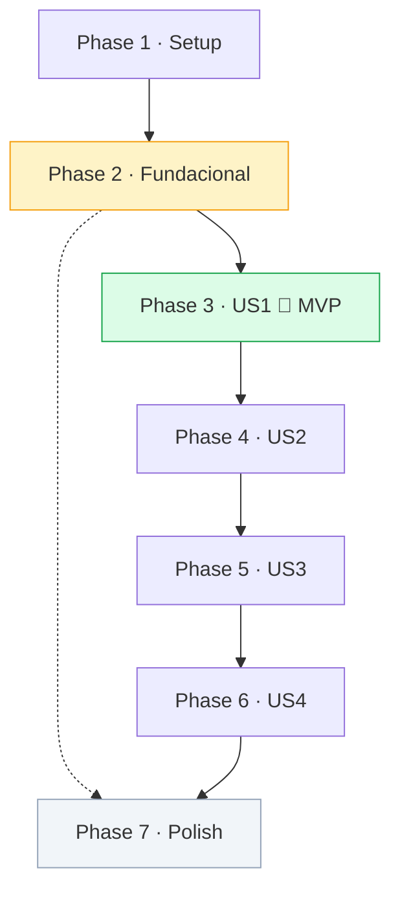
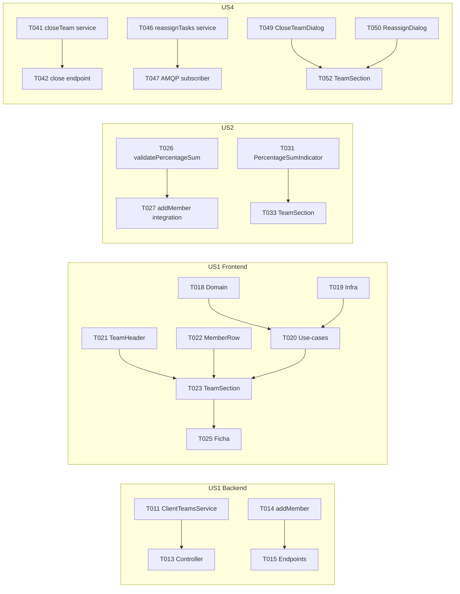

# Tasks: Asignaciones Múltiples en Ficha de Cliente

**Input**: Design documents from `specs/001-client-team-assignments/`

**Branch**: `001-client-team-assignments` | **Date**: 2026-05-25

**Services**: `pgi-service-pgi-api` (backend), `pgi-app-pgi-web` (frontend), `pd-service-obligations-api` (AMQP)

## Format: `[ID] [P?] [Story?] Description`

- **[P]**: Paralelizable — ficheros distintos, sin dependencia de tarea incompleta
- **[Story]**: Historia de usuario a la que pertenece (US1–US4)
- Sin label de story → Setup o Fundacional

---

## Phase 1: Setup

**Purpose**: Verificar que el snapshot de MikroORM está limpio antes de tocar entidades. Obligatorio antes de cualquier edición de entidades.

- [ ] T001 Verificar snapshot limpio en pgi-service-pgi-api: ejecutar `npx mikro-orm migration:check` desde `asesores/pgi-service-pgi-api/` y confirmar "No changes required"
- [ ] T002 [P] Verificar snapshot limpio en pd-service-obligations-api: ejecutar `npx mikro-orm migration:check` desde `plataforma-del-dato/pd-service-obligations-api/` y confirmar "No changes required"

**Checkpoint**: Los dos snapshots están sincronizados. Se puede empezar a editar entidades.

---

## Phase 2: Fundacional (bloqueante para todas las historias)

**Purpose**: Entidades, migración y configuración base que necesitan todas las historias de usuario.

**⚠️ CRÍTICO**: Ninguna historia de usuario puede empezar hasta completar esta fase.

- [ ] T003 Crear entidad `ClientTeam` (id, client FK, department, startDate, endDate nullable, createdBy, createdAt, updatedAt) en `asesores/pgi-service-pgi-api/src/domain/models/client-team.ts`
- [ ] T004 Extender entidad `ClientAssignment` añadiendo columna `percentage` (smallint, NOT NULL, DEFAULT 100, CHECK 1–100) y `team` (nullable FK → ClientTeam) en `asesores/pgi-service-pgi-api/src/domain/models/client-assignment.ts`
- [ ] T005 Crear migración MikroORM (`npm run migrations:create`) en `asesores/pgi-service-pgi-api/src/migrations/` — añadir manualmente el índice parcial: `CREATE UNIQUE INDEX idx_client_team_active ON client_team (client_id, department) WHERE end_date IS NULL`; verificar que `npx mikro-orm migration:create --dump` devuelve "No changes required"
- [ ] T006 [P] Registrar `ClientTeam` en la lista de entidades de MikroORM y añadir `ClientTeamsService` y `ClientTeamsController` como providers vacíos en `asesores/pgi-service-pgi-api/src/app.module.ts`
- [ ] T007 [P] Añadir publicación `backoffice-api.v1.task-reassignment.requested` (routingKey: `backoffice-api.v1.task-reassignment.requested`) al config de RabbitMQ en `asesores/pgi-service-pgi-api/src/config/default.config.ts`
- [ ] T008 [P] Extender `toClientAssignmentDto` y `ClientAssignmentDto` con campos `percentage` (number) y `teamId` (string | null) en `asesores/pgi-service-pgi-api/src/application/rest/client-assignments/dto/client-assignment-dto.ts`
- [ ] T009 [P] Extender modelo de dominio frontend `ClientAssignment` con `percentage` y `teamId` en `asesores/pgi-app-pgi-web/src/features/client-assignments/domain/models/client-assignment.model.ts` y su DTO en `asesores/pgi-app-pgi-web/src/features/client-assignments/infrastructure/dto/client-assignment-dto.ts`
- [ ] T010 [P] Crear estructura de carpetas vacía para el nuevo feature module `client-teams` (domain/, application/use-cases/, infrastructure/, presentation/components/) en `asesores/pgi-app-pgi-web/src/features/client-teams/`

**Checkpoint**: Migración aplicada, entidades compilando, feature module esqueleto listo. Historias de usuario pueden empezar en paralelo.

---

## Phase 3: User Story 1 — Crear y gestionar el equipo (Priority: P1) 🎯 MVP

**Goal**: Un responsable puede crear el equipo de un cliente (responsable + coordinador opcional + ≥1 asesor + técnicos opcionales), guardarlo y verlo activo en la ficha del cliente.

**Independent Test**: Abrir ficha de un cliente sin equipo → crear equipo con un asesor al 100% → guardar → verificar equipo activo visible en la UI y respondiendo en `GET /v1/client-teams/:clientId/department/FISCAL`.

### Backend

- [ ] T011 [US1] Crear `ClientTeamsService` con métodos `createTeam()` (valida first-of-month, valida no active team existe, `em.fork()` + `em.create()` + `em.persistAndFlush()`), `getTeamsByClient()` (`disableIdentityMap: true`), `getActiveSummary()` y helper `validateMonthBoundary(date)` en `asesores/pgi-service-pgi-api/src/domain/services/client-teams/client-teams.service.ts`
- [ ] T012 [P] [US1] Crear DTOs `CreateTeamParamsDto` (startDate: Date, @IsDateString + @IsNotEmpty) y `ClientTeamDto` (id, clientId, department, startDate, endDate, isActive, createdBy, createdAt) en `asesores/pgi-service-pgi-api/src/application/rest/client-teams/dto/`
- [ ] T013 [US1] Crear `ClientTeamsController` con endpoints: `GET /:clientId/department/:department` (lista equipos), `POST /:clientId/department/:department` (crea equipo), `GET /:clientId/department/:department/active-summary` en `asesores/pgi-service-pgi-api/src/application/rest/client-teams/client-teams.controller.ts` — auth: `CLIENT_ASSIGNMENT_VIEW` / `CLIENT_ASSIGNMENT_EDIT`
- [ ] T014 [US1] Añadir método `addMember()` a `ClientAssignmentsService`: recibe teamId, employeeId, role, percentage, dateFrom; valida equipo activo; valida RESPONSABLE/COORDINADOR max 1; valida COORDINADOR ≠ RESPONSABLE; `em.fork()` + `em.create()`; publica `client_assignment_updated` en `asesores/pgi-service-pgi-api/src/domain/services/client-assignments/client-assignments.service.ts`
- [ ] T015 [US1] Añadir DTOs `AddMemberParamsDto` (employeeId, role, percentage, dateFrom) y endpoints `POST /:clientId/:teamId/members` y `DELETE /:clientId/:teamId/members/:assignmentId` a `ClientAssignmentsController` en `asesores/pgi-service-pgi-api/src/application/rest/client-assignments/client-assignments.controller.ts` — guard: `CLIENT_ASSIGNMENT_EDIT` + dept-specific
- [ ] T016 [US1] Añadir método `removeMember()` a `ClientAssignmentsService`: fija `dateTo = endOfCurrentMonth()`, valida que queden ≥1 asesor activo tras la eliminación; publica `client_assignment_updated` en `asesores/pgi-service-pgi-api/src/domain/services/client-assignments/client-assignments.service.ts`
- [ ] T017 [P] [US1] Escribir test de integración (testcontainers): crear equipo → añadir asesor → verificar GET lista el equipo y miembro; intentar crear segundo equipo activo → verificar 409 en `asesores/pgi-service-pgi-api/src/domain/services/client-teams/client-teams.service.spec.ts`

### Frontend

- [ ] T018 [P] [US1] Crear modelo de dominio `ClientTeam` y interface `ClientTeamsRepository` en `asesores/pgi-app-pgi-web/src/features/client-teams/domain/`
- [ ] T019 [P] [US1] Crear `ClientTeamDto`, mapper `fromClientTeamDto()` y `ClientTeamsRepositoryImpl` (httpClient calls a `/v1/client-teams/`) en `asesores/pgi-app-pgi-web/src/features/client-teams/infrastructure/`
- [ ] T020 [US1] Crear use-cases `get-client-teams`, `create-team`, `add-member`, `remove-member` con `composition-root.ts` en `asesores/pgi-app-pgi-web/src/features/client-teams/application/use-cases/`
- [ ] T021 [P] [US1] Crear componente `TeamHeader` (muestra startDate formateada, createdBy, badge activo/cerrado) en `asesores/pgi-app-pgi-web/src/features/client-teams/presentation/components/team-section/team-header.tsx`
- [ ] T022 [P] [US1] Crear componente `TeamMemberRow` (nombre empleado, role badge, campo % readonly en US1, botón eliminar con guard de permiso) en `asesores/pgi-app-pgi-web/src/features/client-teams/presentation/components/team-section/team-member-row.tsx`
- [ ] T023 [US1] Crear componente `TeamSection` (fetches team via useQuery, renderiza TeamHeader + TeamMemberRow list + botón "Añadir miembro" + botón "Crear equipo" si no hay equipo activo) en `asesores/pgi-app-pgi-web/src/features/client-teams/presentation/components/team-section/team-section.tsx`
- [ ] T024 [US1] Crear `TeamMemberForm` dialog (TanStack Form: employee autocomplete, role select, dateFrom date picker, campo % — Zod: todos requeridos, % 1–100) en `asesores/pgi-app-pgi-web/src/features/client-teams/presentation/components/team-form/team-member-form.tsx`
- [ ] T025 [US1] Integrar `TeamSection` en el tab "Asignaciones" de la ficha del cliente en `asesores/pgi-app-pgi-web/src/features/clients/presentation/components/client-profile-tabs/`

**Checkpoint**: Un responsable puede crear un equipo, añadir asesores y verlo en la ficha. MVP funcionalmente completo.

---

## Phase 4: User Story 2 — Distribución de carga por porcentaje (Priority: P2)

**Goal**: El responsable puede ajustar el % de carga de cada miembro y el sistema valida en tiempo real que asesores sumen 100% y técnicos sumen 100% (si los hay) antes de permitir guardar.

**Independent Test**: Equipo existente con 1 asesor al 100% → añadir segundo asesor al 40% sin ajustar el primero → sistema muestra advertencia y bloquea el guardado. Ajustar a 60%+40% → permite guardar.

### Backend

- [ ] T026 [US2] Añadir `validatePercentageSum(teamId, role, newPercentage?, excludeAssignmentId?)` a `ClientTeamsService`: consulta asesores activos del equipo, suma porcentajes, devuelve error estructurado si ≠ 100 en `asesores/pgi-service-pgi-api/src/domain/services/client-teams/client-teams.service.ts`
- [ ] T027 [US2] Llamar a `validatePercentageSum()` desde `ClientAssignmentsService.addMember()` y `removeMember()` (solo para roles ASESOR y TECNICO) en `asesores/pgi-service-pgi-api/src/domain/services/client-assignments/client-assignments.service.ts`
- [ ] T028 [US2] Crear `PatchPercentageParamsDto` (percentage: number, effectiveFrom: Date) y añadir endpoint `PATCH /:clientId/:teamId/members/:assignmentId` a `ClientAssignmentsController` — servicio: cierra asignación actual (dateTo = effectiveFrom - 1d) y crea nueva con nuevo % en `asesores/pgi-service-pgi-api/src/application/rest/client-assignments/`
- [ ] T029 [P] [US2] Añadir endpoint `POST /:clientId/:teamId/validate` a `ClientTeamsController` (llama `validatePercentageSum` por grupo de rol, devuelve `{ valid, violations[] }`) en `asesores/pgi-service-pgi-api/src/application/rest/client-teams/client-teams.controller.ts`
- [ ] T030 [P] [US2] Escribir test de integración: 2 asesores al 60%+50% → 400 `PERCENTAGE_VALIDATION_FAILED`; al 60%+40% → 201; 1 técnico al 80% → 400 en `asesores/pgi-service-pgi-api/src/domain/services/client-teams/client-teams.service.spec.ts`

### Frontend

- [ ] T031 [P] [US2] Crear componente `PercentageSumIndicator` (recibe role + assignments[], muestra suma actual, verde si =100, rojo si ≠100, con tooltip de distribución) en `asesores/pgi-app-pgi-web/src/features/client-teams/presentation/components/team-section/percentage-sum-indicator.tsx`
- [ ] T032 [US2] Añadir campo % editable a `TeamMemberRow` y validación Zod cross-field (sum de asesores = 100, sum de técnicos = 100 si los hay) en `TeamMemberForm` en `asesores/pgi-app-pgi-web/src/features/client-teams/presentation/components/`
- [ ] T033 [US2] Integrar `PercentageSumIndicator` en `TeamSection` y deshabilitar botón "Guardar" cuando la suma sea ≠ 100% para algún grupo en `asesores/pgi-app-pgi-web/src/features/client-teams/presentation/components/team-section/team-section.tsx`
- [ ] T034 [P] [US2] Crear use-case `update-member-percentage` en `asesores/pgi-app-pgi-web/src/features/client-teams/application/use-cases/update-member-percentage.use-case.ts`

**Checkpoint**: Editar % con suma incorrecta bloquea el guardado. Guardar con suma correcta persiste correctamente.

---

## Phase 5: User Story 3 — Histórico de cambios de asignación (Priority: P3)

**Goal**: Vista de solo lectura con todos los cambios de asignación (altas, bajas, cambios de %) — accesible para todos los perfiles con acceso a la ficha.

**Independent Test**: Crear equipo → cambiar % de un asesor → acceder al histórico → verificar dos entradas: original (con dateTo) y nueva (sin dateTo).

### Backend

- [ ] T035 [US3] Añadir método `getAssignmentHistory(clientId, department, filters?)` a `ClientAssignmentsService` (retorna todas las filas incluyendo las con dateTo, ordenadas por dateFrom DESC; `disableIdentityMap: true`) en `asesores/pgi-service-pgi-api/src/domain/services/client-assignments/client-assignments.service.ts`
- [ ] T036 [US3] Añadir endpoint `GET /v1/client-assignments/:clientId/department/:department/history` (query params: role?, employeeId?) a `ClientAssignmentsController` — auth: `CLIENT_ASSIGNMENT_VIEW` en `asesores/pgi-service-pgi-api/src/application/rest/client-assignments/client-assignments.controller.ts`
- [ ] T037 [P] [US3] Escribir test de integración: crear equipo → cambiar % → verificar history devuelve 2 entradas con dateFrom/dateTo correctos en `asesores/pgi-service-pgi-api/src/domain/services/client-assignments/client-assignments.service.spec.ts`

### Frontend

- [ ] T038 [P] [US3] Crear use-case `get-assignment-history` y añadir a composition-root en `asesores/pgi-app-pgi-web/src/features/client-teams/application/use-cases/`
- [ ] T039 [P] [US3] Crear componente `TeamHistoryAccordion` (tabla con columnas: Empleado, Rol, %, Período "Jun 2026 – Ago 2026", colapsable) en `asesores/pgi-app-pgi-web/src/features/client-teams/presentation/components/team-history/team-history-accordion.tsx`
- [ ] T040 [US3] Integrar `TeamHistoryAccordion` en `TeamSection` debajo de los miembros activos (todos los perfiles pueden verlo — sin guard de edición) en `asesores/pgi-app-pgi-web/src/features/client-teams/presentation/components/team-section/team-section.tsx`

**Checkpoint**: El histórico muestra todos los períodos con fechas y porcentajes correctos para cualquier usuario con acceso a la ficha.

---

## Phase 6: User Story 4 — Cierre de equipo y reasignación de tareas (Priority: P4)

**Goal**: El responsable puede cerrar un equipo fijando una fecha de fin que se propaga a todos sus miembros. Puede reasignar tareas manualmente entre miembros en cualquier momento.

**Independent Test**: Equipo activo sin tareas pendientes → responsable fija fecha de cierre → todos los miembros reciben dateTo → equipo pasa a inactivo en el histórico.

### Backend — pgi-service-pgi-api

- [ ] T041 [US4] Añadir método `closeTeam(teamId, endDate, user)` a `ClientTeamsService`: valida endDate = last-of-month, valida equipo activo, `em.fork()` + `em.transactional()` para fijar `endDate` en `ClientTeam` y `dateTo = endDate` en todos los miembros activos; publica `client_assignment_updated` por cada miembro en `asesores/pgi-service-pgi-api/src/domain/services/client-teams/client-teams.service.ts`
- [ ] T042 [US4] Crear `CloseTeamParamsDto` (endDate: Date) y añadir endpoint `PUT /:clientId/:teamId/close` a `ClientTeamsController` — guard: `CLIENT_ASSIGNMENT_EDIT` en `asesores/pgi-service-pgi-api/src/application/rest/client-teams/client-teams.controller.ts`
- [ ] T043 [US4] Añadir método `publishTaskReassignment(clientId, dept, fromEmployeeId, toEmployeeId, taskIds, requestedBy)` a `ClientAssignmentsService` (publica evento `backoffice-api.v1.task-reassignment.requested` vía rabbitMQService) en `asesores/pgi-service-pgi-api/src/domain/services/client-assignments/client-assignments.service.ts`
- [ ] T044 [US4] Crear `ReassignTasksParamsDto` (fromEmployeeId, toEmployeeId, taskIds?: string[]) y añadir endpoint `POST /:clientId/:teamId/reassign-tasks` → devuelve 202 Accepted en `asesores/pgi-service-pgi-api/src/application/rest/client-teams/client-teams.controller.ts`
- [ ] T045 [P] [US4] Escribir test de integración: closeTeam → verificar team.endDate set, todos los miembros con dateTo, evento published; intentar editar equipo cerrado → verificar 409 en `asesores/pgi-service-pgi-api/src/domain/services/client-teams/client-teams.service.spec.ts`

### Backend — pd-service-obligations-api

- [ ] T046 [P] [US4] Añadir método `reassignTasksBetweenAdvisors(clientId, dept, fromEmployeeId, toEmployeeId, taskIds?)` a `TasksService`: actualiza `task.advisor` para tareas PENDING del `fromEmployeeId` (filtrando por `taskIds` si se proporcionan); `em.fork()`; idempotente (reasignar tarea ya reasignada es no-op) en `plataforma-del-dato/pd-service-obligations-api/src/domain/services/tasks/tasks.service.ts`
- [ ] T047 [US4] Crear `TaskReassignmentSubscriber` (AMQP consumer de `obligations-api:task-reassignment:process`, llama a `tasksService.reassignTasksBetweenAdvisors()`; `em.fork()` en el handler) en `plataforma-del-dato/pd-service-obligations-api/src/application/amqp/task-reassignment-subscriber/task-reassignment.subscriber.ts`
- [ ] T048 [US4] Registrar `TaskReassignmentSubscriber` en AppModule y añadir queue `obligations-api:task-reassignment:process` a las definiciones de RabbitMQ en `plataforma-del-dato/pd-service-obligations-api/src/app.module.ts` y `infra/rabbitmq/definitions.json`

### Frontend

- [ ] T049 [P] [US4] Crear `CloseTeamDialog` (date picker para endDate con validación last-of-month, mensaje de confirmación con lista de miembros afectados, botón confirmar) en `asesores/pgi-app-pgi-web/src/features/client-teams/presentation/components/close-team-dialog/close-team-dialog.tsx`
- [ ] T050 [P] [US4] Crear `TaskReassignmentDialog` (fromEmployee select, toEmployee select filtrado a miembros activos del equipo, lista de tareas opcional, confirmar → llama reassign-tasks use-case → 202) en `asesores/pgi-app-pgi-web/src/features/client-teams/presentation/components/task-reassignment-dialog/task-reassignment-dialog.tsx`
- [ ] T051 [US4] Crear use-cases `close-team` y `reassign-tasks` en `asesores/pgi-app-pgi-web/src/features/client-teams/application/use-cases/`
- [ ] T052 [US4] Integrar `CloseTeamDialog` y `TaskReassignmentDialog` en `TeamSection` (solo visibles con permiso `CLIENT_ASSIGNMENT_EDIT`; botón "Cerrar equipo" en el header, botón "Reasignar tareas" en cada miembro) en `asesores/pgi-app-pgi-web/src/features/client-teams/presentation/components/team-section/team-section.tsx`

**Checkpoint**: Cierre de equipo funcional end-to-end; reasignación manual de tareas llega a obligations-api vía RabbitMQ.

---

## Phase 7: Polish & Cross-Cutting Concerns

- [ ] T053 [P] Ejecutar `npm run lint:fix && npm run build` en `asesores/pgi-service-pgi-api/` y corregir errores
- [ ] T054 [P] Ejecutar `npm run build` en `asesores/pgi-app-pgi-web/` (TypeScript check + Vite build) y corregir errores
- [ ] T055 [P] Ejecutar `npm run lint:fix && npm run build` en `plataforma-del-dato/pd-service-obligations-api/` y corregir errores
- [ ] T056 Ejecutar smoke tests del `quickstart.md` end-to-end: crear equipo → añadir miembros → validar % → cerrar equipo → verificar histórico

---

## Dependencies & Execution Order

### Dependencias entre fases



### Dependencias dentro de cada historia



### Oportunidades de paralelismo entre historias

Con dos desarrolladores desde Phase 3:
- **Dev A** — backend: T011 → T013 → T014 → T015 → T016
- **Dev B** — frontend: T018 → T019 → T020 → T021 → T022 → T023

---

## Parallel Example: User Story 1

```bash
# Lanzar en paralelo (ficheros distintos, sin dependencias):
Task T012 — DTOs CreateTeamParamsDto + ClientTeamDto
Task T018 — ClientTeam domain model + repository interface (frontend)
Task T019 — ClientTeamDto + RepositoryImpl (frontend)
Task T021 — TeamHeader component
Task T022 — TeamMemberRow component
Task T017 — Test de integración createTeam + addMember

# Luego (requieren los anteriores):
Task T011 — ClientTeamsService (requiere entidad de Phase 2)
Task T013 — ClientTeamsController (requiere T011 + T012)
Task T020 — use-cases (requiere T018 + T019)
Task T023 — TeamSection (requiere T020 + T021 + T022)
Task T025 — integración en ficha (requiere T023)
```

---

## Implementation Strategy

### MVP (solo US1 — Phase 1 + 2 + 3)

1. Completar **Phase 1**: Verificar snapshots
2. Completar **Phase 2**: Entidades + migración (bloquea todo) — ~1 día
3. Completar **Phase 3**: Backend + frontend US1 — ~2–3 días
4. **STOP y VALIDAR**: Crear equipo, añadir miembros, ver en ficha → funcional
5. Deploy/demo si está listo

### Entrega incremental

1. Setup + Fundacional → Base lista
2. US1 → Crear y gestionar equipo → **Demo MVP**
3. US2 → Validación de % → **Demo con validación**
4. US3 → Histórico → **Demo completo sin cierre**
5. US4 → Cierre + reasignación → **Feature completa**

---

## Notes

- Siempre leer el CLAUDE.md de cada servicio antes de editar su código
- Nunca usar `@EnsureRequestContext()` en los nuevos subscribers AMQP de obligations-api
- `em.fork()` antes de cualquier write; `disableIdentityMap: true` en reads
- Commit por cada tarea o grupo lógico: `feat(client-teams): T011 create ClientTeamsService`
- Ejecutar `npx mikro-orm migration:create --dump` después de T005 para confirmar que no hay drift
- Los tests de integración arrancan testcontainers automáticamente (~10s primer arranque)
